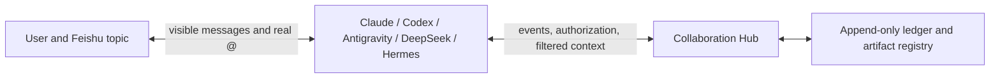

# Feishu Multi-Agent Collaboration Design

[Back to README](../README.md) | [中文](./DESIGN.zh-CN.md) |
[Concepts](./COLLABORATION_CONCEPTS.md) | [Product vision](./PRODUCT_VISION.md) |
[产品目标](./PRODUCT_VISION.zh-CN.md) |
[Windows operations](./WINDOWS_OPERATIONS.md) | [Distributed roadmap](./DISTRIBUTED_DEPLOYMENT_ROADMAP.md)

## One-Sentence Architecture

Feishu carries visible human/agent conversation and real notifications. The
local Hub carries machine-verifiable task state, context visibility and work
authorization. One Feishu topic is one task; mentioning an agent selects who
works next.

## The Soul: Share Task State, Not Model Mind-State

Putting four independent bots in a group is not collaboration. Each bridge has
its own events and model session, so the next agent cannot reliably know what
the previous one completed. Broadcasting every message causes races and loops;
merging all model sessions leaks private runtime data and pollutes context.

The Hub therefore shares a filtered, auditable task projection:

- original requirements and later user constraints;
- accepted conclusions, decisions, evidence and risks;
- artifacts, commits, documents and open questions;
- completed work, failures and explicit next steps.

It does not share raw chain-of-thought, scratch work, irrelevant tool logs,
model session metadata, App Secrets, tokens or unrelated topics. Agents retain
their own models, reasoning depth, speed, tools and memory.

## Correctness Comes From Boundaries

Collaboration spans three planes that must align without being conflated:

| Plane | Source of truth | Responsibility |
| --- | --- | --- |
| Control | Hub ledger | Tasks, ownership, dispatch, causality, lifecycle and idempotency |
| Messaging | Feishu | Visible conversation, real mentions, topics and file delivery |
| Execution | Agent bridge | Model process, workspace, login, network and current bot identity |

A text mention is not authorization, a dispatch is not a physical wake-up, and
a model name is not a Feishu sending identity. Consequently, one run consumes
one dispatch addressed to it; child actions cite that active parent dispatch;
messages and files use the current bridge profile; every bot independently
passes group admission; and proxy settings are scoped to the process that needs
them rather than inherited by the whole system.



## Topic Is The Task Boundary

```text
tenantKey + chatId + threadId -> taskId
```

Messages in one topic belong to one task. Two topics in the same group remain
isolated. Direct messages and non-topic group messages keep ordinary bridge
behavior unless explicitly configured otherwise. The boundary comes from a
structure the user can see, not from a model guess.

## Real Mention Plus Dispatch

A real Feishu `@` and a Hub `dispatch` are two separate keys:

- the mention is the physical, user-visible wake-up signal;
- dispatch is the logical authorization to perform specified work.

A human mention can assign work directly. An agent must first record a
structured `handoff`, `ask` or `return`, then visibly mention the target in the
same topic. A text-only mention without pending authorization is ignored. Each
dispatch is consumed once, is tied to the active dispatch that caused it, and
has an idempotency key. The loop guard applies to the depth of that causal
chain—not to the lifetime number of delegations in a topic. Every new human
assignment starts a new root at depth 1, so a long-lived topic never becomes
unusable merely because it has accumulated legitimate work. The causal-depth
ceiling only stops unbounded Agent-to-Agent recursion.

Dispatches have an explicit lifecycle: `pending -> accepted -> completed` or
`pending -> accepted -> failed`. A child action must name an accepted parent
dispatch for the same task and actor. This prevents stale work from spawning
new work and makes failed runs auditable instead of leaving them accepted.

Agent-originated delegation uses one entry point for both keys. It accepts a
stable Hub agent ID, records the causal `ask` or `handoff`, resolves the target
bot's current Feishu `open_id` from the runtime identity registry, and sends a
real mention. Agents never guess identity from group membership. Hub actions
and Feishu delivery use stable idempotency keys, so a retry does not create a
second unit of work.

The identity registry contains routing metadata, never credentials. Each bot's
credentials remain in its profile. The pilot prepends an identity-neutral
`lark-cli` entry point that preserves the current bridge environment; stale
same-name scripts in an external workspace therefore cannot make one agent send
as another.

## Ownership State Machine

| Action | Ownership | Target use |
| --- | --- | --- |
| `assign` | Move to the human-mentioned agent | Initial selection or manual reassignment |
| `handoff` | Transfer to target | Continue the main task |
| `ask` | Keep current owner | Focused review or consultation |
| `return` | Keep current owner | Return findings/artifacts |
| `complete` | Close task | Owner confirms completion |

Only the current owner may hand off, ask or complete. The Hub maintains an
owner lease and derives state by replaying its append-only ledger, so bots do
not hold conflicting copies of task truth.

## Context Envelope

Before the original user message, an authorized bridge injects:

```text
collaboration_context
  contract: taskId, currentOwner, yourDispatch, rules
  entries: ordered events visible to this agent
  artifacts: durable files visible to this agent

bridge_context
  chatId, threadId, sender, mentions, message IDs

original user message
```

`yourDispatch` remains the single objective for this run; shared history cannot
bury it. The model is asked for conclusions, evidence, artifact paths and next
steps, not private reasoning. Its final visible response becomes a reusable
task event for later authorized participants.

Capacity must not be handled by silently chopping arbitrary ledger events. The
ledger remains the complete append-only fact source and the Hub produces a
semantic projection by task, participation and visibility. As tasks grow, the
correct extension is a source-sequenced summary checkpoint with cursor access
to original events, while adapters carry large prompts over stdin or files
instead of treating Windows argv length as a business limit. Every projection
must disclose its covered sequence range and provenance.

This is also an explicit current capacity boundary. JSONL grows continuously,
startup replays the complete ledger and hot indexes remain in memory. Topics do
not pollute one another, but one long-lived topic repeatedly carries all visible
events and therefore consumes progressively more model tokens. Native Agent
session history may duplicate Hub history. Summary checkpoints, recent-event
windows, cold-task archival and hot-memory unloading are Planned P1 in the
[distributed roadmap](./DISTRIBUTED_DEPLOYMENT_ROADMAP.md).

## Causal Depth, Not Topic Age

`hop` is the depth of the current delegation chain. Every new human assignment
creates a root at depth 1; only an Agent-to-Agent child increments it. A topic
may therefore host any number of legitimate human turns without becoming
permanently unusable. `maxCausalDepth` limits only recursive wake-up chains.
Legacy `maxHops` is accepted for manifest migration, but new configuration uses
the causal name.

A child action must reference an accepted dispatch for the same task whose
target is the acting agent. Bridges close every accepted dispatch as
`completed` or `failed`, so stale and failed runs cannot silently remain active.

## Visibility

| Visibility | Readers | Typical content |
| --- | --- | --- |
| `task-public` | Task participants | Requirements, accepted decisions and results |
| `handoff` | Both sides of a transfer | Transfer-specific instructions |
| `targeted` | Named agent | Focused question/answer |
| `private-runtime` | Producing agent | Non-shareable runtime information |
| `secret` | Nobody; rejected from ledger | Tokens and App Secrets |

Participation is itself a gate. An agent that has never been assigned,
consulted or handed the task cannot query that task projection. Filtering is
performed by the Hub, not merely requested in a prompt.

This is protocol isolation, not OS isolation. Processes running as the same
Windows user may still access files that user can access. Use separate users,
containers or remote workers for hard confidentiality.

## Files Are First-Class Artifacts

PPTX, DOCX, XLSX, PDF, images and archives cannot be handed off reliably as a
temporary path in prose. The artifact store snapshots by content:

```text
.runtime/artifacts/<taskId>/<sha256>/<safe-file-name>
```

An artifact records its stable ID, original name, type, absolute shared path,
SHA-256, byte length, creator, visibility and available Feishu message/file
keys. `collab-artifact.cmd publish` snapshots the file, sends it through the
current bot identity, then records the event only after delivery succeeds.
Inbound attachments are also snapshotted after bridge validation.

Transport idempotency keys are bounded protocol fields. They are derived from
bounded task/agent/content-hash components to satisfy the platform limit; the
full SHA-256 remains in the artifact record for integrity and deduplication.

Hermes keeps native attachment sending. The isolated Hook detects real output
paths, snapshots them and records the same protocol event. Hermes source, venv,
configuration, sessions, memories and skills are not replaced.

Artifact is a protocol abstraction for a deliverable; it does not require the
Hub to store file bytes. The current single-machine provider is the
`.runtime/artifacts` snapshot. The distributed target uses pluggable locators:
Git repository/commit/path for code and Markdown; Feishu message/file or Drive
references for office files, PDFs, images and user attachments; optional object
storage for large data. The Hub retains task relationship, producer,
visibility, digest and locator, while the receiving Bridge materializes a local
cache path.

This separation allows storage providers to evolve without changing task,
dispatch or context semantics and without requiring a separate central file
server merely to obtain Artifact semantics.

## Network Is Per-Agent Capability

The Hub and Feishu channel remain direct. A model CLI that needs a proxy gets
it only in that agent's child environment, with localhost excluded so Hub calls
stay local. For Antigravity, the launcher may derive the current Windows user
proxy for `agy.exe`; it does not reinstall the agent, modify authentication
state, or leak proxy variables to other agents. Connectivity, bridge health and
authentication are separate diagnostic dimensions.

## Deployment Shape

The latest feature branch builds every maintained adapter. Separate bridge
processes still use distinct Feishu profiles and environments. The pilot
manifest describes launch/rollback commands; it does not install or log into
agents on the user's behalf.

Current distributed intake lets the mentioned execution bridge submit an
event. A stricter production shape can use a fifth silent coordinator app as
the single ordered event stream. It never runs a model or replies; execution
bots consume only their authorized dispatches.

Whatever implementation evolves, these invariants remain: Feishu is the user
interface, the Hub is task truth, agents preserve their individual abilities,
context is projected by task and visibility, and visible wake-up must match
formal authorization.

Pilot's supported deployment remains one Windows computer. Bridge and Hub
already communicate over HTTP, but current scripts start a local Hub, all
callers share one bearer token, artifacts expose the producing computer's
absolute `localPath`, and short fixed dispatch polling is not WAN-resilient.
See the [distributed roadmap](./DISTRIBUTED_DEPLOYMENT_ROADMAP.md) for the target
shape and phased acceptance criteria.
