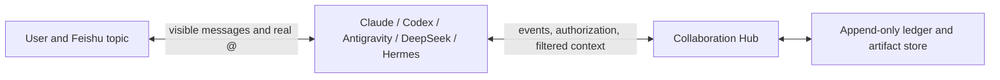

# Feishu Multi-Agent Collaboration Design

[Back to README](../README.md) | [中文](./DESIGN.zh-CN.md) |
[Product vision](./PRODUCT_VISION.md) | [产品目标](./PRODUCT_VISION.zh-CN.md) |
[Windows operations](./WINDOWS_OPERATIONS.md)

## One-Sentence Architecture

Feishu carries visible human/agent conversation and real notifications. The
local Hub carries machine-verifiable task state, context visibility and work
authorization. One Feishu topic is one task; mentioning an agent selects who
works next.

## The Soul: Share Task State, Not Model Mind-State

Putting four independent bots in a group is not collaboration. Each bridge has
its own events and model session, so the next agent cannot reliably know what
the previous one completed. Broadcasting every message causes races and loops;
merging all model sessions leaks private runtime data and pollutes context.

The Hub therefore shares a filtered, auditable task projection:

- original requirements and later user constraints;
- accepted conclusions, decisions, evidence and risks;
- artifacts, commits, documents and open questions;
- completed work, failures and explicit next steps.

It does not share raw chain-of-thought, scratch work, irrelevant tool logs,
model session metadata, App Secrets, tokens or unrelated topics. Agents retain
their own models, reasoning depth, speed, tools and memory.



## Topic Is The Task Boundary

```text
tenantKey + chatId + threadId -> taskId
```

Messages in one topic belong to one task. Two topics in the same group remain
isolated. Direct messages and non-topic group messages keep ordinary bridge
behavior unless explicitly configured otherwise. The boundary comes from a
structure the user can see, not from a model guess.

## Real Mention Plus Dispatch

A real Feishu `@` and a Hub `dispatch` are two separate keys:

- the mention is the physical, user-visible wake-up signal;
- dispatch is the logical authorization to perform specified work.

A human mention can assign work directly. An agent must first record a
structured `handoff`, `ask` or `return`, then visibly mention the target in the
same topic. A text-only mention without pending authorization is ignored. Each
dispatch is consumed once and has hop/idempotency limits, preventing prompt
forgery, duplicate retries and bot wake-up loops.

## Ownership State Machine

| Action | Ownership | Target use |
| --- | --- | --- |
| `assign` | Move to the human-mentioned agent | Initial selection or manual reassignment |
| `handoff` | Transfer to target | Continue the main task |
| `ask` | Keep current owner | Focused review or consultation |
| `return` | Keep current owner | Return findings/artifacts |
| `complete` | Close task | Owner confirms completion |

Only the current owner may hand off, ask or complete. The Hub maintains an
owner lease and derives state by replaying its append-only ledger, so bots do
not hold conflicting copies of task truth.

## Context Envelope

Before the original user message, an authorized bridge injects:

```text
collaboration_context
  contract: taskId, currentOwner, yourDispatch, rules
  entries: ordered events visible to this agent
  artifacts: durable files visible to this agent

bridge_context
  chatId, threadId, sender, mentions, message IDs

original user message
```

`yourDispatch` remains the single objective for this run; shared history cannot
bury it. The model is asked for conclusions, evidence, artifact paths and next
steps, not private reasoning. Its final visible response becomes a reusable
task event for later authorized participants.

## Visibility

| Visibility | Readers | Typical content |
| --- | --- | --- |
| `task-public` | Task participants | Requirements, accepted decisions and results |
| `handoff` | Both sides of a transfer | Transfer-specific instructions |
| `targeted` | Named agent | Focused question/answer |
| `private-runtime` | Producing agent | Non-shareable runtime information |
| `secret` | Nobody; rejected from ledger | Tokens and App Secrets |

Participation is itself a gate. An agent that has never been assigned,
consulted or handed the task cannot query that task projection. Filtering is
performed by the Hub, not merely requested in a prompt.

This is protocol isolation, not OS isolation. Processes running as the same
Windows user may still access files that user can access. Use separate users,
containers or remote workers for hard confidentiality.

## Files Are First-Class Artifacts

PPTX, DOCX, XLSX, PDF, images and archives cannot be handed off reliably as a
temporary path in prose. The artifact store snapshots by content:

```text
.runtime/artifacts/<taskId>/<sha256>/<safe-file-name>
```

An artifact records its stable ID, original name, type, absolute shared path,
SHA-256, byte length, creator, visibility and available Feishu message/file
keys. `collab-artifact.cmd publish` snapshots the file, sends it through the
current bot identity, then records the event only after delivery succeeds.
Inbound attachments are also snapshotted after bridge validation.

Hermes keeps native attachment sending. The isolated Hook detects real output
paths, snapshots them and records the same protocol event. Hermes source, venv,
configuration, sessions, memories and skills are not replaced.

## Deployment Shape

The latest feature branch builds every maintained adapter. Separate bridge
processes still use distinct Feishu profiles and environments. The pilot
manifest describes launch/rollback commands; it does not install or log into
agents on the user's behalf.

Current distributed intake lets the mentioned execution bridge submit an
event. A stricter production shape can use a fifth silent coordinator app as
the single ordered event stream. It never runs a model or replies; execution
bots consume only their authorized dispatches.

Whatever implementation evolves, these invariants remain: Feishu is the user
interface, the Hub is task truth, agents preserve their individual abilities,
context is projected by task and visibility, and visible wake-up must match
formal authorization.
