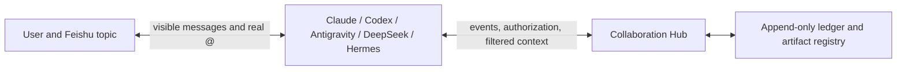

# Feishu Multi-Agent Collaboration Design

[Back to README](../README.md) | [中文](./DESIGN.zh-CN.md) |
[Concepts](./COLLABORATION_CONCEPTS.md) | [Product vision](./PRODUCT_VISION.md) |
[产品目标](./PRODUCT_VISION.zh-CN.md) |
[Windows operations](./WINDOWS_OPERATIONS.md) | [Distributed roadmap](./DISTRIBUTED_DEPLOYMENT_ROADMAP.md)

## One-Sentence Architecture

Feishu carries visible human/agent conversation and real notifications. The
local Hub carries machine-verifiable conversation state, context visibility and
attention authorization. One Feishu topic is one conversation; explicit work
actions optionally select who owns work next.

The user can therefore have World run a deep analysis, then mention `@Chariot` in
the same topic to implement it. The user does not copy chat history: Chariot
receives the current dispatch and objective, and queries its own local journal
when it needs earlier records. It never gets World's private chain-of-thought,
secrets or unrelated run logs.

## Why Four Bots In One Group Are Not Enough

Four independent bridges each know only the messages they received and their own
model session. Putting them in one group produces three problems:

1. The second Agent does not know what the first Agent has already done.
2. Every bot may answer at once, or two bots may `@` each other into a wake-up
   loop.
3. Merging all the chat and model sessions leaks private runtime information and
   pollutes context.

The project therefore adds no fifth all-purpose Agent, and does not put the four
models into one session. Beside the four execution Agents it adds a thin local
control plane: the Collaboration Hub.


```mermaid
flowchart LR
  U["User and Feishu topic"]
  A["Claude / Codex / Antigravity / DeepSeek / Hermes"]
  H["Collaboration Hub"]
  L["Append-only ledger and artifact registry"]
  U <-->|"visible messages and real @"| A
  A <-->|"events, authorization, filtered context"| H
  H <--> L
```

The Hub runs no model and does not reply to Feishu on an Agent's behalf. It
answers four questions:

- Which task is this?
- Who owns it right now?
- Who is actually authorized to work this time?
- Which context is visible to this Agent?

## Correctness Comes From Boundaries

Three planes must align without being conflated:

| Plane | Source of truth | Responsibility |
| --- | --- | --- |
| Control | Hub ledger | Tasks, ownership, dispatch, causality, lifecycle and idempotency |
| Messaging | Feishu | Visible conversation, real mentions, topics and file delivery |
| Execution | Agent bridge | Model process, workspace, login, network and current bot identity |

A text mention is not authorization, a dispatch is not a physical wake-up, and a
model name is not a Feishu sending identity. One run consumes one dispatch
addressed to it; child actions cite that active parent dispatch; messages and
files use the current bridge profile; every bot independently passes group
admission; and proxy settings are scoped to the process that needs them rather
than inherited by the whole system.

## The Soul: Share Task State, Not Model Mind-State

What the Hub shares is a filtered, auditable task state, not one model's
complete session snapshot.

Shared:

- the user's requirements, constraints and later confirmed changes;
- accepted conclusions and design decisions;
- evidence, risks and open questions;
- file paths, commits, documents and other artifact references;
- completed items, failure reasons and explicit next steps.

Not shared:

- raw chain-of-thought;
- scratch work and irrelevant tool output;
- an Agent's own run traces and internal session metadata;
- App Secrets, access tokens and other secrets;
- history unrelated to the current Feishu topic.

The Agent that takes over gets a workable handover packet, not a long chat dump
it has to digest. Each Agent still keeps its own model, reasoning depth, speed,
tools and memory, and the collaboration layer does not grind them into one.

## Topic Is The Task Boundary

```text
tenantKey + chatId + threadId -> taskId
```

Messages in one topic belong to one task. Two topics in the same group remain
isolated. Direct messages and non-topic group messages keep ordinary bridge
behavior unless explicitly configured otherwise. The boundary comes from a
structure the user can see; no model guesses it. A real acceptance run therefore
has to happen in the **same topic**.

## Real Mention Plus Dispatch

A real Feishu `@` and a Hub `dispatch` are two separate keys:

- the mention is the physical, user-visible wake-up signal;
- dispatch is the logical authorization to perform specified work.

A human mention can assign work directly. An agent must first record a
structured `reply`, `handoff` or `ask`, then visibly mention the target in the
same topic. A text-only mention without pending authorization is ignored. Each
dispatch is consumed once, is tied to the active dispatch that caused it, and
has an idempotency key. The loop guard applies to the depth of that causal chain,
not to the lifetime number of delegations in a topic. Every new human assignment
starts a new root at depth 1, so a long-lived topic never becomes unusable
because it has accumulated legitimate work. The causal-depth ceiling only
stops unbounded Agent-to-Agent recursion; autonomous chat turns are bounded
separately by `maxConversationTurns`.

When one human message mentions several bots, Feishu delivers that same message
through each bot application's independent event connection. The Hub merges
those authenticated observations by Feishu message ID. Each bridge may assert
only its own real mention; the append-only routing expansion creates one
dispatch per newly observed target and clears single-owner state once the
message becomes fanout. Arrival order therefore cannot make only the first bot
respond, including when Hermes reaches the Hub later than the Node bridges.

Dispatches have an explicit lifecycle: `pending -> accepted -> completed` or
`pending -> accepted -> failed`. A child action must name an accepted parent
dispatch for the same task and actor, which stops stale work from spawning new
work and makes failed runs auditable instead of leaving them accepted.
Acknowledging is idempotent by key: replaying the same acknowledgement returns
the current dispatch without writing. Bridges close every accepted dispatch as
`completed` or `failed`. Reaching `completed` closes the task for agent actions:
a later non-message input is rejected, so the status never silently flips back
to open. A new human message in the same topic is still journaled and can carry
a fresh assignment, which is how a long-lived topic continues after one finished
piece of work.

Agent-originated delegation uses one entry point for both keys. It accepts a
stable Hub agent ID, records the causal `reply`, `ask` or `handoff`, resolves the
target bot's current Feishu `open_id` from the runtime identity registry, and
sends a real mention. Agents never guess identity from group membership. Hub
actions and Feishu delivery use stable idempotency keys, so a retry does not
create a second unit of work.

An `ask` has one additional bridge-owned completion rule shared by every Bot
adapter: the consulted Bot returns only its result and artifacts. Once the Hub
has atomically recorded that return, it resolves the **current** owner and
creates the return dispatch; the producing Bridge sends that same final result
with one real Feishu mention of that owner. A consulted model must not issue a
second delegation to wake the owner. The Bridge ignores a control marker for
that run, so Codex, Claude, Antigravity, DeepSeek Harness and Hermes cannot
produce duplicate owner wake-ups when their prompting or model behavior differs.

Each agent keeps its own append-only local journal of what its own bridge
actually observed: messages, downloaded attachments and Bot results, **one file
per topic** (`<agentRoot>/collaboration/topics/<chatId>/<threadId>.jsonl`, or
`_chat.jsonl` for a chat message outside any topic). The agent can query it on
demand. Two agents on the same computer keep separate journals and never append
to a shared file, so N agents on one computer behave exactly like N machines; a
new topic starts a new file instead of growing one ever-longer ledger. The
journal is never copied to another computer and local paths are never treated as
portable. Hub prompts carry the current dispatch and a local query command
instead of a growing transcript.

A collaboration marker is executable only when its opening and closing tags are
both present, and only three markers exist: `collaboration_handoff`,
`collaboration_reply` and `collaboration_ask`. An unclosed marker that runs to
the end of the text is treated as malformed: the Hub records one Hub-authorized
`repair` action and returns a fixed correction instruction to the originating
bridge, which asks the same Bot to regenerate only the complete marker. An
unclosed marker embedded in ordinary prose is not malformed and stays literal
text. Malformed text creates no dispatch and no real mention; the Hub permits at
most one repair for the active run, after which the run is recorded as failed if
the marker is still invalid. The limit is keyed to the run's own accepted
dispatch, so a later dispatch can be repaired again, while a retry with the same
idempotency key is a duplicate and re-returns the same instruction.

The identity registry contains routing metadata, never credentials. It holds,
per Hub agent ID, the display name, the `openId` the bot's own app sees for
itself, optional `nodeId`, `instanceId` and `version` reported by the bridge,
and the last registration time. It is runtime state held in Hub memory rather
than a ledger event, so a Hub restart empties it until each bridge reconnects
and registers again; a bridge registers on every connect, including after a
credential swap. Feishu `open_id`s are app-scoped, so the stored value is
meaningful to the app that registered it, and registering the same agent ID from
a second app replaces the first value. Each bot's credentials remain in its
profile. The pilot prepends an identity-neutral `lark-cli` entry point that
preserves the current bridge environment; stale same-name scripts in an external
workspace therefore cannot make one agent send as another.

## Ownership State Machine

| Action | Ownership | Target use |
| --- | --- | --- |
| `reply` | Keep current owner | One ordinary group turn that wakes another participant without transferring work |
| `handoff` | Transfer to target | Continue the main task |
| `ask` | Keep current owner | Focused review or consultation |
| `return` | Keep current owner | Return findings/artifacts and bridge-wake the current owner once |
| `complete` | Close task | Owner confirms completion |
| `repair` | Keep current owner | One Hub-authorized retry for an invalid collaboration marker |

There is no separate `assign` action. A human message that names exactly one bot
is the assignment: the Hub records the message, a `lease` with reason `mention`
and a `mention` dispatch at hop 1. A human message that names several bots
records one `fanout` dispatch per target and no lease, because a shared task has
no single owner; a later observation that widens the target set clears the owner
and the lease the same way.

Only the current owner may `handoff`, `ask` or `complete`. `reply` is open to any
task participant, so a participant can invite another bot for one turn without
taking over the work. Every action must also come from a registered bot that is
already a participant in the task, and must cite an accepted dispatch for the
same task and the acting agent.

The Hub maintains an owner lease and derives state by replaying its append-only
ledger, so bots do not hold conflicting copies of task truth. Each `lease` event
stores an absolute `expiresAt` derived from `leaseMinutes` (default 30). The Hub
has no expiry timer: it re-evaluates whether the lease is still live whenever an
action arrives, and an expired lease makes the actor a non-owner, which is what
a rejection such as `only the current owner (none) may handoff` reports. The
projection still shows the last written owner and timestamp, so treat the lease
timestamp as the authority rather than the owner field alone.

A dispatch comes from a human mention (one target → `mention`, several →
`fanout`), from `reply`, `handoff` and `ask`, from the conditional `return`, and
from the fanout merge of a second bridge's observation. It is never created by
`complete`, `repair`, an artifact registration, an agent-authored message or an
undirected human message.

## How Context Enters, Is Stored And Delivered

A normal handover runs like this:

1. The user mentions `@World` in the topic.
2. The World bridge submits the normalized message to the Hub.
3. The Hub appends the message, the owner lease and a dispatch for World.
4. The World bridge reads only the task projection visible to World, confirms
   the dispatch, then runs Codex.
5. World's final answer is written back to the ledger as a `return` event.
6. The user mentions `@Chariot` in the same topic.
7. The Hub reassigns ownership and creates a new dispatch for Chariot.
8. The Chariot bridge receives the original task and its own target dispatch,
   then runs; it queries older local records or a specific deliverable on demand.

The ledger is append-only JSONL. Every event carries a sequence number, an
idempotency key, a task ID and a timestamp, and content-bearing events also carry
a visibility class. Current owner, participants and dispatch status are
projections replayed from those events, so the four bots do not each keep a copy
of the truth that can conflict.

## Visibility

| Visibility | Readers | Typical content |
| --- | --- | --- |
| `task-public` | Task participants | Requirements, accepted decisions and results |
| `handoff` | Both sides of a transfer | Transfer-specific instructions |
| `targeted` | Named agent | Focused question/answer |
| `private-runtime` | Producing agent | Non-shareable runtime information |
| `secret` | Nobody; rejected from ledger | Tokens and App Secrets |

Participation is itself a gate. An agent that has never been assigned,
consulted or handed the task cannot query that task projection. Filtering is
performed by the Hub, not merely requested in a prompt. The enforcement point
differs by event kind: a `dispatch` is visible only to its own target, an `ack`
only to the acknowledging bot, and `lease` and `task-completed` events are
visible to every participant. Content-bearing events (messages, actions and
artifacts) carry an explicit visibility class and are filtered by the class
above. A `secret` message is rejected when it is submitted, so it never reaches
the ledger at all; a hand-crafted artifact event cannot claim `secret`
visibility in the typed client, and the filter would show it to nobody.

The Hub ledger is the only authority for ownership. The local journal never
records leases, dispatches or idempotency keys, so a bot that reads its own
journal still cannot decide who owns a task; only the Hub can answer that.

This is protocol isolation, not OS isolation. Processes running as the same
Windows user may still access files that user can access. Use separate users,
containers or remote workers for hard confidentiality.

## Context Envelope

Before the original user message, an authorized bridge injects:

```text
collaboration_context
  contract
    taskId
    currentOwner
    yourDispatch: the full dispatch record for this run
    availableAgents: id and display name only
    rules
  localJournal: this agent's topic scope and the local-context query command

bridge_context
  chatId, threadId, sender, mentions, message IDs

original user message
```

`yourDispatch` remains the single objective for this run; history cannot bury
it. `availableAgents` carries stable agent IDs and display names so the model can
name a delegation target; it omits every `openId`, which the bridge resolves when
it sends the real mention. The fixed `rules` block names the local journal query
command, forbids exposing private reasoning, requires structured delegation
instead of a text-only `@`, and requires `collab-artifact.cmd publish` for task
files. The model is asked for conclusions, evidence, artifact paths and next
steps.

The envelope is narrow: no conversation transcript, no artifact catalog, no
other task's records. The Hub applies participation and visibility before the
builder sees an entry, so excluded material never reaches the prompt. The final
visible response is recorded both as a Hub task event and in the local journal.

The Hub ledger remains the complete append-only control-plane fact source (tasks,
ownership, dispatches, causality and idempotency keys, replayed on start), but it
is no longer replayed into Bot prompts. Each agent writes a separate JSONL
journal under its own runtime directory, **one file per topic**:

```text
<agentRoot>/collaboration/topics/<chatId>/<threadId>.jsonl
<agentRoot>/collaboration/topics/<chatId>/_chat.jsonl   (chat message outside a topic)
```

Its key is `chatId:threadId` for a Feishu topic, so two topics in one group
cannot read one another's records. An ordinary non-topic group has the group ID
as its scope because Feishu gives it no finer visible boundary. The journal
contains only messages that agent received, files that agent downloaded, and
that agent's Bot results; it never holds tasks, ownership, dispatches or
idempotency keys, and it cannot answer who owns a task. The pre-`topics/` single
file is still read so an in-place upgrade keeps its history, but nothing is
written there any more.

The journal is never copied to another computer, and a local path is never a
cross-machine Artifact locator.

On demand, a Bot uses `lark-channel-bridge local-context read` or `search`
with its current scope. Queries are scope-filtered and exact-match on scope, so
records written under a different scope are invisible; they return at most 50
records, newest last. Normal group and topic runs in the standard bridges start
fresh model work instead of resuming a previous provider session, so the journal
is not an implicit ever-growing prompt. Hermes keeps ownership of its native
session; the Hook also receives no Hub-history replay, but provider-side session
retention is outside this project's control. Journal retention, Hub-ledger cold
storage and Hermes-native session compaction remain roadmap work; see the
[distributed roadmap](./DISTRIBUTED_DEPLOYMENT_ROADMAP.md).

## Causal Depth, Not Topic Age

`hop` is the depth of the current delegation chain. Every new human assignment
creates a root at depth 1; only an Agent-to-Agent child increments it. A topic
may therefore host any number of legitimate human turns without becoming
permanently unusable. `maxCausalDepth` (default 8) limits only `handoff` and
`ask` recursion. `reply` has its own ceiling, `maxConversationTurns` (default
32), so an autonomous social loop is bounded by turns rather than by delegation
depth. `return`, `complete` and `repair` are not depth-checked, because they
never extend the chain. Legacy `maxHops` is accepted for manifest migration and
is read only when `maxCausalDepth` is absent, but new configuration uses the
causal name.

A child action must reference an accepted dispatch for the same task whose
target is the acting agent. Bridges close every accepted dispatch as
`completed` or `failed`, so stale and failed runs cannot silently remain active.

## Files Are First-Class Artifacts

PPTX, DOCX, XLSX, PDF, images and archives cannot be handed off reliably as a
temporary path in prose. The artifact store snapshots by content:

```text
.runtime/artifacts/<taskId>/<sha256>/<safe-file-name>
```

The layout is `<artifactRoot>/<safe taskId>/<sha256>/<safe-file-name>`, where
the pilot sets `artifactRoot`; `safe taskId` keeps only `[A-Za-z0-9._-]` and is
truncated to 120 characters. The Artifact ID is `artifact_` plus the first 24
hex characters of the SHA-256, so identical content in the same task is the same
record and a re-snapshot of an unchanged file is reused rather than copied.

An artifact records its stable ID, original name, type, absolute shared path,
SHA-256, byte length, creator, visibility and available Feishu message/file
keys. The type is taken from the caller when it is given and otherwise inferred
from the extension: presentation, document, spreadsheet, image, pdf or a generic
file. A Feishu locator is stored only when the send actually returned both a
message ID and a file key; otherwise the locator points at the local snapshot.
`collab-artifact.cmd publish` snapshots the file, sends it through the
current bot identity, then records the event only after delivery succeeds.
Inbound attachments are also snapshotted after bridge validation.

Registration does not make file bytes part of every prompt. The prompt carries
no artifact catalog at all: a shared artifact reaches the model only through the
path and locator the agent already has, or through an explicit query.
`collab-artifact.cmd resolve --list` prints compact rows without any path or
locator, and `--id` or `--name` returns one full record, so on-demand retrieval
never replays every old deliverable. Resolution is bounded by Hub participation
and visibility, so an agent cannot resolve a file it was never allowed to see.

Transport idempotency keys are bounded protocol fields. They are derived from
bounded task/agent/content-hash components to satisfy the platform limit; the
full SHA-256 remains in the artifact record for integrity and deduplication.

In a collaboration task, World, Justice and Chariot are required to publish
shared files with `collab-artifact.cmd publish` instead of a bare
`lark-cli --file`. Hermes keeps native attachment sending. The isolated Hook
detects real output paths, snapshots them and records the same protocol event.
Hermes source, venv, configuration, sessions, memories and skills are not
replaced.

Artifact is a protocol abstraction for a deliverable; it does not require the
Hub to store file bytes. The current single-machine provider is the
`.runtime/artifacts` snapshot. The distributed target uses the pluggable
locators the types already define (`local`, `feishu`, `git` and `object`): Git
repository/commit/path for code and Markdown; Feishu message/file or Drive
references for office files, PDFs, images and user attachments; optional object
storage for large data. The Hub retains task relationship, producer,
visibility, digest and locator, while the receiving Bridge is responsible for
materializing a local cache path. That receiver-side materialization is not
implemented yet; the current phase status lives in the
[distributed roadmap](./DISTRIBUTED_DEPLOYMENT_ROADMAP.md).

This separation allows storage providers to evolve without changing task,
dispatch or context semantics and without requiring a separate central file
server merely to obtain Artifact semantics.

## Network Is Per-Agent Capability

The Hub and Feishu channel remain direct. A model CLI that needs a proxy gets
it only in that agent's child environment, with localhost excluded so Hub calls
stay local. For Antigravity, the launcher may derive the current Windows user
proxy for `agy.exe`; it does not reinstall the agent, modify authentication
state, or leak proxy variables to other agents. Connectivity, bridge health and
authentication are separate diagnostic dimensions.

Fool uses the same protocol through an isolated copy of the Hermes source and a
removable Hook that injects input, cancels an unauthorized wake-up and records
results. The original Hermes source, venv, configuration, sessions, memories and
skills are not reinstalled or overwritten.

## Deployment Shape

`release/hub` builds every maintained adapter for the central deployment;
`release/worker` is the second-PC deployment that connects to that Hub without
starting another one. Separate bridge processes still use distinct Feishu
profiles and environments. The pilot manifest describes launch/rollback
commands; it does not install or log into agents on the user's behalf.

Current distributed intake lets the mentioned execution bridge submit an
event. A stricter production shape can use a fifth silent coordinator app as
the single ordered event stream: it would never run a model or reply, and
execution bots would consume only their authorized dispatches. The Hub config
and the bridge already reserve that shape. The config accepts an optional
`coordinator` block (disabled in the example, and omitted entirely by the pilot)
and the bridge accepts `LARK_COLLAB_EVENT_SOURCE=coordinator`, in which case it
waits for an authorized dispatch instead of submitting the message it observed
itself. The coordinator app itself is implemented and disabled by default, so it
runs only when a config enables it; the remaining work is tracked in the
[distributed roadmap](./DISTRIBUTED_DEPLOYMENT_ROADMAP.md).

Whatever implementation evolves, these invariants remain: Feishu is the user
interface, the Hub is task truth, agents preserve their individual abilities,
context is projected by task and visibility, and visible wake-up must match
formal authorization.

Pilot keeps `all` as the default one-PC Hub-plus-local-Bots behavior and also
supports a main PC as the center with additional private-network workers.
Per-Agent credentials constrain caller identity, Artifact provider locators
express portable locations, and the coordinator-source wait window covers
ordinary cross-network reordering. See the
[distributed roadmap](./DISTRIBUTED_DEPLOYMENT_ROADMAP.md) for automatic
materialization, atomic claiming, and production hardening status.
