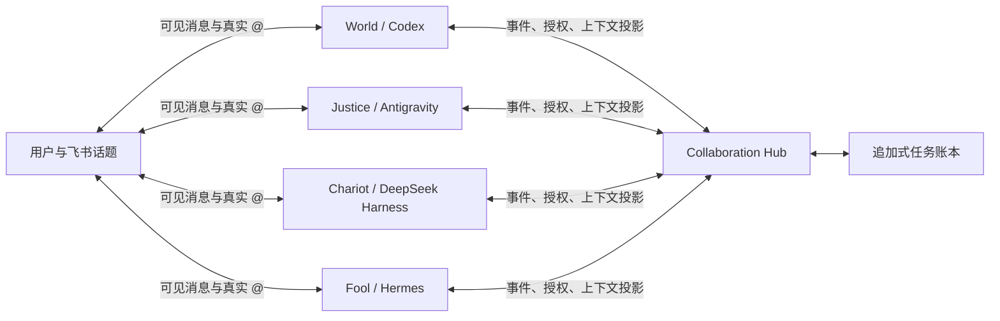

# 飞书多 Agent 协作设计

本文解释这个项目真正解决的问题、用户能得到什么体验，以及为什么不能把四个
机器人简单拉进一个群就算“多 Agent 协作”。产品目标见
[PRODUCT_VISION.zh-CN.md](./PRODUCT_VISION.zh-CN.md)，Windows 启停操作见
[WINDOWS_OPERATIONS.zh-CN.md](./WINDOWS_OPERATIONS.zh-CN.md)。

## 一句话思路

**飞书负责承载人与 Agent 的可见对话和真实通知，Hub 负责机器可判定的任务状态、
上下文权限与工作授权。一个飞书话题就是一个任务，`@` 谁就是选择谁工作。**

它带来的核心效果是：用户可以先让 World 深度分析，再在同一个话题 `@Chariot`
接着实现。Chariot 自动拿到前序结论、证据和产物，不需要用户复制聊天记录，也
不会拿到 World 的私有思维链、秘密或无关运行日志。

## 为什么四个机器人在一个群里还不够

四套独立桥接各自只知道自己收到的消息和自己的模型会话。直接拉群会出现三个
根本问题：

1. 第二个 Agent 不知道第一个 Agent 已经做了什么。
2. 所有机器人可能抢答，或者机器人互相 `@` 后形成唤醒循环。
3. 把所有聊天和模型会话粗暴合并，又会泄露私有运行信息并污染上下文。

因此项目没有建立“第五个万能 Agent”，也没有把四个模型塞进同一个会话。它在
四个执行 Agent 之外增加一个很薄的本地控制面：Collaboration Hub。



Hub 不运行模型，也不替 Agent 回复飞书。它只回答四类问题：

- 这是哪个任务？
- 当前谁负责？
- 这次到底授权谁工作？
- 对这个 Agent 来说，哪些上下文可见？

## 设计的灵魂：共享任务状态，不共享脑内会话

本项目共享的是**经过筛选、可追溯的任务状态**，不是某个模型的完整会话快照。

应该共享：

- 用户的任务、约束和后来确认的修改；
- 已接受的结论与设计决策；
- 证据、风险、开放问题；
- 文件路径、提交、文档和其他产物引用；
- 已完成事项、失败原因和明确的下一步。

不应该共享：

- 原始思维链；
- 临时草稿和无关工具输出；
- Agent 自己的运行跟踪、内部会话元数据；
- App Secret、访问令牌和其他秘密；
- 与当前飞书话题无关的历史。

这样做有两个重要结果。第一，接手者拿到的是可执行的交接包，而不是一大段难以
消化的聊天转储。第二，每个 Agent 仍能保留自己的模型、推理强度、速度、工具和
长期记忆；协作层不会把它们磨成同一个 Agent。

## 话题就是任务边界

任务 ID 由稳定的三元组确定：

```text
tenantKey + chatId + threadId -> taskId
```

因此：

- 同一个话题里的多轮消息属于同一任务；
- 同一个群里的两个话题是两个任务，互不串上下文；
- 普通私聊和非话题消息默认不进入协作模式，保留原桥接行为；
- 任务边界由飞书中用户看得见的结构决定，不靠模型猜测。

这也是为什么真实验收必须在**话题群的同一个话题**中进行。

## `@` 与 dispatch：必须同时成立的双钥匙

飞书 `@` 和 Hub dispatch 分别解决不同问题：

- **真实 `@`**：让飞书把事件送到目标机器人，是物理唤醒信号。
- **dispatch**：Hub 记录“谁授权谁做什么”，是逻辑工作许可。

人类 `@Agent` 可以直接创建一次分配和 dispatch。Agent 想唤醒另一个 Agent 时，
必须先在 Hub 执行结构化的 `handoff` 或 `ask`，成功后再在飞书真实 `@` 对方。
只有文字 `@` 而没有待消费 dispatch，目标桥接会安静忽略。

这套双钥匙是设计中最关键的一点：

- 飞书通知仍然对用户可见，不会变成黑箱后台编排；
- 提示词里伪造一句“@Chariot”不能获得授权；
- 同一个 dispatch 只能被接收一次，重试不会重复执行；
- 机器人互相引用、回复或误 `@` 不会无限循环；
- 用户直接选择 Agent 的操作仍然自然，只需要正常 `@`。

## 所有权不是聊天礼仪，而是状态机

Hub 为每个任务维护当前负责人和有期限的 lease。协作动作有明确语义：

| 动作 | 所有权变化 | 谁被唤醒 | 用途 |
| --- | --- | --- | --- |
| `assign` | 交给用户 `@` 的 Agent | 被 `@` 的 Agent | 首次选择或人工改派 |
| `handoff` | 转给目标 Agent | 目标 Agent | 正式接手后续工作 |
| `ask` | 不变 | 被咨询 Agent | 局部审查或专业咨询 |
| `return` | 不变 | 必要时返回当前负责人 | 交回结果与产物 |
| `complete` | 任务关闭 | 无 | 当前负责人确认完成 |

只有当前负责人可以 `handoff`、`ask` 或 `complete`。Hub 还限制最大协作跳数，
并用飞书 message ID 和 action key 做幂等控制。路由正确性不依赖“请 Agent 自觉”。

## 上下文如何进入、存储和分发

一次正常接手经历以下过程：

1. 用户在话题中 `@World`。
2. World bridge 把标准化消息提交给 Hub。
3. Hub 追加消息、负责人 lease 和给 World 的 dispatch。
4. World bridge 只读取对 World 可见的任务投影，确认 dispatch 后才运行 Codex。
5. World 的最终答复以 `return` 事件写回账本。
6. 用户在同一话题 `@Chariot`。
7. Hub 改派负责人并为 Chariot 创建一次新 dispatch。
8. Chariot bridge 获得原始任务、World 的公开结果、产物引用和自己的目标，然后运行。

账本是追加式 JSONL。每个事件都有顺序号、幂等键、任务 ID、时间和可见性。当前
负责人、参与者和 dispatch 状态都是从事件重放得到的投影，不由四个机器人各自
保存一份容易冲突的“真相”。

## 可见性如何共享与隔离

Hub 在返回上下文前按目标 Agent 过滤事件：

| 可见性 | 能看到的人 | 典型内容 |
| --- | --- | --- |
| `task-public` | 当前任务参与者 | 用户要求、公开结论、最终结果 |
| `handoff` | 交接双方 | 专门的交接说明 |
| `targeted` | 指定 Agent | `ask` 的局部问题和回答 |
| `private-runtime` | 产生它的 Agent | 不应传播的运行信息 |
| `secret` | 无人，拒绝入账 | token、App Secret 等秘密 |

“参与任务”本身也是门槛。未被分配、咨询或转交的 Agent 不能读取该任务上下文。
过滤发生在 Hub，不只是提示 Agent “请不要看”。

这里必须诚实说明边界：四个进程目前以同一个 Windows 用户运行，所以这是**协作
协议层的隔离**，不是操作系统强隔离。Agent 若拥有全盘工具权限，理论上仍可读取
同一用户有权限访问的文件。需要强保密时，应使用不同 Windows 用户、容器或远程
执行环境。

## 给 Agent 的消息有什么特殊设计

进入协作模式时，桥接不会只把用户原话转发给模型，而是在普通
`bridge_context` 和用户消息之前插入一个机器可读的 `collaboration_context`：

```text
collaboration_context
  contract
    taskId
    currentOwner
    yourDispatch: reason, objective, hop, status
    rules
  entries: 仅对当前 Agent 可见的有序任务事件

bridge_context
  chatId, threadId, sender, mentions, messageIds...

用户本次原始消息
```

这个信封刻意把几件事拆开：

- `taskId` 告诉 Agent 正在处理哪个持续任务；
- `currentOwner` 消除“现在到底谁负责”的歧义；
- `yourDispatch` 是本轮唯一目标，不让共享历史淹没当前指令；
- `entries` 提供经过权限过滤的事实和产物；
- `rules` 要求先做结构化动作，再真实 `@`，并禁止泄露思维链和秘密；
- 用户原话保持原样放在最后，模型仍能理解自然语言意图。

Agent 被要求输出结论、证据、产物路径和下一步，而不是输出私有推理过程。最终
可见答复会自动记录回任务上下文，成为后来接手者可以复用的状态。

## 文件不是文字附注，而是一等共享产物

PPT、Word、Excel、PDF、图片和压缩包不能只靠最终回复里的一段路径文字来交接。
项目为此定义了 `artifact` 事件和内容寻址的共享文件库：

```text
.runtime/artifacts/<taskId>/<sha256>/<safe-file-name>
```

每个共享产物包含：

- 稳定 artifact ID、原文件名和种类；
- 共享副本的本机绝对路径；
- SHA-256、字节大小和可选 MIME；
- 创建者与可见范围；
- 能取得时保存飞书 `message_id` 和 `file_key`。

文件发布是一个原子工作流，而不是“先发飞书、以后希望有人记得登记”：

1. Agent 创建文件。
2. `collab-artifact.cmd publish` 计算哈希并复制到任务共享库。
3. 命令使用当前 Agent 已绑定的飞书身份把文件回复到原话题。
4. 只有发送成功后才向 Hub 追加 artifact 事件。
5. 后续 Agent 的 `collaboration_context.artifacts` 直接给出共享路径和完整性信息。

World、Justice 和 Chariot 在协作任务中被明确要求使用该命令代替裸
`lark-cli --file`。Fool 保留 Hermes 原生附件发送：Hermes 最终回复中的真实本机
文件路径会由隔离 Hook 在发送前自动快照和登记。用户发给任一 Agent 的入站附件
也会在下载和安全策略校验通过后自动进入同一共享库。

共享的是快照，不是脆弱的源路径。即使 Agent 后来清理自己的工作目录，其他
Agent 仍可读取共享副本。同一任务中的相同文件按 SHA-256 去重；artifact 事件仍
遵守 `task-public`、`handoff`、`targeted` 和 `private-runtime` 可见性过滤。

Fool 使用同样的协议，但通过一个隔离 Hermes 源码副本和可移除 Hook 实现输入
注入、未经授权唤醒取消与结果记录。Hermes 原源码、venv、配置、会话、记忆和
技能不被重装或覆盖。

## 当前试验版与最终形态

当前本机 pilot 使用 `distributed` 事件源：被飞书唤醒的执行 bridge 同时负责把
本次消息送进 Hub。这已经能完成“用户先 `@World`，再 `@Chariot` 接手”的顺序
协作，但未 `@` 的补充消息是否能被统一收录，仍受飞书给各机器人分发事件的方式
影响。

更完整的形态是增加一个**静默 coordinator 飞书应用**。它不运行模型、不回复，
只把话题事件按统一顺序写入 Hub。四个执行 Agent 只消费给自己的 dispatch。这样
可以彻底消除多 bridge 重复观测和普通消息遗漏的问题，同时不改变用户界面。

无论实现如何演进，以下原则不变：飞书是操作界面，Hub 是唯一任务真相，Agent
保留各自能力，上下文按任务和权限投影，真实通知与正式授权必须对应。
