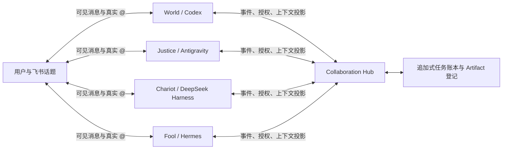

# 飞书多 Agent 协作设计

[返回中文 README](../README.zh.md) | [English](./DESIGN.md) |
[概念入门](./COLLABORATION_CONCEPTS.zh-CN.md) | [产品目标](./PRODUCT_VISION.zh-CN.md) |
[Windows 运维](./WINDOWS_OPERATIONS.zh-CN.md) | [跨电脑路线图](./DISTRIBUTED_DEPLOYMENT_ROADMAP.zh-CN.md)

## 一句话思路

飞书负责承载人与 Agent 的可见对话和真实通知，Hub 负责机器可判定的任务状态、
上下文权限与注意力授权。一个飞书话题就是一段对话；显式工作动作才选择谁接手工作。

用户可以先让 World 深度分析，再在同一个话题 `@Chariot` 接着实现。用户不需要复制
聊天记录：Chariot 拿到的是当前 dispatch 和目标，需要更早的记录时按需查询本机账本，
也不会拿到 World 的私有思维链、秘密或无关运行日志。

## 为什么四个机器人在一个群里还不够

四套独立桥接各自只知道自己收到的消息和自己的模型会话。直接拉群会出现三个
根本问题：

1. 第二个 Agent 不知道第一个 Agent 已经做了什么。
2. 所有机器人可能抢答，或者机器人互相 `@` 后形成唤醒循环。
3. 把所有聊天和模型会话粗暴合并，又会泄露私有运行信息并污染上下文。

因此项目没有建立“第五个万能 Agent”，也没有把四个模型塞进同一个会话。它在
四个执行 Agent 之外增加一个很薄的本地控制面：Collaboration Hub。


```mermaid
flowchart LR
    U["用户与飞书话题"]
    W["World / Codex"]
    J["Justice / Antigravity"]
    C["Chariot / DeepSeek Harness"]
    F["Fool / Hermes"]
    H["Collaboration Hub"]
    L["追加式任务账本与 Artifact 登记"]

    U <-->|"可见消息与真实 @"| W
    U <-->|"可见消息与真实 @"| J
    U <-->|"可见消息与真实 @"| C
    U <-->|"可见消息与真实 @"| F
    W <-->|"事件、授权、上下文投影"| H
    J <-->|"事件、授权、上下文投影"| H
    C <-->|"事件、授权、上下文投影"| H
    F <-->|"事件、授权、上下文投影"| H
    H <--> L
```

Hub 不运行模型，也不替 Agent 回复飞书。它只回答四类问题：

- 这是哪个任务？
- 当前谁负责？
- 这次到底授权谁工作？
- 对这个 Agent 来说，哪些上下文可见？

## 正确性来自边界，不来自提示词自觉

三个平面必须对齐，不能混为一谈：

| 平面 | 唯一真相 | 负责内容 |
| --- | --- | --- |
| 控制面 | Hub 账本 | 任务、所有权、dispatch、因果关系、幂等与生命周期 |
| 消息面 | 飞书 | 用户可见对话、真实 `@`、话题与文件交付 |
| 执行面 | 各 Agent bridge | 模型进程、工作区、登录状态、网络和当前 bot 身份 |

这三个平面不能互相冒充：飞书里的文本 `@` 不是授权，Hub dispatch 不是物理唤醒，
模型名称也不是飞书发送身份。以下不变量来自这个区分：

- 一个话题只映射到一个任务；Hub 是任务状态的唯一真相；
- 一次 Agent 运行只消费一个发给自己的待处理 dispatch；
- Agent 发起的动作必须引用触发本轮运行的父 dispatch；
- 发消息和发文件必须使用当前 bridge 注入的 bot profile，不能从工作目录猜身份；
- 每个 bot 独立通过群准入策略，不能用另一个 bot 的白名单或凭据代替；
- 网络代理按具体进程注入，不能污染 Hub 或飞书长连接。

## 设计的灵魂：共享任务状态，不共享脑内会话

本项目共享的是**经过筛选、可追溯的任务状态**，不是某个模型的完整会话快照。

应该共享：

- 用户的任务、约束和后来确认的修改；
- 已接受的结论与设计决策；
- 证据、风险、开放问题；
- 文件路径、提交、文档和其他产物引用；
- 已完成事项、失败原因和明确的下一步。

不应该共享：

- 原始思维链；
- 临时草稿和无关工具输出；
- Agent 自己的运行跟踪、内部会话元数据；
- App Secret、访问令牌和其他秘密；
- 与当前飞书话题无关的历史。

接手者拿到的是可执行的交接包，而不是一大段难以消化的聊天转储；同时每个 Agent
仍保留自己的模型、推理强度、速度、工具和长期记忆，协作层不会把它们磨成同一个
Agent。

## 话题就是任务边界

任务 ID 由稳定的三元组确定：

```text
tenantKey + chatId + threadId -> taskId
```

因此：

- 同一个话题里的多轮消息属于同一任务；
- 同一个群里的两个话题是两个任务，互不串上下文；
- 普通私聊和非话题消息默认不进入协作模式，保留原桥接行为；
- 任务边界由飞书中用户看得见的结构决定，不靠模型猜测。

真实验收因此必须在**话题群的同一个话题**中进行。

## `@` 与 dispatch：必须同时成立的双钥匙

飞书 `@` 和 Hub dispatch 分别解决不同问题：

- **真实 `@`**：让飞书把事件送到目标机器人，是物理唤醒信号。
- **dispatch**：Hub 记录“谁授权谁做什么”，是逻辑工作许可。

人类 `@Agent` 可以直接创建一次分配和 dispatch。Agent 想唤醒另一个 Agent 时，
必须先在 Hub 执行结构化的 `reply`、`handoff` 或 `ask`，成功后再在飞书真实 `@`
对方。只有文字 `@` 而没有待消费 dispatch，目标桥接会安静忽略。其中 `reply` 只是
邀请对方在群里回一轮，不转移工作所有权；`handoff` 才是正式交接。

两把钥匙必须同时成立，因此：

- 飞书通知仍然对用户可见，不会变成黑箱后台编排；
- 提示词里伪造一句“@Chariot”不能获得授权；
- 同一个 dispatch 只能被接收一次，重试不会重复执行；
- 机器人互相引用、回复或误 `@` 不会无限循环；
- 用户直接选择 Agent 的操作仍然自然，只需要正常 `@`。

一条人类消息同时 `@` 多个 bot 时，飞书会通过每个 bot 应用各自独立的事件连接
投递同一个 message ID。Hub 按 message ID 合并这些经过认证的观察：每个 bridge
只能声明“自己确实被 `@`”，Hub 用追加式 routing expansion 为每个新目标创建独立
dispatch；一旦目标数超过一个，就清除单负责人状态并按 fanout 处理。因此事件到达
顺序不会再导致只有第一个 bot 响应，Hermes 即使晚于 Node bridge 到达也不例外。

dispatch 的生命周期是显式的：`pending -> accepted -> completed`，失败时走
`pending -> accepted -> failed`。子动作必须引用同一任务、同一发起者的一条已接受父
dispatch，这样过期的工作无法再派生新工作，失败运行也会被如实记录，不会停留在已接受
状态。ack 按幂等键去重：重放同一条确认只会返回当前 dispatch，不会重复写入。bridge
把每条已接受的 dispatch 结束为 `completed` 或 `failed`。任务一旦到达 `completed`，
后续的非消息输入会被拒绝，状态不会悄悄回到未完成；同一话题里新的用户消息仍会记账，
并可以带来一次新的分配，长期话题就是这样在一个工作片段结束后继续下去的。

Agent 自主委派使用一个原子化入口完成这两个步骤。它接收稳定的 Hub Agent ID，
先写入带父 dispatch 的 `reply`、`ask` 或 `handoff`，再从 Hub 的运行时身份注册表取得
目标 bot 的飞书 `open_id` 并发送真实 mention。Agent 不需要、也不允许从群成员列表猜测
目标身份。Hub 动作和飞书发送分别使用稳定幂等键；发送失败时授权仍可审计，重试
不会创建第二份工作。

`ask` 还有一条由 bridge 统一执行的收尾规则，适用于所有 Bot adapter：被咨询的
Bot 只返回自己的结论和 Artifact。Hub 原子记录该 `return` 后，会解析**当前**负责人并
创建 return dispatch；产生结果的 bridge 再把同一条最终结果带着一次真实飞书 `@` 发给
该负责人。被咨询的模型不应自行发起第二次委派来叫醒负责人；若仍输出控制标记，bridge
会在这次咨询中忽略它。这样 Codex、Claude、Antigravity、DeepSeek
Harness 和 Hermes 不会因为提示词或模型习惯不同而重复回唤负责人。

每个 agent 维护自己的追加式本地账本，只记录**它自己的** bridge 实际收到的消息、已下载
附件和 Bot 结果，并且**每个话题一个文件**
（`<agentRoot>/collaboration/topics/<chatId>/<threadId>.jsonl`；不在话题里的聊天消息进
`_chat.jsonl`），供本 agent 按需查询。同一台电脑上的多个 agent 各写各的账本，绝不追加到
同一个文件，所以一台电脑上 N 个 agent 的表现和 N 台机器完全一致；新话题开新文件，
而不是往一个越来越长的账本里追加。账本不会复制到另一台电脑，也不会把本机路径当成可跨机
位置。升级前留下的单文件布局仍然会被读取，以保留旧历史，但新记录不再写入那里。Hub
提示词只带当前 dispatch 和本地查询命令，不再自动塞入不断增长的历史。

协作标记只有开始和结束标签都存在时才可执行，而且只有
`collaboration_handoff`、`collaboration_reply`、`collaboration_ask` 三种。只有一路
延伸到文本末尾的未闭合标记才算畸形：Hub 会记录一次由 Hub 授权的 `repair` 动作，并向
产生该标记的 bridge 返回固定的纠错指令；bridge 让同一个 Bot 只重做完整标记。夹在普通
正文中间、后面还有内容的未闭合标记不算畸形，按普通文本处理。畸形文本不会创建
dispatch 或真实 `@`；Hub 对同一活动运行最多允许一次重做，仍不合格则把该运行记录为
失败。这个上限按该次运行自己的已接受 dispatch 计算，所以之后的 dispatch 仍可再修，
而用同一个幂等键重试只会拿到同一份纠错指令。

身份注册表只描述“哪个已连接 bridge 当前代表哪个飞书 bot”，不承载凭据。它按 Hub agent
ID 保存显示名、该 bot 自己应用看到的 `openId`、bridge 上报的可选 `nodeId`、
`instanceId`、`version`，以及最近一次注册时间。它是仅供运行时使用的 Hub 内存状态，
不是账本事件，所以 Hub 重启后会清空，直到各 bridge 重新连上并重新注册；bridge 每次
连接（包括凭据切换后重连）都会注册一次。飞书 `open_id` 按应用隔离，因此存下来的值只
对注册它的应用有意义；同一个 agent ID 被第二个应用注册会覆盖前一个值。凭据始终留在
各自 profile。Pilot 把身份无关的 `lark-cli` 入口放到所有 Agent 的 `PATH`
最前面；入口只转发到真实 CLI 并保留当前 Agent 的环境。因此外部工作目录中即使
残留同名脚本，也不能让一个 Agent 使用另一个 bot 的身份回复。

## 所有权是状态机

Hub 为每个任务维护当前负责人和有期限的 lease。协作动作有明确语义：

| 动作 | 所有权变化 | 谁被唤醒 | 用途 |
| --- | --- | --- | --- |
| `reply` | 不变 | 被邀请的参与者 | 群里普通的一轮对话，唤醒对方但不移交工作 |
| `handoff` | 转给目标 Agent | 目标 Agent | 正式接手后续工作 |
| `ask` | 不变 | 被咨询 Agent | 局部审查或专业咨询 |
| `return` | 不变 | bridge 一次真实回唤当前负责人 | 交回结果与产物 |
| `complete` | 任务关闭 | 无 | 当前负责人确认完成 |
| `repair` | 不变 | 无 | Hub 授权一次无效协作标记重做 |

代码里没有单独的 `assign` 动作。人类消息只 `@` 一个 bot 就是那次分配：Hub 依次写入
消息、一条 reason 为 `mention` 的 lease，以及一条 hop 为 1 的 `mention` dispatch。
人类消息 `@` 了多个 bot 时，每个目标各得到一条 `fanout` dispatch，并且不写 lease，
因为共享任务没有唯一负责人；后续另一个 bridge 的观察扩大了目标集合时，同样会清空
负责人和 lease。

只有当前负责人可以 `handoff`、`ask` 或 `complete`；`reply` 对任务参与者开放，所以
参与者可以邀请另一个 bot 回一轮而不接手工作。任何动作还要求发起者是已注册、且已经是
该任务参与者的 bot，并且引用一条属于同一任务、指向自己的 `accepted` dispatch。

Hub 还用飞书 message ID 和 action key 做幂等控制，正确性由代码校验，不靠 Agent 自觉。

Hub 为每个任务维护带期限的 lease，每条 lease 事件写入由 `leaseMinutes`（默认 30）
算出的绝对 `expiresAt`。Hub 没有到期定时器：它只在动作到达时重新判断 lease 是否仍然
有效，过期即视为当前没有负责人，`only the current owner (none) may handoff` 这类拒绝
信息就来自这里。投影里仍保留最后一次写入的负责人和时间戳，所以判断归属要看 lease
时间戳，不能只看负责人字段。

dispatch 只由这些路径创建：人类 mention（1 个目标 → `mention`，多个 → `fanout`）、
`reply`、`handoff`、`ask`、满足条件的 `return`，以及重复消息的 fanout 合并。
`complete`、`repair`、artifact 登记、agent 自己发的消息和无目标的人类消息都不会创建
dispatch。

## 上下文如何进入、存储和分发

一次正常接手经历以下过程：

1. 用户在话题中 `@World`。
2. World bridge 把标准化消息提交给 Hub。
3. Hub 追加消息、负责人 lease 和给 World 的 dispatch。
4. World bridge 只读取对 World 可见的任务投影，确认 dispatch 后才运行 Codex。
5. World 的最终答复以 `return` 事件写回账本。
6. 用户在同一话题 `@Chariot`。
7. Hub 改派负责人并为 Chariot 创建一次新 dispatch。
8. Chariot bridge 获得原始任务和自己的目标 dispatch，然后运行；需要更早的本地记录或
   某个交付件时，再按需查询。

账本是追加式 JSONL。每个事件都有顺序号、幂等键、任务 ID 和时间，带内容的事件还会带
可见性等级。当前负责人、参与者和 dispatch 状态都是从事件重放得到的投影，不由四个
机器人各自保存一份容易冲突的“真相”。

## 可见性如何共享与隔离

Hub 在返回上下文前按目标 Agent 过滤事件：

| 可见性 | 能看到的人 | 典型内容 |
| --- | --- | --- |
| `task-public` | 当前任务参与者 | 用户要求、公开结论、最终结果 |
| `handoff` | 交接双方 | 专门的交接说明 |
| `targeted` | 指定 Agent | `ask` 的局部问题和回答 |
| `private-runtime` | 产生它的 Agent | 不应传播的运行信息 |
| `secret` | 无人，拒绝入账 | token、App Secret 等秘密 |

“参与任务”本身也是门槛。未被分配、咨询或转交的 Agent 不能读取该任务上下文。
过滤发生在 Hub，不只是提示 Agent “请不要看”。执行过滤的位置按事件类型区分：
`dispatch` 只对它的目标可见，`ack` 只对确认它的 bot 可见，`lease` 和
`task-completed` 对所有参与者可见；消息、动作和 artifact 这类带内容的事件各有显式
可见性等级，按上表过滤。`secret` 消息在提交时就被拒绝，根本不会进入账本；手工构造的
artifact 事件在类型上也不能声明 `secret`，即便写进去过滤结果也是对谁都不可见。

所有权只能由 Hub 账本回答。本机账本从不记录 lease、dispatch 或幂等键，所以一个 bot
即使读遍自己的账本也无法判断任务归谁，必须问 Hub。

四个进程目前以同一个 Windows 用户运行，所以这是**协作协议层的隔离**，
不是操作系统强隔离。Agent 若拥有全盘工具权限，理论上仍可读取同一用户有权限
访问的文件。需要强保密时，应使用不同 Windows 用户、容器或远程执行环境。

## 给 Agent 的消息有什么特殊设计

进入协作模式时，桥接会在普通 `bridge_context` 和用户消息之前插入一个机器可读的
`collaboration_context`：

```text
collaboration_context
  contract
    taskId
    currentOwner
    yourDispatch: 本轮完整的 dispatch 记录（reason, objective, hop, status...）
    availableAgents: 只含 id 和显示名
    rules
  localJournal: 本 agent 的话题 scope 与 local-context 查询命令

bridge_context
  chatId, threadId, sender, mentions, messageIds...

用户本次原始消息
```

信封各项的用途：

- `taskId` 告诉 Agent 正在处理哪个持续任务；
- `currentOwner` 消除“现在到底谁负责”的歧义；
- `yourDispatch` 是本轮唯一目标，不让历史淹没当前指令；
- `availableAgents` 只给稳定 Agent ID 和显示名，让模型能指明委派对象；它不含任何
  `openId`，真实 `@` 由 bridge 在发送时解析；
- `localJournal` 只提供当前话题的本 agent 按需查询入口，不自动注入历史；
- `rules` 给出本地查询命令，要求先做结构化动作、再真实 `@`，要求任务文件用
  `collab-artifact.cmd publish`，并禁止泄露思维链和秘密；
- 用户原话保持原样放在最后，模型仍能理解自然语言意图。

信封很窄：不含对话记录，不含 artifact 目录，也不含其他任务的记录。Hub 在构造提示词
之前就完成参与关系和可见性过滤，被排除的内容根本不会进入信封。Agent 的最终可见答复
会同时记录为 Hub 任务事件和本机账本记录。

Hub 账本仍是完整、追加式的控制面事实来源（任务、所有权、dispatch、因果关系和幂等键
都在这里，启动时整体重放），但它不再被逐轮重放到 Bot 提示词。每个 agent 在自己的运行
目录写独立 JSONL 账本，**每个话题一个文件**：

```text
<agentRoot>/collaboration/topics/<chatId>/<threadId>.jsonl
<agentRoot>/collaboration/topics/<chatId>/_chat.jsonl   （不在话题里的聊天消息）
```

飞书话题以 `chatId:threadId` 为键，因此同一个群的两个话题不能互相读取。普通非话题群
只能以群 ID 为键，因为飞书没有提供更细的可见边界。账本只含该 agent 实际收到的消息、
它已经下载的附件和它自己的 Bot 结果；它不含任务、所有权、dispatch 或幂等键，也无法
回答“这个任务归谁”。升级前留下的单文件布局（`collaboration/local-topic-ledger.jsonl`）
仍然会被读取以保留旧历史，但新记录不再写入那里。

账本不会复制到另一台电脑，本机路径也绝不是跨机器 Artifact locator。

Bot 需要旧信息时，使用当前 scope 执行 `lark-channel-bridge local-context read` 或
`search`；查询先按 scope 精确匹配过滤（scope 不同的记录不可见），最多返回 50 条，
按时间升序取最新的若干条。标准 bridge 的普通群和话题轮次会启动新的模型工作，而不是
恢复先前 provider session，所以账本不会变成隐式、无限增长的提示词。Hermes 保留对自己
原生 session 的控制；Hook 同样不会收到 Hub 历史重放，但模型提供方一侧的 session 保留
不由本项目控制。账本保留策略、Hub 冷存储和 Hermes 原生 session 压缩仍是路线图工作，
阶段状态见[跨电脑路线图](./DISTRIBUTED_DEPLOYMENT_ROADMAP.zh-CN.md)。

## 转发层级是因果链，不是话题寿命

`hop` 只表示当前这条委派因果链的深度。用户每次在话题中重新指定 Agent，都会
创建深度为 1 的新根 dispatch；Agent 在该轮运行中 `ask` 或 `handoff` 时，子
dispatch 才在父 dispatch 的基础上加 1。因此，同一个长期话题可以经历任意多轮
正常工作，不会因为历史累计到 8 次就永久失效。

仍保留因果深度上限，是为了阻止错误提示或模型行为造成 Agent 之间无限互相唤醒；
它不限制业务任务的总轮数。`maxCausalDepth`（默认 8）只约束 `handoff` 和 `ask`；
群聊寒暄式的 `reply` 由另一个上限 `maxConversationTurns`（默认 32）约束，按轮数
而不是按委派深度封顶；`return`、`complete` 和 `repair` 不做深度检查，因为它们不
延长因果链。每个 Agent 动作必须携带触发当前运行的父 dispatch，Hub 会校验父项属于
同一任务、目标确实是该 Agent 且状态为 `accepted`。dispatch 结束时由 bridge 明确
写成 `completed` 或 `failed`，而不是一直停留在已接受状态。同一动作的幂等键也包含
父 dispatch，所以不同人工轮次中的相同自然语言不会被误判成旧请求。

配置项因此命名为 `maxCausalDepth`。旧清单中的 `maxHops` 只作为迁移兼容读取（且仅在
没有 `maxCausalDepth` 时生效），新清单和文档不再使用会让人误解为“话题累计次数”的名称。

## 文件不是文字附注，而是一等共享产物

PPT、Word、Excel、PDF、图片和压缩包不能只靠最终回复里的一段路径文字来交接。
项目为此定义了 `artifact` 事件和内容寻址的共享文件库：

```text
.runtime/artifacts/<taskId>/<sha256>/<safe-file-name>
```

实际布局是 `<artifactRoot>/<safe taskId>/<sha256>/<safe-file-name>`，其中
`artifactRoot` 由 pilot 配置；`safe taskId` 只保留 `[A-Za-z0-9._-]` 并截断到 120
字符。Artifact ID 是 `artifact_` 加 SHA-256 的前 24 个十六进制字符，所以同一任务里
相同内容就是同一条记录，重新快照一个未变化的文件会直接复用。

每个共享产物包含：

- 稳定 artifact ID、原文件名和种类（调用方给定时以调用方为准，否则按扩展名推断为
  presentation、document、spreadsheet、image、pdf 或通用 file）；
- 共享副本的本机绝对路径；
- SHA-256、字节大小和可选 MIME；
- 创建者与可见范围；
- 只有发送真实返回了 message ID 和 file key 时才写入飞书 locator，否则 locator 指向
  本机快照。

文件发布是一个原子工作流，不会“先发飞书、以后等人补登记”：

1. Agent 创建文件。
2. `collab-artifact.cmd publish` 计算哈希并复制到任务共享库。
3. 命令使用当前 Agent 已绑定的飞书身份把文件回复到原话题。
4. 只有发送成功后才向 Hub 追加 artifact 事件。
5. 后续 Agent 拿到的是本轮 dispatch 和规则，而不是一份 artifact 目录；需要旧交付件时
   用命令按需查询。

登记文件不等于每轮都把文件内容或完整路径塞进模型。`collab-artifact.cmd resolve --list`
只打印不含路径和 locator 的精简元数据，`--name` 或 `--id` 才返回一条完整记录；解析过程
仍受 Hub 的参与关系和可见性约束，拿不到从未对该 Agent 可见的文件。

外部 API 的幂等键属于传输协议字段，必须满足平台长度限制。它由任务、Agent 和
内容哈希的有界片段稳定生成，而不是把任意长度的任务 ID 直接拼接进去；完整
SHA-256 仍保存在 artifact 记录中承担内容完整性，不依赖短幂等键承担安全校验。

World、Justice 和 Chariot 在协作任务中被明确要求使用该命令代替裸
`lark-cli --file`。Fool 保留 Hermes 原生附件发送：Hermes 最终回复中的真实本机
文件路径会由隔离 Hook 在发送前自动快照和登记。用户发给任一 Agent 的入站附件
也会在下载和安全策略校验通过后自动进入同一共享库。

共享的是快照，不是脆弱的源路径。即使 Agent 后来清理自己的工作目录，其他
Agent 仍可读取共享副本。同一任务中的相同文件按 SHA-256 去重；artifact 事件仍
遵守 `task-public`、`handoff`、`targeted` 和 `private-runtime` 可见性过滤。

Artifact 是交付件的协议抽象，不等于 Hub 必须保存文件内容。当前单机 provider 是
`.runtime/artifacts` 本地快照；跨电脑目标使用类型里已经定义的可插拔 locator
（`local`、`feishu`、`git` 和 `object`）：代码和 Markdown 引用 Git
repository/commit/path，PPT、Word、Excel、PDF、图片和用户附件优先引用飞书
message/file 或云盘资源，大型数据按需引用对象存储。Hub 只维护任务归属、创建者、
可见性、摘要、完整性和 locator；接手 Bridge 负责拉取并生成本机缓存路径。接收端
自动落地目前尚未实现，阶段状态见
[跨电脑路线图](./DISTRIBUTED_DEPLOYMENT_ROADMAP.zh-CN.md)。

这种分层允许更换文件后端而不改变任务、dispatch 和上下文协议，也避免为了获得
Artifact 语义而强制部署另一套中央文件服务器。

## 网络是 Agent 运行能力，不是全局副作用

Hub 与飞书连接默认直连本机和飞书；需要代理访问模型服务的 Agent 只在自己的
子进程环境中获得代理。以 Antigravity 为例，启动器可读取 Windows 当前用户代理，
但 `HTTP_PROXY`、`HTTPS_PROXY` 和 `ALL_PROXY` 只传给 `agy.exe`，同时保留
`NO_PROXY=127.0.0.1,localhost`。这避免模型服务的网络要求改变 Hub、其他 Agent
或飞书长连接的路由。

认证数据与网络可达性也是两个维度。启动器只构造进程环境，不重装 Agent、不修改
登录缓存，也不把一次上游 EOF 解释为认证失效。健康判断应分别观察 bridge 连接、
Agent 进程、模型端点和代理上游。

Fool 使用同样的协议，但通过一个隔离 Hermes 源码副本和可移除 Hook 实现输入
注入、未经授权唤醒取消与结果记录。Hermes 原源码、venv、配置、会话、记忆和
技能不被重装或覆盖。

## 当前试验版与最终形态

`release/hub` 为中央部署构建全部受维护的 adapter；`release/worker` 是第二台电脑的
部署分支，只连接那个 Hub，不会另起一个。不同 bridge 进程仍使用各自的飞书 profile
和环境。Pilot 清单只描述启动和回滚命令，不会替用户安装或登录 Agent。

当前本机 pilot 使用 `distributed` 事件源：被飞书唤醒的执行 bridge 同时负责把
本次消息送进 Hub。这已经能完成“用户先 `@World`，再 `@Chariot` 接手”的顺序
协作，但未 `@` 的补充消息是否能被统一收录，仍受飞书给各机器人分发事件的方式
影响。

更完整的形态是增加一个**静默 coordinator 飞书应用**。它不运行模型、不回复，
只把话题事件按统一顺序写入 Hub。四个执行 Agent 只消费给自己的 dispatch。这样
可以彻底消除多 bridge 重复观测和普通消息遗漏的问题，同时不改变用户界面。Hub
配置和 bridge 已经预留了这个形态：配置接受可选的 `coordinator` 块（示例里
`enabled: false`，pilot 生成的配置完全不写该块），bridge 也接受
`LARK_COLLAB_EVENT_SOURCE=coordinator`，此时它不再提交自己观察到的消息，而是等待
一条授权给自己的 dispatch。coordinator 应用本身已经实现，只是默认关闭，只有配置
显式启用才会运行；剩余工作见
[跨电脑路线图](./DISTRIBUTED_DEPLOYMENT_ROADMAP.zh-CN.md)。

无论实现如何演进，以下原则不变：飞书是操作界面，Hub 是唯一任务真相，Agent
保留各自能力，上下文按任务和权限投影，真实通知与正式授权必须对应。

Pilot 默认继续以 `all` 角色在同一台 Windows 电脑运行 Hub 和全部本机 Bot；也支持
主电脑兼任中心、额外 `worker` 通过私网连接。每 Agent 独立凭据约束调用身份，Artifact
使用 provider locator 表达跨节点位置，Coordinator 等待窗口覆盖普通跨网乱序。
接收端自动下载、原子 claim 和生产安全加固的状态见
[跨电脑路线图](./DISTRIBUTED_DEPLOYMENT_ROADMAP.zh-CN.md)。
