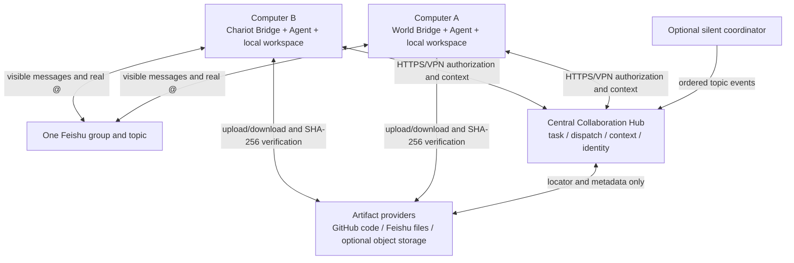

# Distributed Deployment Status And Roadmap

[Back to README](../README.md) | [中文](./DISTRIBUTED_DEPLOYMENT_ROADMAP.zh-CN.md) |
[Concepts](./COLLABORATION_CONCEPTS.md) | [Design](./DESIGN.md) |
[Windows operations](./WINDOWS_OPERATIONS.md)

This document defines the correct target topology, capability status and
delivery order for multi-computer collaboration. Every capability is marked
Implemented or Planned P0/P1/P2 and moves to Implemented after its acceptance
criteria pass.

## Bottom Line

**Feishu already permits remote Bots to receive messages and visibly mention
one another. The missing work is in the local Hub, Pilot, authentication,
dispatch waiting and file sharing behind Feishu.**

The single-machine Pilot remains the compatible default. The same Pilot now
supports a main PC in `all` mode plus additional remote workers. Automatic
cross-node artifact retrieval and production-grade dispatch remain roadmap work.

## Capability Status And Target

| Capability | Status | Correct target |
| --- | --- | --- |
| Bots send/receive in one Feishu group | Implemented | Every Bridge connects to Feishu independently |
| Real Bot-to-Bot mentions | Implemented | Each app configures bot-message permission and group admission |
| Shared text task context | Implemented | `all` and `worker` nodes use one Hub `publicUrl` |
| Dispatch, ownership and visibility | P0 implemented | Each authenticated principal operates only its Agent identity |
| PPT/PDF/Word artifact sharing | Locator implemented; download planned | Feishu locator plus receiver-side materialization |
| Shared code workspace state | Registration implemented; retrieval planned | Git repository, commit and path locator |
| Secure remote deployment | Planned P0/P2 | Private-network MVP followed by TLS, rotation, limits and audit |
| Turnkey remote operations | P0 implemented | `hub`, `worker`, and backward-compatible `all` roles |

## Foundation To Preserve

The project does not need a replacement orchestrator. Preserve topic-to-task
identity, Hub task truth, real-mention-plus-dispatch authorization, append-only
events, idempotency, owner leases, causal depth, visibility projections,
independent Bot credentials/models/workspaces and the optional silent
coordinator.

The change is to promote the local control plane into a central collaboration
service—not to turn the Hub into another LLM or merge model sessions.

## Target Topology



Workers need no inbound Agent-to-Agent ports. They make outbound connections to
Feishu, the central Hub, GitHub when a code task needs it, and their own model
services. Object storage is optional for large data or archives, not a required
central service for the remote MVP.

### Central Means One Logical Truth, Not Dedicated Hardware

Every Bot computer has a local Bridge and all Bridges connect to one logical
Hub. Its physical placement can evolve:

| Shape | Hub placement | Stage |
| --- | --- | --- |
| Colocated | On computer A beside one Bot | P0 experiment and minimal deployment |
| Always-on node | NAS, small server or internal host | Stable team operation |
| Cloud service | Hub API plus database | Remote teams and production |

In every shape there is one authoritative task/owner/dispatch/idempotency/
visibility state. GitHub and Feishu hold code and ordinary files; the Hub records
their task relationship, producer, integrity and retrieval locator.

## Implemented Foundation And Planned Hardening

### Separate Process Role, Bind Address And Public URL

Pilot supports `hub`, `worker` and backward-compatible `all` roles. A worker receives a
`publicUrl`, shared tenant key and its own credential; it must never create or
start a local Hub. A Hub receives distinct `bindHost`, `port` and `publicUrl`
settings. `runOnThisNode: false` registers a future remote Agent without
launching it on the main PC.

### Bind Credentials To Agent Identity

Each registered Agent has a separate credential, while the central token is
reserved for administration. The server derives the principal
from authentication instead of trusting `actorAgentId` in the request body.
Use Tailscale, WireGuard or an enterprise VPN for the first release; a public
endpoint additionally requires TLS, rotation, limits and audit.

### Continue From Bounded Waiting To Recoverable Claiming

Coordinator and execution Bot events may arrive in either order. The Bridge now
uses a configurable 10-second backoff window. Continue with atomic `claim`, execution heartbeat/lease and
completion endpoints plus long polling, SSE or a background dispatcher. Agent
registration should carry `nodeId`, `instanceId`, `lastSeenAt`, version and
capabilities so restart and duplicate instances are observable.

### Use Provider + Locator For Artifacts

Artifact is a deliverable registration protocol, not a new file server. Use Git
repository + commit + path for code and Markdown; use Feishu `messageId +
fileKey` or Drive token for office files, PDFs, images and user attachments; add
an object-storage key only for large generated data or archival needs. A
receiver materializes its own cache and verifies SHA-256. P0 acceptance includes
proving cross-Bot file-download permissions in a real group.

### Hand Off Workspaces Through Git

Use repository/branch/commit references for code, Feishu Artifact locators for
ordinary files, and ownership or branch-per-agent for concurrent edits. A local absolute
path may be a node cache path, never shared truth.

## Context, Memory And Token Scaling

JSONL currently grows indefinitely, startup replays it and hot task/dispatch/
idempotency indexes stay in memory. Topics are isolated, but all visible events
in one long-lived topic are currently sent again to the Agent. Disk and Hub
memory therefore grow with all tasks; prompt tokens mainly grow with the active
topic. A resumed native Agent session may duplicate Hub history.

The target projection is:

```text
complete append-only source ledger
  -> source-sequenced summary checkpoint
  -> recent original events
  -> current dispatch and active artifacts
  -> Agent prompt
```

Add task cursors, explicit prompt limits, checkpoint provenance and cold-task
archival. Mechanical projection can omit unhelpful repeated runtime events, but
must not delete the source ledger. Semantic summaries record producer, covered
sequence range and source cursor. JSONL remains sufficient for a single-Hub
MVP; SQLite or PostgreSQL later provides transactions and uniqueness constraints.

## Delivery Phases

### P0: Text-Only Remote MVP (implemented in code; second-PC acceptance pending)

- split `bindHost`, `publicUrl` and process role (implemented);
- prevent workers from starting a local Hub;
- provision a common tenant key and per-Agent credentials;
- run over a private VPN, not bare public HTTP;
- use the implemented two-credential HTTP handoff integration test; complete
  the second physical-PC acceptance test.

Acceptance: World on computer A transfers through Feishu, Chariot on computer B
receives the same task ID, filtered conclusions and its own dispatch, while an
unauthorized Agent cannot read them.

### P0: Remote Artifacts

- `git`, `feishu`, `local`, and optional `object` providers are defined;
- Git commit registration and Feishu locator registration are implemented;
- share locator, task ownership, visibility and integrity metadata only;
- materialize a local cache path on the receiving node;
- test cross-Bot Feishu download permission, retry, duplicate registration,
  digest failure and size limits.

Acceptance: a PPT created on computer A can be downloaded without a shared
filesystem, verified, modified on computer B and sent back by B's Bot identity.

### P1: Reliable Dispatch And Presence

Add atomic claim, heartbeat, lease expiry, safe retry, long polling/SSE,
persistent identity/presence and coordinator-order/restart tests.

### P1: Context Checkpoints And Archival

Add cursors, summary checkpoints, recent-event windows, prompt-token metrics,
cold-task unloading and protection against duplicate native-session history.

### P2: Production Hardening

Add SQLite/PostgreSQL adapters and migrations, TLS, credential rotation, audit,
backup/recovery and non-Windows worker/container operation. Multi-Hub high
availability is optional and should not block the two-node MVP.

## GitHub References

- [`iamkentzhu/lark-bot2bot`](https://github.com/iamkentzhu/lark-bot2bot)
  demonstrates a local orchestrator calling a remote Hermes HTTP endpoint. It
  lacks this project's ledger, dual-key authorization and visibility projection.
- [`a2aproject/A2A`](https://github.com/a2aproject/A2A/blob/main/docs/specification.md)
  is useful for Task/Message/Artifact separation, asynchronous lifecycle, push
  notification, Agent Card and authentication concepts. Compatibility can be
  incremental; a rewrite is unnecessary.
- [`microsoft/autogen` distributed group chat sample](https://github.com/microsoft/autogen/tree/main/python/samples/core_distributed-group-chat)
  demonstrates multiple workers connecting to a central runtime host.
- [`larksuite/channel-sdk-node`](https://github.com/larksuite/channel-sdk-node)
  documents the Feishu channel foundation and the `im:message.group_at_msg` /
  `include_bot` requirement for Bot-to-Bot mentions.
- [`aws-samples/sample-lark-mcp-on-agentcore`](https://github.com/aws-samples/sample-lark-mcp-on-agentcore)
  is heavier than this project needs, but is a useful reference for HTTPS
  gateways, token validation, secret storage, persistent state and audit.

## Maintaining This Roadmap

The capability table is the single progress entry point. When a phase ships:

1. pass the acceptance criteria defined here;
2. move the capability from Planned to Implemented;
3. move operational configuration and commands into Windows operations;
4. retain the target architecture and remaining plans while removing obsolete
   transitional notes.

The documentation then always answers: what is the correct shape, how much is
implemented, and what comes next.
