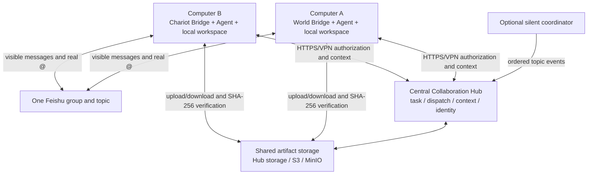

# Distributed Deployment Status And Roadmap

[Back to README](../README.md) | [中文](./DISTRIBUTED_DEPLOYMENT_ROADMAP.zh-CN.md) |
[Concepts](./COLLABORATION_CONCEPTS.md) | [Design](./DESIGN.md) |
[Windows operations](./WINDOWS_OPERATIONS.md)

This document distinguishes “the underlying code uses a network protocol”
from “the project supports a secure, complete multi-computer deployment.” Two
Bots on different computers can collaborate in one Feishu group in principle,
but that topology is not yet turnkey or production-ready.

## Bottom Line

**Feishu already permits remote Bots to receive messages and visibly mention
one another. The missing work is in the local Hub, Pilot, authentication,
dispatch waiting and file sharing behind Feishu.**

Bridge-to-Hub communication already uses HTTP, so a manually configured trusted
LAN can demonstrate text-only context handoff. Current Pilot behavior, absolute
artifact paths and one shared bearer token still make the supported product a
single-machine system. Do not expose the current Hub directly to the Internet.

## Current Support Matrix

| Capability | Multi-computer status | Reason |
| --- | --- | --- |
| Bots send/receive in one Feishu group | Works | Every Bridge connects to Feishu independently |
| Real Bot-to-Bot mentions | Works with permissions | Each app needs bot-message permission and group admission |
| Shared text task context | Protocol foundation only | Client accepts a URL, but Pilot creates and starts a local Hub |
| Dispatch, ownership and visibility | Network-capable but under-authenticated | All callers share one bearer token |
| PPT/PDF/Word artifact sharing | Unsupported | `localPath` belongs to the producing computer |
| One shared code workspace | Unsupported | Uncommitted local state is not replicated |
| Safe Internet deployment | Unsupported | No TLS or per-Agent identity boundary |
| Turnkey remote operations | Unsupported | `Start-CollabAgent` starts a local Hub |

## Foundation To Preserve

The project does not need a replacement orchestrator. Preserve topic-to-task
identity, Hub task truth, real-mention-plus-dispatch authorization, append-only
events, idempotency, owner leases, causal depth, visibility projections,
independent Bot credentials/models/workspaces and the optional silent
coordinator.

The change is to promote the local control plane into a central collaboration
service—not to turn the Hub into another LLM or merge model sessions.

## Target Topology



Workers need no inbound Agent-to-Agent ports. They make outbound connections to
Feishu, the central Hub, artifact storage and their own model services.

## Required Changes

### Separate Process Role, Bind Address And Public URL

Add `hub`, `worker` and backward-compatible `all` roles. A worker receives a
`publicUrl`, shared tenant key and its own credential; it must never create or
start a local Hub. A Hub receives distinct `bindHost`, `port` and `publicUrl`
settings.

### Bind Credentials To Agent Identity

Replace the shared bearer capability with credentials scoped to World,
Chariot, coordinator and administrator roles. The server derives the principal
from authentication instead of trusting `actorAgentId` in the request body.
Use Tailscale, WireGuard or an enterprise VPN for the first release; a public
endpoint additionally requires TLS, rotation, limits and audit.

### Replace The Fixed Dispatch Race With Recoverable Claiming

Coordinator and execution Bot events may arrive in either order. Replace the
short fixed polling window with atomic `claim`, execution heartbeat/lease and
completion endpoints plus long polling, SSE or a background dispatcher. Agent
registration should carry `nodeId`, `instanceId`, `lastSeenAt`, version and
capabilities so restart and duplicate instances are observable.

### Replace Shared Local Paths With Downloadable Artifacts

The shared record should contain an artifact ID, digest, size and remote
locator (`hub`, `s3` or verified `feishu` reference). A receiver downloads into
its own cache and verifies SHA-256. Start with Hub upload/download endpoints or
an object-store adapter. Treat Feishu files as visible copies unless cross-app
resource-download permissions have been proven in a real group.

### Hand Off Workspaces Through Git

Use repository/branch/commit references for code, artifact storage for ordinary
files, and ownership or branch-per-agent for concurrent edits. A local absolute
path may be a node cache path, never shared truth.

## Context, Memory And Token Scaling

JSONL currently grows indefinitely, startup replays it and hot task/dispatch/
idempotency indexes stay in memory. Topics are isolated, but all visible events
in one long-lived topic are currently sent again to the Agent. Disk and Hub
memory therefore grow with all tasks; prompt tokens mainly grow with the active
topic. A resumed native Agent session may duplicate Hub history.

The target projection is:

```text
complete append-only source ledger
  -> source-sequenced summary checkpoint
  -> recent original events
  -> current dispatch and active artifacts
  -> Agent prompt
```

Add task cursors, explicit prompt limits, checkpoint provenance and cold-task
archival. Mechanical projection can omit unhelpful repeated runtime events, but
must not delete the source ledger. Semantic summaries record producer, covered
sequence range and source cursor. JSONL remains sufficient for a single-Hub
MVP; SQLite or PostgreSQL later provides transactions and uniqueness constraints.

## Delivery Phases

### P0: Text-Only Remote MVP

- split `bindHost`, `publicUrl` and process role;
- prevent workers from starting a local Hub;
- provision a common tenant key and per-Agent credentials;
- run over a private VPN, not bare public HTTP;
- add a two-isolated-node handoff integration test.

Acceptance: World on computer A transfers through Feishu, Chariot on computer B
receives the same task ID, filtered conclusions and its own dispatch, while an
unauthorized Agent cannot read them.

### P0: Remote Artifacts

- add upload/download or an object-storage backend;
- share locator and integrity metadata only;
- materialize a local cache path on the receiving node;
- test retry, duplicate upload, digest failure, authorization and size limits.

Acceptance: a PPT created on computer A can be downloaded without a shared
filesystem, verified, modified on computer B and sent back by B's Bot identity.

### P1: Reliable Dispatch And Presence

Add atomic claim, heartbeat, lease expiry, safe retry, long polling/SSE,
persistent identity/presence and coordinator-order/restart tests.

### P1: Context Checkpoints And Archival

Add cursors, summary checkpoints, recent-event windows, prompt-token metrics,
cold-task unloading and protection against duplicate native-session history.

### P2: Production Hardening

Add SQLite/PostgreSQL adapters and migrations, TLS, credential rotation, audit,
backup/recovery and non-Windows worker/container operation. Multi-Hub high
availability is optional and should not block the two-node MVP.

## GitHub References

- [`iamkentzhu/lark-bot2bot`](https://github.com/iamkentzhu/lark-bot2bot)
  demonstrates a local orchestrator calling a remote Hermes HTTP endpoint. It
  lacks this project's ledger, dual-key authorization and visibility projection.
- [`a2aproject/A2A`](https://github.com/a2aproject/A2A/blob/main/docs/specification.md)
  is useful for Task/Message/Artifact separation, asynchronous lifecycle, push
  notification, Agent Card and authentication concepts. Compatibility can be
  incremental; a rewrite is unnecessary.
- [`microsoft/autogen` distributed group chat sample](https://github.com/microsoft/autogen/tree/main/python/samples/core_distributed-group-chat)
  demonstrates multiple workers connecting to a central runtime host.
- [`larksuite/channel-sdk-node`](https://github.com/larksuite/channel-sdk-node)
  documents the Feishu channel foundation and the `im:message.group_at_msg` /
  `include_bot` requirement for Bot-to-Bot mentions.
- [`aws-samples/sample-lark-mcp-on-agentcore`](https://github.com/aws-samples/sample-lark-mcp-on-agentcore)
  is heavier than this project needs, but is a useful reference for HTTPS
  gateways, token validation, secret storage, persistent state and audit.

## Accurate Claims Until This Ships

It is accurate to say the Hub API has a remote-capable protocol foundation and
that trusted-private-network text experiments are possible with manual setup.
It is not accurate to claim supported multi-computer deployment, production
Internet security, remote artifact access, context summaries or automatic
archival yet.
