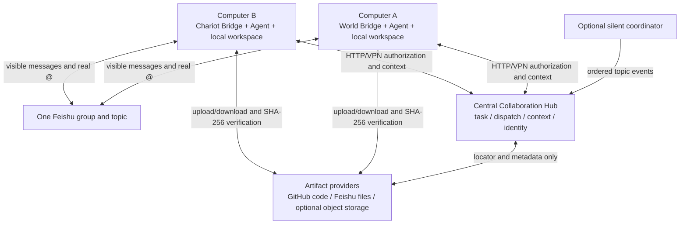

# Distributed Deployment Status And Roadmap

[Back to README](../README.md) | [中文](./DISTRIBUTED_DEPLOYMENT_ROADMAP.zh-CN.md) |
[Concepts](./COLLABORATION_CONCEPTS.md) | [Design](./DESIGN.md) |
[Windows operations](./WINDOWS_OPERATIONS.md) | [Networking](./NETWORKING.md)

Every capability below is marked Implemented or Planned P0/P1/P2 and moves to
Implemented once its acceptance criteria pass.

## Bottom Line

**Feishu already permits remote Bots to receive messages and visibly mention
one another. The missing work is in the local Hub, Pilot, authentication,
dispatch waiting and file sharing behind Feishu.**

The single-machine Pilot remains the compatible default. The same Pilot now
supports a main PC in `all` mode plus additional remote `worker` nodes and a
center-only `hub` node. Per-Agent credentials, remote Hub addressing, one Hub
task truth and cross-node Artifact locators are implemented. Automatic
receiver-side Artifact download, reconnect recovery after a Hub restart,
credential rotation, request limits and audit remain planned.

## Capability Status And Target

| Capability | Status | Correct target |
| --- | --- | --- |
| Bots send/receive in one Feishu group | Implemented | Every Bridge connects to Feishu independently |
| Real Bot-to-Bot mentions | Implemented | Each app configures bot-message permission and group admission |
| Shared text task context | Implemented | `all` and `worker` nodes address one Hub through `hub.publicUrl` and share one `hub.tenantKey` |
| Local observed-topic journal and on-demand context | Implemented | Each agent records only what it observed, one file per topic; prompts carry the current dispatch and a local query entry point |
| Process roles and remote addressing | Implemented | `role: all \| hub \| worker`, `hub.bindHost`, `hub.port`, `hub.publicUrl`, `nodeId` |
| Per-Agent credentials | Implemented | `agent-tokens.json` on the Hub, `credentialEnv`/`credential` on the node, one distinct secret per authenticated principal |
| Dispatch, ownership and visibility | Implemented | Each authenticated principal operates only its Agent identity |
| Hub single task truth | Implemented | One append-only ledger per Hub holds tasks, ownership, dispatches, acks and idempotency |
| PPT/PDF/Word artifact sharing | Locator implemented; download planned | Feishu locator plus receiver-side materialization |
| Shared code workspace state | Registration implemented; retrieval planned | Git repository, commit and path locator |
| Artifact resolution on demand | Implemented | `collab-artifact.cmd resolve --list` and `--id`/`--name` under Hub participation and visibility rules |
| Secure remote deployment | Partly implemented | Private-network HTTP plus per-Agent tokens today; TLS, rotation, limits and audit planned |
| Remote start/stop | Partly implemented | Role-aware local start/stop for `hub`, `worker` and backward-compatible `all`; controlling another machine remotely is not implemented |

## Foundation To Preserve

The project does not need a replacement orchestrator. Preserve topic-to-task
identity, Hub task truth, real-mention-plus-dispatch authorization, append-only
events, idempotency, owner leases, causal depth, visibility projections,
independent Bot credentials/models/workspaces and the optional silent
coordinator.

The work is to promote the local control plane into a central collaboration
service. It does not turn the Hub into another LLM or merge Agent model sessions.

## Target Topology


```mermaid
flowchart TB
  F["One Feishu group and topic"]
  H["Central Collaboration Hub\ntask / dispatch / context / identity"]
  S["Artifact providers\nGitHub code / Feishu files / optional object storage"]
  A["Computer A\nWorld Bridge + Agent + local workspace"]
  B["Computer B\nChariot Bridge + Agent + local workspace"]
  C["Optional silent coordinator"]

  A <-->|"visible messages and real @"| F
  B <-->|"visible messages and real @"| F
  C -->|"ordered topic events"| H
  A <-->|"HTTP/VPN authorization and context"| H
  B <-->|"HTTP/VPN authorization and context"| H
  H <-->|"locator and metadata only"| S
  A <-->|"upload/download and SHA-256 verification"| S
  B <-->|"upload/download and SHA-256 verification"| S
```

Workers need no inbound Agent-to-Agent ports. They make outbound connections to
Feishu, the central Hub, GitHub when a code task needs it, and their own model
services.

The shared protocol carries control messages and Artifact metadata. File content
never travels over it. The Hub copies no bytes and serves no Artifact download:
publishing a file sends it through Feishu (or registers a Git revision), and the
receiver obtains it from that provider. Object storage is optional, for large
data or archives; the remote MVP does not require a central storage service.

### Central Means One Logical Truth, Not Dedicated Hardware

Every Bot computer has a local Bridge and all Bridges connect to one logical
Hub. Its physical placement can evolve:

| Shape | Hub placement | Stage |
| --- | --- | --- |
| Colocated | On computer A beside one Bot | P0 experiment and minimal deployment |
| Always-on node | NAS, small server or internal host | Stable team operation |
| Cloud service | Hub API plus database | Remote teams and production |

In every shape there is one authoritative task/owner/dispatch/idempotency/
visibility state. GitHub and Feishu hold code and ordinary files; the Hub records
their task relationship, producer, integrity and retrieval locator.

## Implemented Foundation And Planned Hardening

### Process Role, Bind Address And Public URL

The Pilot manifest carries `role: "all" | "hub" | "worker"`; omitting it means
`all`, which keeps an existing single-computer manifest working unchanged. The
role decides two independent things:

| Role | Runs a local Hub | Starts local Agents |
| --- | --- | --- |
| `all` | yes | yes |
| `hub` | yes | no |
| `worker` | no | yes |

A worker never creates the Hub token file, the tenant key file, `agent-tokens.json`
or `hub-config.json`, and `Start-CollabHub.ps1` refuses to run with
`This Pilot config is a worker node and does not run a local Hub.` Before starting
an Agent on a non-Hub role the Pilot probes the remote Hub and fails fast with
`Remote Hub is unavailable: <url>`.

`hub.bindHost` (or the legacy `hub.host`) becomes the Hub's listen host and
defaults to `127.0.0.1`; `hub.port` defaults to `17321`. `hub.publicUrl` is the
address every node uses to reach the Hub and defaults to `http://<host>:<port>`
with `0.0.0.0` rewritten to `127.0.0.1`. A worker manifest needs `hub.publicUrl`
and `hub.tenantKey` and nothing else from the Hub block. `nodeId` labels the
machine and defaults to the computer name; together with the Agent id it forms
`LARK_COLLAB_INSTANCE_ID` (`<nodeId>:<agentId>`). The Bridge reports `nodeId` and
`instanceId` on every identity registration; the package version is included only
when `npm_package_version` is set, which is normally absent because the Pilot
runs `node dist\cli.js` directly.

A worker manifest fragment, showing that `credentialEnv` belongs to the Agent
entry, not to `hub`:

```json
{
  "schemaVersion": 2,
  "role": "worker",
  "nodeId": "second-pc",
  "hub": {
    "publicUrl": "https://collab.example.internal",
    "tenantKey": "shared-collaboration-domain"
  },
  "agents": [
    {
      "id": "reviewer",
      "displayName": "Reviewer",
      "credentialEnv": "LARK_COLLAB_REVIEWER_TOKEN"
    }
  ]
}
```

`runOnThisNode: false` keeps an Agent in the Hub's roster and in
`hub-config.json` while excluding it from the local start/stop/validate set. That
is the supported way to register an Agent that will run on another computer.

### Bind Credentials To Agent Identity

On a Hub or `all` node the Pilot keeps one file per credential kind under
`.runtime\`:

| File | Contents |
| --- | --- |
| `hub-token.txt` | the Hub admin token, 64 hex characters |
| `tenant-key.txt` | the shared tenant key, from `hub.tenantKey` or generated once |
| `agent-tokens.json` | a flat `{ "<agentId>": "<64 hex>" }` map, one distinct token per enabled Agent |
| `hub-config.json` | the generated Hub configuration, including `auth.agentTokenEnvs` |

`agent-tokens.json` keeps existing entries, generates a token only for an Agent
that lacks one, and does not prune an Agent that has been removed.
`hub-config.json` maps each Agent id to an environment variable name
`LARK_COLLAB_AGENT_TOKEN_<SAFEID>` (uppercased, every character outside
`[A-Z0-9]` replaced by `_`); `run-hub.ps1` computes the same mapping from
`agent-tokens.json` and exports those variables to the Hub process, which refuses
to start if any two credentials are equal (`Hub admin and Agent credentials must
all be unique`).

On the node side an Agent resolves its credential from `agents[].credentialEnv`,
a Process-scope environment variable name and the preferred form. If the
manifest names `credentialEnv` but that variable is empty, the start fails with
`Credential environment variable is not set: <name>`. The literal
`agents[].credential` and then the Agent's entry in `agent-tokens.json` are used
only when the manifest omits `credentialEnv` entirely.
`Export-CollabWorkerConfig.ps1` writes a worker manifest that contains the
exported Agent's credential, forces `enabled`/`runOnThisNode` to `true`, replaces
`nodeId` with the placeholder `replace-with-<agent>-node-name`, and carries
`hub.publicUrl` plus `hub.tenantKey`. The receiving machine must set `nodeId`, the
Agent id, the launch path and `LARK_CHANNEL_HOME` to its own values. That Agent id
is the Agent's Hub-side identity, not a free local nickname: the Bridge reports it
as `LARK_COLLAB_AGENT_ID`, and the Hub rejects a credential that acts as another
agent or routes a message to another target, so it has to stay the id the Hub
registered for that credential. The file must be transferred privately and kept
out of Git.

Because Task Scheduler promotes User-scope variables into the process environment
but an interactive PowerShell session does not, both `Start-CollabAgent.ps1` and
`Run-CollabAgentSupervisor.ps1` copy the User-scope value of `credentialEnv` into
Process scope before starting the Agent. Store a worker token as a User-scope
variable and the same manifest works interactively and at logon.

The server derives the principal from the `Authorization: Bearer` credential
(admin token first, then each Agent token) rather than trusting `actorAgentId` in
the request body. An Agent credential can only read and act as its own Agent id
(`agent credential cannot act as another agent`), can only route an observed
message to itself, and only a task participant may read context or publish an
action or artifact. Ownership checks are layered on top: `handoff`, `ask` and
`complete` require the currently active owner, every action needs an accepted
causal parent dispatch, and each dispatch can be acknowledged only by its target
Agent. Causal depth and autonomous reply turns are bounded by
`hub.maxCausalDepth` (default `8`) and `hub.maxConversationTurns` (default `32`);
owner leases expire after `hub.leaseMinutes` (default `30`).

Use Tailscale, WireGuard or an enterprise VPN for the first release; a public
endpoint additionally requires TLS, rotation, limits and audit. A shared token is
not protected by keeping the URL secret.

### Continue From Bounded Waiting To Recoverable Claiming

A coordinator or execution Bot event may arrive in either order. The Bridge
already survives that: it submits the human message, accepts the dispatch routed
to it, acknowledges it idempotently (`accept:<dispatchId>:<messageId>`), and a
coordinator-source Bridge polls `GET /v1/dispatches/agents/<id>` for a
configurable window (`LARK_COLLAB_DISPATCH_WAIT_MS`, default `10000` ms) with
100 ms → 1 s backoff before concluding that no work is authorized. Duplicate or
retried submissions do not create a second dispatch, and a torn final ledger line
is discarded whole on replay.

What remains is recovery rather than first-delivery correctness. Add atomic
`claim`, execution heartbeat/lease and completion endpoints plus long polling, SSE
or a background dispatcher, so a Bridge that loses the Hub mid-run can resume
instead of waiting for the next Feishu event:

```text
POST /v1/dispatches/:id/claim
POST /v1/dispatches/:id/heartbeat
POST /v1/dispatches/:id/complete
```

These routes do not exist today; only `POST /v1/dispatches/:id/ack` does. Agent
registration does carry `nodeId`, `instanceId` and version, but the registry is
in-memory and is lost when the Hub restarts, so persistent presence and an
explicit reconnect path are still to build.

### Use Provider + Locator For Artifacts

Artifact is a deliverable registration protocol. It does not add a file server.
Publishing snapshots the file into the node's own cache (`<LARK_COLLAB_ARTIFACT_ROOT>\<taskId>\<sha256>\<name>`),
computes its SHA-256 and records name, kind, size, MIME, the local cache path and a
portable locator. The locator is the cross-node truth:

| Content | Provider | Locator |
| --- | --- | --- |
| Office files, PDFs, images, user attachments | Feishu | `{ provider: "feishu", messageId, fileKey }`, filled from the real send result |
| Code, Markdown, configuration | Git | `{ provider: "git", repository, commit, path? }` |
| Current node's cache | local | `{ provider: "local", path }`, never a cross-node reference |
| Optional large data or archives | object | `{ provider: "object", uri }` |

`collab-artifact.cmd publish` sends the snapshot through Feishu and only then
registers the Feishu locator, so a `fileKey` that exists in the ledger has already
been delivered. `collab-artifact.cmd register-git` still snapshots the file for
hashing and caching but replaces the locator with the Git revision; it performs no
Git network access.

Receivers read the record with `collab-artifact.cmd resolve --list`, which prints a
compact catalog (`id`, `name`, `kind`, `size`, `mime`) without exposing paths or
locators, or with `--id`/`--name` for one full record. Resolution goes through
`GET /v1/tasks/<taskId>/context`, so the Hub's participation and visibility rules
bound what can be listed. A `local` locator that points at another machine's
`C:\…` path is still returned as-is: nothing downloads or verifies a remote
Artifact automatically, and `LARK_COLLAB_ARTIFACT_ROOT` is a cache, not a shared
store.

P0 acceptance still includes proving cross-Bot file-download permissions in a real
group, and no Artifact size or count limit exists in code.

### Hand Off Workspaces Through Git

Use repository/branch/commit references for code, Feishu Artifact locators for
ordinary files, and ownership or branch-per-agent for concurrent edits. A local
absolute path may be a node cache path, never shared truth.

## Context, Memory And Token Scaling

Three different things grow, and only the prompt is bounded today:

- **Hub ledger:** JSONL is appended for every submit and ack, the Hub replays all
  of it on start, and the task, dispatch and idempotency indexes stay in memory.
  There is no retention or archival.
- **Local journal:** one append-only file per Agent and per topic, written by the
  node that observed the traffic, never replicated and never replayed into a
  prompt. The Pilot points `LARK_COLLAB_NODE_LEDGER_ROOT` at
  `.runtime\local-topic-ledger\<agentId>`, and the Bridge writes
  `<root>\collaboration\topics\<chatId>\<threadId>.jsonl` (or `_chat.jsonl` for a
  chat that is not a topic). Read on demand with
  `lark-channel-bridge local-context search|read`, which returns the newest
  matching records with a `--limit` default of 12 and a hard cap of 50.
- **Bot prompt:** the Hub sends a small envelope, not a topic transcript. The
  `collaboration_context` section contains `taskId`, `currentOwner`,
  `yourDispatch` (the whole dispatch record, whose objective carries the actual
  request), the available Agent ids and display names, a fixed rules list and a
  `localJournal` pointer. The context route also returns conversation entries and
  an Artifact catalog; neither is injected into the prompt, so the current request
  cannot grow with topic history.

The target projection is:

```text
complete append-only source ledger
  -> source-sequenced summary checkpoint
  -> recent original events
  -> current dispatch and active artifacts
  -> Agent prompt
```

Candidate settings for that work:

```json
{
  "context": {
    "recentEventLimit": 20,
    "maxPromptTokens": 30000,
    "checkpointEveryEvents": 50
  },
  "retention": {
    "archiveCompletedAfterDays": 30,
    "retainArchivedDays": 90
  }
}
```

Add explicit prompt budgets (task cursors, token metrics, summary checkpoint
provenance), native-session compaction and cold-task archival, then make the Hub
store swappable. The source ledger is never deleted by prompt projection. A
semantic summary produced by an Agent must record the producer, the covered
sequence range and the source, and the original events must stay readable by
cursor. Long-finished tasks can be offloaded from hot memory into an archive.
JSONL remains sufficient for a single-Hub MVP; SQLite or PostgreSQL later
provides transactions and uniqueness constraints.

## Delivery Phases

### P0: Text-Only Remote MVP (implemented in code; second-PC acceptance pending)

- split `bindHost`, `publicUrl` and process role (implemented);
- prevent workers from starting a local Hub (implemented);
- provision a common tenant key and per-Agent credentials (implemented);
- bind each credential to one Agent identity on every route (implemented);
- run over a private VPN, not bare public HTTP;
- use the implemented two-credential HTTP handoff integration test; complete
  the second physical-PC acceptance test.

Acceptance: World on computer A transfers through Feishu, Chariot on computer B
receives the same task ID and its own dispatch, the Hub holds the filtered task
state for that task, and an unauthorized Agent cannot read it.

### P0: Remote Artifacts

- `git`, `feishu`, `local`, and optional `object` providers are defined;
- Git commit registration and Feishu locator registration are implemented;
- share locator, task ownership, visibility and integrity metadata only;
- on-demand catalog and full-record resolution are implemented;
- materialize a local cache path on the receiving node;
- test cross-Bot Feishu download permission, retry, duplicate registration,
  digest failure and size limits.

Acceptance: a PPT created on computer A can be downloaded without a shared
filesystem, verified, modified on computer B and sent back by B's Bot identity.

### P1: Reliable Dispatch And Presence

Add atomic claim, heartbeat, lease expiry, safe retry, long polling/SSE,
persistent identity/presence and coordinator-order/Hub-restart recovery tests.

### P1: Context Checkpoints And Archival

The current envelope already keeps the prompt independent of topic history, and
Artifact records are selected on demand. Add explicit prompt budgets, summary
checkpoints, prompt-token metrics, cold-task unloading and protection against
duplicate native-session history.

### P2: Production Hardening

Add SQLite/PostgreSQL adapters and migrations, TLS, credential rotation, request
limits, audit, backup/recovery and non-Windows worker/container operation.
Multi-Hub high availability is optional and should not block the two-node MVP.

## GitHub References

- [`iamkentzhu/lark-bot2bot`](https://github.com/iamkentzhu/lark-bot2bot)
  demonstrates a local orchestrator calling a remote Hermes HTTP endpoint. It
  lacks this project's ledger, dual-key authorization and visibility projection.
- [`a2aproject/A2A`](https://github.com/a2aproject/A2A/blob/main/docs/specification.md)
  is useful for Task/Message/Artifact separation, asynchronous lifecycle, push
  notification, Agent Card and authentication concepts. Compatibility can be
  incremental; a rewrite is unnecessary.
- [`microsoft/autogen` distributed group chat sample](https://github.com/microsoft/autogen/tree/main/python/samples/core_distributed-group-chat)
  demonstrates multiple workers connecting to a central runtime host.
- [`larksuite/channel-sdk-node`](https://github.com/larksuite/channel-sdk-node)
  documents the Feishu channel foundation. Whether one bot receives another
  bot's message depends on the app permissions configured for it in the Feishu
  console.
- [`aws-samples/sample-lark-mcp-on-agentcore`](https://github.com/aws-samples/sample-lark-mcp-on-agentcore)
  is heavier than this project needs, but is a useful reference for HTTPS
  gateways, token validation, secret storage, persistent state and audit.

## Maintaining This Roadmap

The capability table is the single progress entry point. When a phase ships:

1. pass the acceptance criteria defined here;
2. move the capability from Planned to Implemented;
3. move operational configuration and commands into Windows operations;
4. retain the target architecture and remaining plans while removing obsolete
   transitional notes.

The documentation then always answers: what is the correct shape, how much is
implemented, and what comes next.
