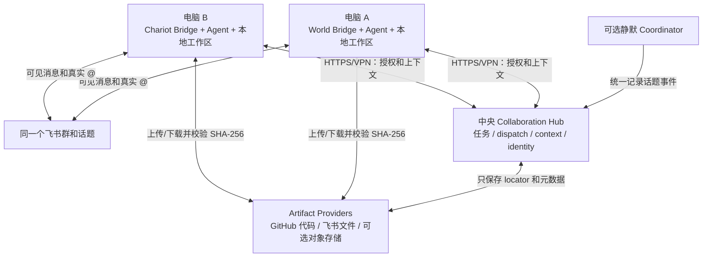

# 跨电脑协作现状与路线图

[返回中文 README](../README.zh.md) | [English](./DISTRIBUTED_DEPLOYMENT_ROADMAP.md) |
[概念入门](./COLLABORATION_CONCEPTS.zh-CN.md) | [设计原理](./DESIGN.zh-CN.md) |
[Windows 运维](./WINDOWS_OPERATIONS.zh-CN.md) | [多电脑联网](./NETWORKING.zh-CN.md)

本文定义跨电脑协作的正确目标形态、能力状态和实施顺序。每项能力使用“已实现”或
“计划 P0/P1/P2”标记；达到对应验收标准后直接更新状态，使本文始终描述项目正在
走向的正确架构。

## 一句话结论

**飞书已经允许异地 Bot 收发消息和真实互相 `@`；需要改造的是飞书背后的本地
Hub、Pilot、鉴权、dispatch 等待和文件共享。**

单机 Pilot 仍是默认兼容基线；同一套 Pilot 现已支持主电脑以 `all` 角色兼任中心和
执行节点，并允许额外 `worker` 连接。跨电脑文件自动取得和生产级可靠调度继续演进。

## 能力状态与目标

| 能力 | 状态 | 正确目标 |
| --- | --- | --- |
| 两个 Bot 在同一飞书群收发消息 | 已实现 | 每个 Bridge 独立连接飞书 |
| Bot 之间真实 `@` | 已实现 | 每个飞书应用配置 bot-to-bot 消息权限和独立群准入 |
| 共享文字任务上下文 | 已实现 | `all` 和 `worker` 通过 `publicUrl` 连接同一个中央 Hub |
| 有界提示投影 | 已实现 | 原始需求、最近语义事件和按需 Artifact |
| dispatch、所有权和可见性 | 已实现 P0 | 每个认证主体只能操作自己的 Agent 身份 |
| 共享 PPT/PDF/Word 等文件 | 已实现 locator；计划自动下载 | Artifact 优先引用飞书文件，并在接收节点本地落盘 |
| 共享代码工作区状态 | 已实现登记；计划自动取得 | Artifact 引用 Git repository、commit 和 path |
| 安全远程部署 | 计划 P0/P2 | 私网 MVP；TLS、轮换、限流和审计完成生产化 |
| 开箱即用跨机启停 | 已实现 P0 | Pilot 支持 `hub`、`worker`、`all`，默认保持单机 `all` |

## 当前设计中已经可复用的基础

不需要推翻现有 Hub。以下能力应该保留：

- 一个飞书话题稳定映射一个任务；
- Hub 是任务状态的唯一真相；
- 真实 `@` 与正式 dispatch 的双钥匙；
- 追加式事件、幂等键、负责人 lease 和因果深度；
- 按参与关系与可见性生成上下文投影；
- 每个 Bot 保留自己的飞书身份、模型、登录和工作区；
- 可选静默 coordinator 统一记录飞书事件。

跨电脑改造应把“本地控制面”提升为“中央协作服务”，而不是把 Hub 变成一个新的
LLM 或让 Agent 直接共享彼此的模型会话。

## 目标部署形态



Agent 不需要互相开放端口。每台执行电脑只需要主动连接飞书、中央 Hub、GitHub（代码
任务需要时）和自己的模型服务。对象存储是大文件或长期归档的可选 provider，不是
跨电脑 MVP 的必备中央服务。

### 中央表示一份逻辑真相，不表示一台专用机器

每台 Bot 电脑都有自己的本地 Bridge；所有 Bridge 连接同一个逻辑 Hub。Hub 的物理
位置可以按规模选择：

| 形态 | Hub 运行位置 | 适用阶段 |
| --- | --- | --- |
| 共置 | 与电脑 A 的 Bot 同机 | P0 实验和最小部署 |
| 常在线节点 | NAS、小服务器或公司内网主机 | 稳定团队运行 |
| 云服务 | Hub API + 数据库 | 远程团队和生产化 |

无论物理形态如何，任务、负责人、dispatch、幂等和上下文可见性只有一份权威状态。
GitHub 和飞书分别保存代码与普通文件；Hub 保存它们属于哪个任务、由谁交付、怎样
验证和怎样取得。

## 已实现基础与后续改进

### Pilot 部署角色和地址

Pilot 使用 `bindHost` 控制中央 Hub 监听，使用 `publicUrl` 控制本机或远程 Bridge
访问地址。省略 `role` 时自动使用 `all`，保持旧清单的一台电脑完整运行方式：

```json
{
  "role": "worker",
  "hub": {
    "publicUrl": "https://collab.example.internal",
    "tenantKey": "shared-collaboration-domain",
    "credentialEnv": "LARK_COLLAB_AGENT_TOKEN"
  }
}
```

`worker` 不创建账本和中央 token，也不会启动本机 Hub。`all` 同时运行 Hub 和本机 Bot；
`runOnThisNode: false` 可让主节点登记将来运行在别处的 Agent。

### 每 Agent 凭据证明调用者是谁

Hub 为每个 Agent 生成独立凭据，并从认证主体约束 identity、context、dispatch、ack、
action 和 artifact 的 Agent ID；admin token 留给中央启动与诊断：

```text
world credential       -> 只能以 world 身份领取和回写
chariot credential     -> 只能以 chariot 身份领取和回写
coordinator            -> 与中央 Hub 同进程写入规范化飞书消息
admin credential       -> 只用于中央启动、配置和诊断
```

第一阶段优先使用 Tailscale、WireGuard 或企业 VPN 形成私网；正式公网入口需要 TLS、
凭据轮换、限流、请求大小限制和审计。共享 token 不能仅靠隐藏 URL 保护。

### 跨网等待与下一步可靠调度

Coordinator 模式现按可配置等待窗口轮询 dispatch，默认 10 秒并逐步退避，覆盖普通
跨网乱序。生产级目标仍是原子 claim、执行 lease 和可恢复等待，对应接口可演进为：

```text
POST /v1/dispatches/:id/claim
POST /v1/dispatches/:id/heartbeat
POST /v1/dispatches/:id/complete
```

Bridge 可以使用长轮询、SSE 或后台拉取。Agent 身份注册还应带上 `nodeId`、
`instanceId`、`lastSeenAt`、版本和能力，Hub 才能区分离线、重连和重复实例。

### Artifact 使用 provider + locator

共享协议使用远程 locator 作为跨节点真相；`C:\...` 或 `/home/...` 只表示某个节点
完成下载后的本地缓存。建议模型：

```ts
interface SharedArtifact {
  id: string;
  name: string;
  sha256: string;
  size: number;
  locator: {
    provider: 'git' | 'feishu' | 'object';
    repository?: string;
    commit?: string;
    path?: string;
    objectKey?: string;
    messageId?: string;
    fileKey?: string;
  };
}
```

Artifact 是交付件登记协议，不是新的文件服务器。推荐默认策略：

- 代码、Markdown 和配置登记 Git repository + commit + path；
- PPT、Word、Excel、PDF、图片和用户附件登记飞书 `messageId + fileKey` 或云盘 token；
- 超大生成数据或长期归档按需要登记对象存储 objectKey。

接手者按 provider 拉取到自己的缓存并验证 SHA-256。P0 需要真实验证不同 Bot 应用对
同一群文件的下载权限；验证通过后飞书就是普通交付件的默认传输与存储层。对象存储
仅作为权限模型或文件规模不适合飞书时的扩展 provider。

### 工作区交接需要 Git 语义

跨电脑后，电脑 A 的未提交代码和本地依赖不会自动出现在电脑 B。应明确约定：

- 代码通过 repository、branch 和 commit 交接；
- 普通文件优先通过飞书 Artifact locator 交接；
- 同一分支并发编辑需要所有权或 branch-per-agent；
- 本机绝对路径只允许作为节点缓存路径，不能作为共享真相。

## 上下文、内存和 Token 的扩展计划

当前 JSONL 会持续追加，Hub 启动时重放全部记录，并把热记录、任务、dispatch 和
幂等索引保留在内存。当前提示投影已经只保留原始需求、最近 8 条语义事件和 20 项
Artifact 精简目录，完整 Artifact 记录按本轮引用选择。Agent 原生 session 仍可能
独立保留更早对话。

目标不是删除事实，而是把事实来源和提示投影分开：

```text
完整追加式原始账本
  -> 带来源序号的阶段摘要检查点
  -> 最近若干原始事件
  -> 本次 dispatch 和活跃 Artifact
  -> Agent prompt
```

建议增加：

```json
{
  "context": {
    "recentEventLimit": 20,
    "maxPromptTokens": 30000,
    "checkpointEveryEvents": 50
  },
  "retention": {
    "archiveCompletedAfterDays": 30,
    "retainArchivedDays": 90
  }
}
```

最近事件窗口和机械事件省略已经实现，但不会删除原始账本。下一步增加任务游标、
token 指标、摘要检查点来源、原生 session 压缩和冷任务归档。语义摘要若由 Agent
生成，必须记录生成者、覆盖序号和来源，允许按游标回读原事件。
完成很久的任务可以从热内存卸载到归档；单 Hub MVP 可继续使用 JSONL，之后再迁移
到 SQLite 或 PostgreSQL，用事务和唯一约束保护 dispatch 与幂等性。

## 分阶段实施

### P0：跨机文字协作 MVP（代码已实现，待第二台真机验收）

- 已拆分 `bindHost`、`publicUrl` 和 `role`；
- worker 连接远程 Hub，不启动本机 Hub；
- 统一分发 tenant key，使用每 Agent 独立凭据；
- 先通过私有 VPN 连接，不开放裸 HTTP 公网端口；
- 已增加两个独立 Agent 凭据客户端经同一 HTTP Hub 交接的集成测试；第二台真机待验收。

验收：电脑 A 的 World 在飞书正式交接后，电脑 B 的 Chariot 能取得相同 taskId、
筛选后的前序结论和自己的 dispatch，且未授权 Agent 不能读取。

### P0：跨机文件交付

- 已定义 `git`、`feishu`、`local` 和可选 `object` Artifact provider；
- 已支持登记 Git commit locator，并在标识齐全时登记飞书 locator；
- Hub 共享 locator、任务归属、可见性和完整性信息；
- Bridge 下载后生成当前节点的 `materializedPath`；
- 测试跨 Bot 飞书下载权限、断线重试、重复登记、哈希错误和大文件限制。

验收：电脑 A 发布的 PPT 在电脑 B 无共享磁盘的情况下可下载、验签、修改并重新
以电脑 B Bot 的身份发回原话题。

### P1：可靠调度和在线状态

- 原子 claim、heartbeat、lease 过期和安全重试；
- 长轮询/SSE 或后台 dispatcher；
- 持久 Agent identity 与在线状态；
- coordinator 事件乱序和 Hub 重启恢复测试。

### P1：上下文检查点和归档

- 已实现最近事件窗口和按需 Artifact 选择；
- 任务级游标和摘要检查点；
- 提示 token 上限和可观测指标；
- 完成任务归档、热内存卸载和恢复；
- 防止 Agent 原生 session 与 Hub 全历史重复注入。

### P2：生产化

- SQLite/PostgreSQL 存储适配器和 schema migration；
- TLS、凭据轮换、审计、备份与恢复；
- Windows 之外的 worker service/容器运行方式；
- 需要时再考虑多 Hub 高可用，不在两节点 MVP 中提前引入。

## 可借鉴的 GitHub 项目和标准

- [`iamkentzhu/lark-bot2bot`](https://github.com/iamkentzhu/lark-bot2bot)：已经支持
  本地编排器通过 HTTP 调用远程 Hermes，可参考异地 Agent endpoint 配置；它没有
  本项目的任务账本、双钥匙授权和可见性投影，不能直接替换 Hub。
- [`a2aproject/A2A`](https://github.com/a2aproject/A2A/blob/main/docs/specification.md)：
  可参考 Task、Message、Artifact、异步状态、push notification、Agent Card 和认证
  的分离。建议让本项目逐步兼容这些概念，不必整体重写。
- [`microsoft/autogen` distributed group chat sample](https://github.com/microsoft/autogen/tree/main/python/samples/core_distributed-group-chat)：
  可参考多个 Agent worker 连接中央 runtime host、注册和序列化的形态。
- [`larksuite/channel-sdk-node`](https://github.com/larksuite/channel-sdk-node)：本项目
  的飞书通道基础，也说明 bot-to-bot `@` 依赖 `im:message.group_at_msg/include_bot`
  权限；缺失时飞书会静默不投递。
- [`aws-samples/sample-lark-mcp-on-agentcore`](https://github.com/aws-samples/sample-lark-mcp-on-agentcore)：
  架构较重，但其 HTTPS 网关、token 校验、秘密存储、持久状态和审计可作为公网部署
  的安全参考。

## 路线图维护方式

能力状态表是跨电脑功能的唯一进度入口。每个阶段完成时：

1. 先通过本节定义的验收标准；
2. 把对应能力从“计划”更新为“已实现”；
3. 将已经落地的配置和命令移入 Windows 运维文档；
4. 保留目标架构和仍未完成的后续计划，删除已经失效的临时说明。

这样文档始终回答“正确形态是什么、现在完成到哪里、下一步做什么”，而不是维护
一套会随版本过期的宣传口径。
