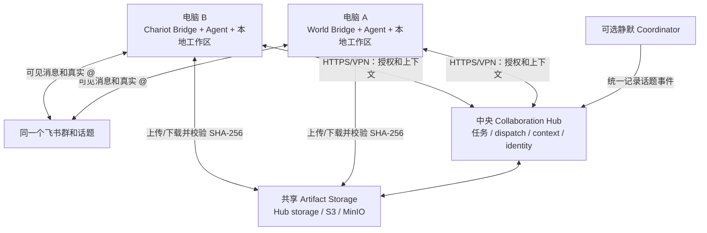

# 跨电脑协作现状与路线图

[返回中文 README](../README.zh.md) | [English](./DISTRIBUTED_DEPLOYMENT_ROADMAP.md) |
[概念入门](./COLLABORATION_CONCEPTS.zh-CN.md) | [设计原理](./DESIGN.zh-CN.md) |
[Windows 运维](./WINDOWS_OPERATIONS.zh-CN.md)

本文区分“底层代码能够联网”和“项目正式支持跨电脑部署”。截至当前版本，两个
Bot 分别运行在不同电脑上并通过同一飞书群协作在架构上可行，但还不是开箱即用、
安全、完整的受支持部署方式。

## 一句话结论

**飞书已经允许异地 Bot 收发消息和真实互相 `@`；需要改造的是飞书背后的本地
Hub、Pilot、鉴权、dispatch 等待和文件共享。**

当前 Bridge 到 Hub 本来就是 HTTP 客户端，因此手工配置可以做只含文字上下文的
可信局域网实验。现有 Pilot、绝对路径 Artifact 和共享 Bearer token 仍然把系统
限制在单机，不应把当前 Hub 直接暴露到公网。

## 当前支持矩阵

| 能力 | 当前跨电脑状态 | 主要原因 |
| --- | --- | --- |
| 两个 Bot 在同一飞书群收发消息 | 可以 | 每个 Bridge 独立连接飞书 |
| Bot 之间真实 `@` | 可以但需权限 | 每个飞书应用需要 bot-to-bot 消息权限和独立群准入 |
| 共享文字任务上下文 | 底层可行，Pilot 未支持 | Client 已使用 Hub URL，但脚本仍读取和启动本机 Hub |
| dispatch、所有权和可见性 | 协议可跨网，安全不足 | 当前所有调用者共享一个 Bearer token |
| 共享 PPT/PDF/Word 等文件 | 不支持 | `localPath` 是产出电脑的绝对路径 |
| 共享同一代码工作区 | 不支持 | 未提交的本地目录不会自动出现在另一台电脑 |
| 公网安全部署 | 不支持 | 没有 TLS、每 Agent 身份凭据、限流和远程运维边界 |
| 开箱即用跨机启停 | 不支持 | `Start-CollabAgent` 会自动启动本机 Hub |

## 当前设计中已经可复用的基础

不需要推翻现有 Hub。以下能力应该保留：

- 一个飞书话题稳定映射一个任务；
- Hub 是任务状态的唯一真相；
- 真实 `@` 与正式 dispatch 的双钥匙；
- 追加式事件、幂等键、负责人 lease 和因果深度；
- 按参与关系与可见性生成上下文投影；
- 每个 Bot 保留自己的飞书身份、模型、登录和工作区；
- 可选静默 coordinator 统一记录飞书事件。

跨电脑改造应把“本地控制面”提升为“中央协作服务”，而不是把 Hub 变成一个新的
LLM 或让 Agent 直接共享彼此的模型会话。

## 目标部署形态



Agent 不需要互相开放端口。每台执行电脑只需要主动连接飞书、中央 Hub、共享文件库
和自己的模型服务。

## 当前阻塞点

### Pilot 把监听地址和访问地址混为一谈

当前 `hub.host` 同时被用于 Hub 监听和 Agent 拼接 URL；`0.0.0.0` 又会被脚本转换为
`127.0.0.1`。远程节点还会创建自己的 token、tenant key、账本并自动启动本机 Hub。

目标配置应明确拆开：

```json
{
  "role": "worker",
  "hub": {
    "publicUrl": "https://collab.example.internal",
    "tenantKey": "shared-collaboration-domain",
    "credentialEnv": "LARK_COLLAB_AGENT_TOKEN"
  }
}
```

Hub 节点则配置 `bindHost`、`port` 和 `publicUrl`。部署角色至少支持 `hub`、`worker`
和兼容当前行为的 `all`；worker 模式绝不能自动启动本机 Hub。

### 一个共享 Token 不能证明调用者是谁

当前 Hub 只检查统一 Bearer token，然后相信请求体里的 `agentId`。公网环境中，拿到
token 的调用者理论上可以冒充其他 Agent。

目标是每 Agent 独立凭据，并从认证主体推导身份：

```text
world credential       -> 只能以 world 身份领取和回写
chariot credential     -> 只能以 chariot 身份领取和回写
coordinator credential -> 只能写入规范化飞书消息
admin credential       -> 只用于配置和诊断
```

第一阶段优先使用 Tailscale、WireGuard 或企业 VPN 形成私网；正式公网入口需要 TLS、
凭据轮换、限流、请求大小限制和审计。共享 token 不能仅靠隐藏 URL 保护。

### 固定 500ms 等待不适合跨网

Coordinator 和执行 Bot 可能几乎同时收到飞书事件。当前执行 Bridge 只短暂轮询待处理
dispatch，跨地区延迟、Hub 抖动或事件乱序都可能让一次合法唤醒被忽略。

目标接口应支持原子 claim、执行 lease 和可恢复等待：

```text
POST /v1/dispatches/:id/claim
POST /v1/dispatches/:id/heartbeat
POST /v1/dispatches/:id/complete
```

Bridge 可以使用长轮询、SSE 或后台拉取。Agent 身份注册还应带上 `nodeId`、
`instanceId`、`lastSeenAt`、版本和能力，Hub 才能区分离线、重连和重复实例。

### 本机路径必须变成可下载的 Artifact

共享协议不应把 `C:\...` 或 `/home/...` 当成另一台电脑可以读取的地址。建议模型：

```ts
interface SharedArtifact {
  id: string;
  name: string;
  sha256: string;
  size: number;
  locator: {
    provider: 'hub' | 's3' | 'feishu';
    objectKey?: string;
    messageId?: string;
    fileKey?: string;
  };
}
```

产出者上传或登记远程 locator；接手者按权限下载到自己的缓存并验证 SHA-256。Hub
可以先内置上传/下载端点，规模扩大后再替换为 S3/MinIO。飞书文件可作为用户可见
副本，也可试验通过 `messageId + fileKey` 重新下载，但必须真实验证不同 Bot 应用之间
的资源权限，不能只假设可用。

### 工作区交接需要 Git 语义

跨电脑后，电脑 A 的未提交代码和本地依赖不会自动出现在电脑 B。应明确约定：

- 代码通过 repository、branch 和 commit 交接；
- 普通文件通过 Artifact Store 交接；
- 同一分支并发编辑需要所有权或 branch-per-agent；
- 本机绝对路径只允许作为节点缓存路径，不能作为共享真相。

## 上下文、内存和 Token 的扩展计划

当前 JSONL 会持续追加，Hub 启动时重放全部记录，并把热记录、任务、dispatch 和
幂等索引保留在内存。同一个长期话题的可见事件目前也会反复进入 Agent 提示词。
因此磁盘和 Hub 内存随所有任务增长，而 token 主要随当前话题增长。

目标不是删除事实，而是把事实来源和提示投影分开：

```text
完整追加式原始账本
  -> 带来源序号的阶段摘要检查点
  -> 最近若干原始事件
  -> 本次 dispatch 和活跃 Artifact
  -> Agent prompt
```

建议增加：

```json
{
  "context": {
    "recentEventLimit": 20,
    "maxPromptTokens": 30000,
    "checkpointEveryEvents": 50
  },
  "retention": {
    "archiveCompletedAfterDays": 30,
    "retainArchivedDays": 90
  }
}
```

机械压缩可以先删除对模型无帮助的重复 ack/lease 展示，但不能删除原始账本。语义
摘要若由 Agent 生成，必须记录生成者、覆盖序号和来源，允许按游标回读原事件。
完成很久的任务可以从热内存卸载到归档；单 Hub MVP 可继续使用 JSONL，之后再迁移
到 SQLite 或 PostgreSQL，用事务和唯一约束保护 dispatch 与幂等性。

## 分阶段实施

### P0：跨机文字协作 MVP

- 拆分 `bindHost`、`publicUrl` 和 `role`；
- worker 连接远程 Hub，不启动本机 Hub；
- 统一分发 tenant key，使用每 Agent 独立凭据；
- 先通过私有 VPN 连接，不开放裸 HTTP 公网端口；
- 增加两台机器/两个隔离节点的文字交接集成测试。

验收：电脑 A 的 World 在飞书正式交接后，电脑 B 的 Chariot 能取得相同 taskId、
筛选后的前序结论和自己的 dispatch，且未授权 Agent 不能读取。

### P0：跨机文件交付

- 引入 artifact upload/download 或对象存储 backend；
- Hub 只共享远程 locator 和完整性信息；
- Bridge 下载后生成当前节点的 `materializedPath`；
- 测试断线重试、重复上传、哈希错误、权限拒绝和大文件限制。

验收：电脑 A 发布的 PPT 在电脑 B 无共享磁盘的情况下可下载、验签、修改并重新
以电脑 B Bot 的身份发回原话题。

### P1：可靠调度和在线状态

- 原子 claim、heartbeat、lease 过期和安全重试；
- 长轮询/SSE 或后台 dispatcher；
- 持久 Agent identity 与在线状态；
- coordinator 事件乱序和 Hub 重启恢复测试。

### P1：上下文检查点和归档

- 任务级游标、摘要检查点、最近事件窗口；
- 提示 token 上限和可观测指标；
- 完成任务归档、热内存卸载和恢复；
- 防止 Agent 原生 session 与 Hub 全历史重复注入。

### P2：生产化

- SQLite/PostgreSQL 存储适配器和 schema migration；
- TLS、凭据轮换、审计、备份与恢复；
- Windows 之外的 worker service/容器运行方式；
- 需要时再考虑多 Hub 高可用，不在两节点 MVP 中提前引入。

## 可借鉴的 GitHub 项目和标准

- [`iamkentzhu/lark-bot2bot`](https://github.com/iamkentzhu/lark-bot2bot)：已经支持
  本地编排器通过 HTTP 调用远程 Hermes，可参考异地 Agent endpoint 配置；它没有
  本项目的任务账本、双钥匙授权和可见性投影，不能直接替换 Hub。
- [`a2aproject/A2A`](https://github.com/a2aproject/A2A/blob/main/docs/specification.md)：
  可参考 Task、Message、Artifact、异步状态、push notification、Agent Card 和认证
  的分离。建议让本项目逐步兼容这些概念，不必整体重写。
- [`microsoft/autogen` distributed group chat sample](https://github.com/microsoft/autogen/tree/main/python/samples/core_distributed-group-chat)：
  可参考多个 Agent worker 连接中央 runtime host、注册和序列化的形态。
- [`larksuite/channel-sdk-node`](https://github.com/larksuite/channel-sdk-node)：本项目
  的飞书通道基础，也说明 bot-to-bot `@` 依赖 `im:message.group_at_msg/include_bot`
  权限；缺失时飞书会静默不投递。
- [`aws-samples/sample-lark-mcp-on-agentcore`](https://github.com/aws-samples/sample-lark-mcp-on-agentcore)：
  架构较重，但其 HTTPS 网关、token 校验、秘密存储、持久状态和审计可作为公网部署
  的安全参考。

## 当前允许和不允许的说法

在路线图完成前，文档和发布说明应准确表述：

- 可以说“核心 Hub API 已使用网络协议，具备远程化基础”；
- 可以说“通过手工配置和可信私网可做文字协作实验”；
- 不应说“当前已经正式支持跨电脑部署”；
- 不应把本机 Artifact 路径、共享 token 或裸 HTTP 描述为生产方案；
- 不应承诺上下文摘要、自动归档、远程文件下载已经存在。
