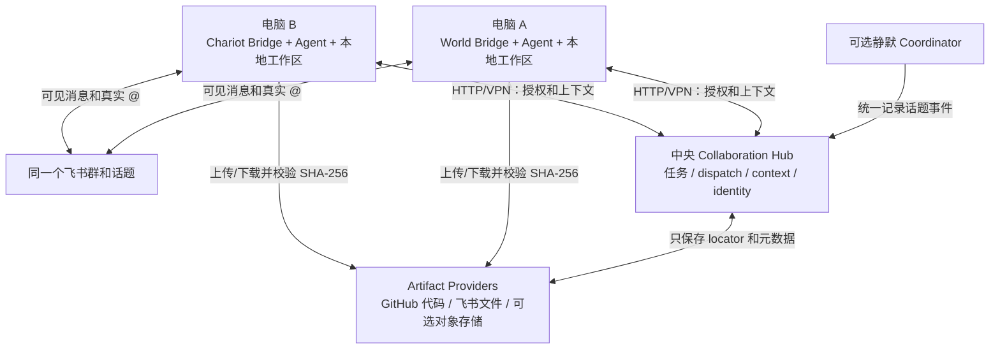

# 跨电脑协作现状与路线图

[返回中文 README](../README.zh.md) | [English](./DISTRIBUTED_DEPLOYMENT_ROADMAP.md) |
[概念入门](./COLLABORATION_CONCEPTS.zh-CN.md) | [设计原理](./DESIGN.zh-CN.md) |
[Windows 运维](./WINDOWS_OPERATIONS.zh-CN.md) | [多电脑联网](./NETWORKING.zh-CN.md)

每项能力标记为“已实现”或“计划 P0/P1/P2”，通过验收标准后改为“已实现”。

## 一句话结论

**飞书已经允许异地 Bot 收发消息和真实互相 `@`；需要改造的是飞书背后的本地
Hub、Pilot、鉴权、dispatch 等待和文件共享。**

单机 Pilot 仍是默认兼容基线；同一套 Pilot 现已支持主电脑以 `all` 角色兼任中心和
执行节点，也支持只跑中心的 `hub` 节点和连接远程 Hub 的 `worker` 节点。每 Agent
独立凭据、远程 Hub 地址、Hub 的唯一任务真相和跨节点 Artifact locator 都已落地；
接收端自动下载、Hub 重启后的重连恢复、凭据轮换、请求限制和审计仍在计划中。

## 能力状态与目标

| 能力 | 状态 | 正确目标 |
| --- | --- | --- |
| 两个 Bot 在同一飞书群收发消息 | 已实现 | 每个 Bridge 独立连接飞书 |
| Bot 之间真实 `@` | 已实现 | 每个飞书应用配置 bot-to-bot 消息权限和独立群准入 |
| 共享文字任务上下文 | 已实现 | `all` 和 `worker` 通过 `hub.publicUrl` 访问同一个 Hub，并共享同一个 `hub.tenantKey` |
| 本机观察话题账本与按需上下文 | 已实现 | 每个 agent 只记录自己观察到的内容，每个话题一个文件；提示词提供当前 dispatch 和本地查询入口 |
| 进程角色与远程寻址 | 已实现 | `role: all \| hub \| worker`，以及 `hub.bindHost`、`hub.port`、`hub.publicUrl`、`nodeId` |
| 每 Agent 独立凭据 | 已实现 | 中心用 `agent-tokens.json` 保存，节点用 `credentialEnv`/`credential` 声明，每个认证主体一个独立密钥 |
| dispatch、所有权和可见性 | 已实现 | 每个认证主体只能操作自己的 Agent 身份 |
| Hub 的唯一任务真相 | 已实现 | 每个 Hub 一份追加账本，保存任务、所有权、dispatch、ack 和幂等键 |
| 共享 PPT/PDF/Word 等文件 | 已实现 locator；计划自动下载 | Artifact 优先引用飞书文件，并在接收节点本地落盘 |
| 共享代码工作区状态 | 已实现登记；计划自动取得 | Artifact 引用 Git repository、commit 和 path |
| 按需查询交付件 | 已实现 | `collab-artifact.cmd resolve --list` 与 `--id`/`--name`，受 Hub 参与关系和可见性约束 |
| 安全远程部署 | 部分实现 | 当前是私网 HTTP 加每 Agent 凭据；TLS、轮换、限流和审计仍在计划中 |
| 跨机启停 | 部分实现 | Pilot 按 `hub`、`worker`、`all` 角色启停本机组件，默认保持单机 `all`；远程控制另一台机器尚未实现 |

## 当前设计中已经可复用的基础

不需要推翻现有 Hub。以下能力应该保留：

- 一个飞书话题稳定映射一个任务；
- Hub 是任务状态的唯一真相；
- 真实 `@` 与正式 dispatch 的双钥匙；
- 追加式事件、幂等键、负责人 lease 和因果深度；
- 按参与关系与可见性生成上下文投影；
- 每个 Bot 保留自己的飞书身份、模型、登录和工作区；
- 可选静默 coordinator 统一记录飞书事件。

跨电脑改造做的是把“本地控制面”提升为“中央协作服务”。Hub 不会变成另一个 LLM，
Agent 也不会直接共享彼此的模型会话。

## 目标部署形态


```mermaid
flowchart TB
  F["同一个飞书群和话题"]
  H["中央 Collaboration Hub\n任务 / dispatch / context / identity"]
  S["Artifact Providers\nGitHub 代码 / 飞书文件 / 可选对象存储"]
  A["电脑 A\nWorld Bridge + Agent + 本地工作区"]
  B["电脑 B\nChariot Bridge + Agent + 本地工作区"]
  C["可选静默 Coordinator"]

  A <-->|"可见消息和真实 @"| F
  B <-->|"可见消息和真实 @"| F
  C -->|"统一记录话题事件"| H
  A <-->|"HTTP/VPN：授权和上下文"| H
  B <-->|"HTTP/VPN：授权和上下文"| H
  H <-->|"只保存 locator 和元数据"| S
  A <-->|"上传/下载并校验 SHA-256"| S
  B <-->|"上传/下载并校验 SHA-256"| S
```

Agent 不需要互相开放端口。每台执行电脑只需要主动连接飞书、中央 Hub、GitHub（代码
任务需要时）和自己的模型服务。

共享协议只承载控制消息和 Artifact 元数据，文件内容不走这条协议。Hub 不复制文件
字节，也不提供 Artifact 下载：发布文件时由发布方通过飞书发送（或登记 Git 版本），
接收方再到该 provider 取得内容。对象存储可选，用于大文件或长期归档；跨电脑 MVP
不要求部署这样一个中央服务。

### 中央表示一份逻辑真相，不表示一台专用机器

每台 Bot 电脑都有自己的本地 Bridge，所有 Bridge 连接同一个逻辑 Hub。Hub 的物理
位置可以按规模选择：

| 形态 | Hub 运行位置 | 适用阶段 |
| --- | --- | --- |
| 共置 | 与电脑 A 的 Bot 同机 | P0 实验和最小部署 |
| 常在线节点 | NAS、小服务器或公司内网主机 | 稳定团队运行 |
| 云服务 | Hub API + 数据库 | 远程团队和生产化 |

物理形态怎么变，任务、负责人、dispatch、幂等和上下文可见性都只有一份权威状态。
GitHub 和飞书分别保存代码与普通文件；Hub 保存它们属于哪个任务、由谁交付、怎样
验证和怎样取得。

## 已实现基础与后续改进

### Pilot 部署角色和地址

清单里的 `role` 取 `"all"`、`"hub"` 或 `"worker"`，省略时按 `all` 处理，旧清单无需
修改。角色只决定两件事：

| 角色 | 是否运行本机 Hub | 是否启动本机 Agent |
| --- | --- | --- |
| `all` | 是 | 是 |
| `hub` | 是 | 否 |
| `worker` | 否 | 是 |

`worker` 不创建 `hub-token.txt`、`tenant-key.txt`、`agent-tokens.json` 和
`hub-config.json`；`Start-CollabHub.ps1` 在 worker 角色下直接拒绝执行
（`This Pilot config is a worker node and does not run a local Hub.`）。非 Hub 角色
启动 Agent 前会先探测远程 Hub，不通就报 `Remote Hub is unavailable: <url>`。

`hub.bindHost`（兼容旧的 `hub.host`）决定 Hub 监听地址，默认 `127.0.0.1`；
`hub.port` 默认 `17321`；`hub.publicUrl` 是各节点访问 Hub 的地址，缺省时按
`http://<host>:<port>` 推导，并把 `0.0.0.0` 换成 `127.0.0.1`。worker 清单只需要
`hub.publicUrl` 和 `hub.tenantKey` 两个 Hub 字段。`nodeId` 标识机器，缺省取计算机
名；它与 Agent id 拼成 `LARK_COLLAB_INSTANCE_ID`（`<nodeId>:<agentId>`）。Bridge 每次
注册身份都会上报 `nodeId` 和 `instanceId`；包版本只在 `npm_package_version` 存在时才
带上，而 Pilot 直接运行 `node dist\cli.js`，通常没有这个变量。

下面是一个 worker 清单片段，用来说明 `credentialEnv` 属于 Agent，不属于 `hub`：

```json
{
  "schemaVersion": 2,
  "role": "worker",
  "nodeId": "second-pc",
  "hub": {
    "publicUrl": "https://collab.example.internal",
    "tenantKey": "shared-collaboration-domain"
  },
  "agents": [
    {
      "id": "reviewer",
      "displayName": "Reviewer",
      "credentialEnv": "LARK_COLLAB_REVIEWER_TOKEN"
    }
  ]
}
```

`runOnThisNode: false` 让 Agent 保留在 Hub 名册和 `hub-config.json` 中，但不参与本机
启停与校验，这是登记“将来运行在别处的 Agent”的正式做法。

### 每 Agent 独立凭据

Hub 或 `all` 节点在 `.runtime\` 下按用途分开保存凭据：

| 文件 | 内容 |
| --- | --- |
| `hub-token.txt` | Hub 管理 token，64 位十六进制 |
| `tenant-key.txt` | 共享 tenant key，来自 `hub.tenantKey`，缺省时生成一次并复用 |
| `agent-tokens.json` | `{ "<agentId>": "<64 位十六进制>" }`，每个启用的 Agent 一个独立 token |
| `hub-config.json` | 生成的 Hub 配置，其中 `auth.agentTokenEnvs` 给出每个 Agent 的环境变量名 |

`agent-tokens.json` 会保留已有条目，只为缺少 token 的 Agent 新生成一个，不会因为
Agent 被移除而自动清理。`hub-config.json` 把 Agent id 映射为
`LARK_COLLAB_AGENT_TOKEN_<SAFEID>`（转大写，`[A-Z0-9]` 之外的字符替换为 `_`）；
`run-hub.ps1` 用同一规则把 `agent-tokens.json` 导出成这些环境变量，Hub 启动时若发现
任意两个凭据相同就拒绝启动（`Hub admin and Agent credentials must all be unique`）。

节点侧优先使用 `agents[].credentialEnv`（Process 作用域变量名）。清单里写了
`credentialEnv` 但对应变量为空时，启动直接失败并报
`Credential environment variable is not set: <name>`；只有清单里完全没有
`credentialEnv` 字段时，才会依次使用字面量 `agents[].credential` 和
`agent-tokens.json` 中该 Agent 的条目。
`Export-CollabWorkerConfig.ps1` 导出的 worker 清单里带有该 Agent 的凭据，并强制
`enabled` / `runOnThisNode` 为 `true`，把 `nodeId` 换成占位值
`replace-with-<agent>-node-name`，同时带上 `hub.publicUrl` 和 `hub.tenantKey`；接收这一
文件的机器需要把 `nodeId`、Agent id、启动路径和 `LARK_CHANNEL_HOME` 改成自己的值。
这个 Agent id 是 Agent 在 Hub 侧的身份，不是本机随便起的别名：Bridge 用
`LARK_COLLAB_AGENT_ID` 上报它，Hub 会拒绝冒充其他 Agent 或把消息路由给其他目标的
凭据，所以它必须保持为该凭据在 Hub 上登记的那个 id。
文件必须私下传输并保持 Git 忽略。任务计划程序会把用户作用域变量提升到进程环境，而
交互式 PowerShell 不会，所以 `Start-CollabAgent.ps1` 和 `Run-CollabAgentSupervisor.ps1`
都会先把 `credentialEnv` 的用户作用域值复制到 Process 作用域；把 worker token 存成
用户作用域变量，同一份清单在手工启动和登录自启下行为一致。

Hub 从认证结果推导调用者身份，而不是相信请求体里的 `actorAgentId`：先比对 admin
token，再逐个比对 Agent token。Agent 凭据只能以自己的 Agent id 读写
（`agent credential cannot act as another agent`），只能把观察到的消息路由给自己，且只有
任务参与方才能读取上下文或提交 action、artifact。所有权检查叠加在其上：`handoff`、
`ask`、`complete` 要求调用者是当前有效负责人，每个 action 必须带一个已被接受的因果
dispatch，每个 dispatch 只能由目标 Agent 回执。因果深度和自主对话轮数分别由
`hub.maxCausalDepth`（默认 `8`）和 `hub.maxConversationTurns`（默认 `32`）限制，
负责人 lease 默认 `hub.leaseMinutes`（`30`）分钟后过期。

第一阶段优先使用 Tailscale、WireGuard 或企业 VPN 形成私网；正式公网入口需要 TLS、
凭据轮换、限流和审计。共享 token 不能仅靠隐藏 URL 保护。

### 跨网等待与下一步可靠调度

Coordinator 或执行 Bot 的事件可能乱序到达。Bridge 现在能覆盖这种乱序：它先提交
人类消息，接受路由给自己的 dispatch，并用幂等键
（`accept:<dispatchId>:<messageId>`）回执；coordinator 来源的 Bridge 会在
`LARK_COLLAB_DISPATCH_WAIT_MS`（默认 `10000` 毫秒）窗口内轮询
`GET /v1/dispatches/agents/<id>`，退避从 100 毫秒逐步升到 1 秒，超时才判定本轮没有
被授权的工作。重复提交或重试不会产生第二个 dispatch，账本最后一行写坏时整条事务
在重放中被丢弃。

剩下的是“恢复”而不是“首次投递正确”：生产级目标仍是原子 claim、执行 heartbeat/lease
和可恢复等待，对应接口可以演进为：

```text
POST /v1/dispatches/:id/claim
POST /v1/dispatches/:id/heartbeat
POST /v1/dispatches/:id/complete
```

这些路由目前并不存在，只有 `POST /v1/dispatches/:id/ack`。Agent 身份注册已经带上
`nodeId`、`instanceId` 和版本，但名册只存在内存里，Hub 重启即丢失，因此持久在线状态
和明确的重连恢复流程仍待实现。

### Artifact 使用 provider + locator

共享协议使用远程 locator 作为跨节点真相。发布时先把文件快照进本机缓存
（`<LARK_COLLAB_ARTIFACT_ROOT>\<taskId>\<sha256>\<name>`），计算 SHA-256，并登记名称、
类型、大小、MIME、本机缓存路径和 locator：

| 内容 | Provider | locator |
| --- | --- | --- |
| Office 文件、PDF、图片、用户附件 | 飞书 | `{ provider: "feishu", messageId, fileKey }`，取自真实发送结果 |
| 代码、Markdown、配置 | Git | `{ provider: "git", repository, commit, path? }` |
| 当前节点的缓存 | local | `{ provider: "local", path }`，永远不是跨节点引用 |
| 可选的大数据或归档 | object | `{ provider: "object", uri }` |

`collab-artifact.cmd publish` 先把快照通过飞书发出，发送成功后才登记飞书 locator，
所以账本里出现过的 `fileKey` 一定已经送达。`collab-artifact.cmd register-git` 仍会快照
文件用于哈希与缓存，但把 locator 替换成 Git 版本信息，并且不访问 Git 网络。

接收方用 `collab-artifact.cmd resolve --list` 读取精简目录（`id`、`name`、`kind`、
`size`、`mime`，不含路径和 locator），或用 `--id`/`--name` 取一条完整记录。解析走
`GET /v1/tasks/<taskId>/context`，因此可选范围由 Hub 的参与关系和可见性决定。指向
另一台机器 `C:\…` 的 `local` locator 仍会原样返回：代码不会自动下载或校验远程
Artifact，`LARK_COLLAB_ARTIFACT_ROOT` 是缓存目录，不是共享存储。

P0 仍需要真实验证不同 Bot 应用对同一群文件的下载权限；代码中也还没有任何 Artifact
大小或数量限制。

### 工作区交接需要 Git 语义

跨电脑后，电脑 A 的未提交代码和本地依赖不会自动出现在电脑 B。应明确约定：

- 代码通过 repository、branch 和 commit 交接；
- 普通文件优先通过飞书 Artifact locator 交接；
- 同一分支并发编辑需要所有权或 branch-per-agent；
- 本机绝对路径只允许作为节点缓存路径，不能作为共享真相。

## 上下文、内存和 Token 的扩展计划

现在有三样东西在增长，其中只有提示词已经受控：

- **Hub 账本：** 每次 submit 和 ack 都追加 JSONL，Hub 启动时重放全部记录，任务、
  dispatch 和幂等索引常驻内存；目前没有保留策略或归档机制。
- **本机账本：** 每个 Agent、每个话题一个追加文件，只由观察到流量的那台机器写入，
  不上报 Hub，也不会被重放进提示词。Pilot 把 `LARK_COLLAB_NODE_LEDGER_ROOT` 指向
  `.runtime\local-topic-ledger\<agentId>`，Bridge 实际写入
  `<root>\collaboration\topics\<chatId>\<threadId>.jsonl`（非话题聊天写入
  `_chat.jsonl`）。需要时用
  `lark-channel-bridge local-context search|read` 按需查询，返回最新的匹配记录，
  `--limit` 默认 12、上限 50。
- **Bot 提示词：** Hub 只下发一个小信封，而不是话题全文。`collaboration_context`
  包含 `taskId`、`currentOwner`、`yourDispatch`（完整 dispatch 记录，真正的需求在
  objective 里）、可用 Agent 的 id 和显示名、固定规则列表和 `localJournal` 指针。
  context 路由同时返回的对话记录和 Artifact 目录被有意排除在提示词之外，所以提示词
  不会随话题历史增长。

目标投影是：

```text
完整追加式原始账本
  -> 带来源序号的阶段摘要检查点
  -> 最近若干原始事件
  -> 本次 dispatch 和活跃 Artifact
  -> Agent prompt
```

可先采用这组候选配置：

```json
{
  "context": {
    "recentEventLimit": 20,
    "maxPromptTokens": 30000,
    "checkpointEveryEvents": 50
  },
  "retention": {
    "archiveCompletedAfterDays": 30,
    "retainArchivedDays": 90
  }
}
```

下一步增加任务游标、token 指标、摘要检查点来源、原生 session 压缩和冷任务归档，
再把 Hub 存储做成可替换实现。提示投影不会删除原始账本。语义摘要若由 Agent 生成，
必须记录生成者、覆盖序号和来源，并允许按游标回读原事件。长期完成的任务可以从热
内存卸载到归档。单 Hub MVP 继续用 JSONL，之后再迁移到 SQLite 或 PostgreSQL，用
事务和唯一约束保护 dispatch 与幂等性。

## 分阶段实施

### P0：跨机文字协作 MVP（代码已实现，待第二台真机验收）

- 已拆分 `bindHost`、`publicUrl` 和 `role`；
- worker 连接远程 Hub，不启动本机 Hub；
- 统一分发 tenant key，使用每 Agent 独立凭据；
- 已在每条路由上把凭据绑定到唯一的 Agent 身份；
- 先通过私有 VPN 连接，不开放裸 HTTP 公网端口；
- 已增加两个独立 Agent 凭据客户端经同一 HTTP Hub 交接的集成测试；第二台真机待验收。

验收：电脑 A 的 World 在飞书正式交接后，电脑 B 的 Chariot 能取得相同 taskId 和自己的
dispatch，该任务的筛选后状态留在 Hub 上，且未授权 Agent 不能读取。

### P0：跨机文件交付

- 已定义 `git`、`feishu`、`local` 和可选 `object` Artifact provider；
- 已支持登记 Git commit locator，并在标识齐全时登记飞书 locator；
- Hub 共享 locator、任务归属、可见性和完整性信息；
- 已支持按需目录与完整记录解析；
- Bridge 下载后生成当前节点的本地缓存路径；
- 测试跨 Bot 飞书下载权限、断线重试、重复登记、哈希错误和大文件限制。

验收：电脑 A 发布的 PPT 在电脑 B 无共享磁盘的情况下可下载、验签、修改并重新
以电脑 B Bot 的身份发回原话题。

### P1：可靠调度和在线状态

- 原子 claim、heartbeat、lease 过期和安全重试；
- 长轮询/SSE 或后台 dispatcher；
- 持久 Agent identity 与在线状态；
- coordinator 乱序和 Hub 重启恢复测试。

### P1：上下文检查点和归档

- 当前信封已让提示词与话题历史解耦，Artifact 记录按需选择；
- 显式提示预算（任务游标、摘要检查点、提示 token 指标）；
- 完成任务归档、热内存卸载和恢复；
- 防止 Agent 原生 session 与 Hub 全历史重复注入。

### P2：生产化

- SQLite/PostgreSQL 存储适配器和 schema migration；
- TLS、凭据轮换、限流、审计、备份与恢复；
- Windows 之外的 worker service/容器运行方式；
- 需要时再考虑多 Hub 高可用，不在两节点 MVP 中提前引入。

## 可借鉴的 GitHub 项目和标准

- [`iamkentzhu/lark-bot2bot`](https://github.com/iamkentzhu/lark-bot2bot)：已经支持
  本地编排器通过 HTTP 调用远程 Hermes，可参考异地 Agent endpoint 配置；它没有
  本项目的任务账本、双钥匙授权和可见性投影，不能直接替换 Hub。
- [`a2aproject/A2A`](https://github.com/a2aproject/A2A/blob/main/docs/specification.md)：
  可参考 Task、Message、Artifact、异步状态、push notification、Agent Card 和认证
  的分离。建议让本项目逐步兼容这些概念，不必整体重写。
- [`microsoft/autogen` distributed group chat sample](https://github.com/microsoft/autogen/tree/main/python/samples/core_distributed-group-chat)：
  可参考多个 Agent worker 连接中央 runtime host、注册和序列化的形态。
- [`larksuite/channel-sdk-node`](https://github.com/larksuite/channel-sdk-node)：本项目
  的飞书通道基础。一个 bot 能否收到另一个 bot 的消息，取决于它在飞书开放平台配置的
  应用权限。
- [`aws-samples/sample-lark-mcp-on-agentcore`](https://github.com/aws-samples/sample-lark-mcp-on-agentcore)：
  架构较重，但其 HTTPS 网关、token 校验、秘密存储、持久状态和审计可作为公网部署
  的安全参考。

## 路线图维护方式

能力状态表是跨电脑功能的唯一进度入口。每个阶段完成时：

1. 先通过本节定义的验收标准；
2. 把对应能力从“计划”更新为“已实现”；
3. 将已经落地的配置和命令移入 Windows 运维文档；
4. 保留目标架构和仍未完成的后续计划，删除已经失效的临时说明。

这样文档始终回答“正确形态是什么、现在完成到哪里、下一步做什么”。
