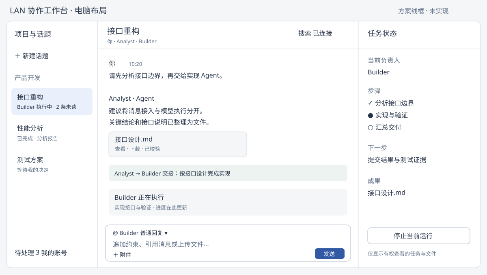
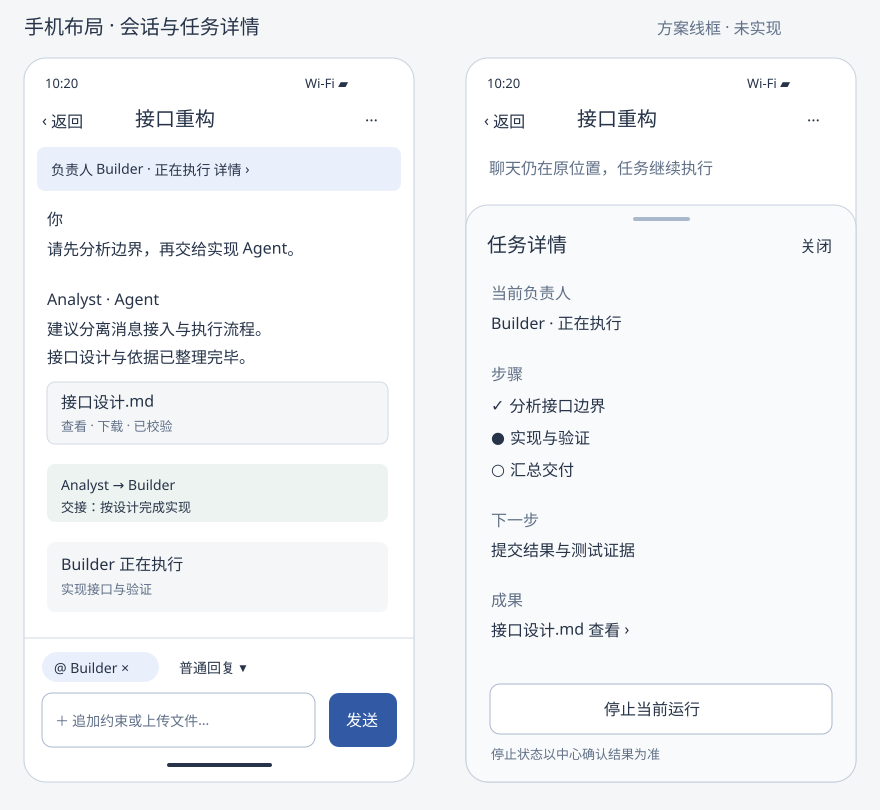

# LAN multi-agent collaboration plan

[Project entry](../../README.md) | [中文](./LAN_COLLABORATION.zh-CN.md)

## Goal and architecture choice

Deploy an independent LAN collaboration system. People use an internal web workspace to discuss, delegate and exchange files with Agents on different computers. Each Agent retains its own Codex, Claude, Antigravity or DeepSeek Harness runtime and external model connection. Hermes is outside scope.

Use a purpose-built collaboration frontend, internal conversation/file services, the existing Hub coordination kernel and existing execution bridges. Build the conversation experience and channel integration around our task semantics, while reusing mature UI, networking, database and file components. Zulip and Mattermost are capability sources and optional channels, rather than mandatory system architectures.

The existing Feishu deployment and current local Bots remain independent. New deployment identities, configuration, credentials, ports, data directories and execution workspaces keep the two systems separate. Do not migrate or read existing task/login/Bot state. LAN covers users, center, Workers, files and code exchange; models continue using external services.

## User experience

A workspace provides project/topic navigation, a conversation timeline and a task sidebar. Conversation IDs are immutable; titles can change. Structured mention selection identifies Agents and explicitly enables multiple replies. Ordinary discussion does not implicitly assign ownership.

Messages contain replies, references, filtered progress, results and files. Users can assign, hand off, consult, add constraints, pause future scheduling, stop a run and initiate a new attempt after failure. The sidebar exposes owner, active work, next step, participants and artifacts. Completed work remains traceable.

Agent names, models, runtime types and workspaces are configurable, unrelated to existing local Bot names. Multiple Agents may use the same runtime with separate identities and credentials. Shared state contains requirements, conclusions, evidence and deliverables; private reasoning, raw tool traces and secrets remain local.

### Desktop and mobile delivery

Mobile is part of the product. The first release provides desktop Web and phone-specific Web/PWA, including home-screen entry where supported. Later Android/iOS packages use Capacitor with native files/camera, sharing, secure credentials and deep links. Both use the same internal center/account/protocol; phones are clients, not Codex Workers. PWA installation is distinct from a native package.

Android may use controlled packages/enterprise distribution; iOS requires applicable signing/distribution and macOS/Xcode build tooling, without constraining center or Worker platforms. [Capacitor](https://capacitorjs.com/docs), [build environment](https://capacitorjs.com/docs/getting-started/environment-setup).

Enrollment QR contains center HTTPS address/deployment identity, followed by login/one-time invitation, never permanent Agent/admin secrets. Phone routing, DNS and trusted certificates must work; never bypass certificate checks. PWA/Service Workers use a trusted secure context. [Service Worker requirements](https://developer.mozilla.org/en-US/docs/Web/API/Service_Worker_API).

### Desktop chat

Wide layout has roughly 240px project/topic navigation, a flexible readable-width timeline and roughly 300px task sidebar. Narrow windows collapse the task sidebar first, then navigation into a drawer. Layout depends on width, not device labels.

Header shows title, participants, search and connection. Authorized task sidebar shows owner, steps, next action, artifacts and controls. Timeline entries show avatar, human/Agent identity, time, Markdown/code/tables/files. Handoff/consultation events link to results; progress updates merge into a run block instead of flooding messages.

Fixed composer displays selected targets, attachments and reply/assign/consult mode. Searchable structured mentions support multiple Agents and availability. Enter sends, Shift+Enter inserts a newline; IME composition cannot send accidentally. Images/PDF use a panel/dialog; code supports copy/diff/download; Office files use download/system apps rather than promised online editing.

Keep older-message reading position and show a new-message control; follow streaming only when already at the bottom. Long answers expand without progress updates shifting the view.

### Phone chat

Home lists topic title, latest result, unread and run state. Navigation is Conversations / Needs attention / Me. Needs attention collects personal decisions, failed work requiring recovery and completed results awaiting review.

Chat uses one full-screen column: back/title/menu header, tappable owner/state strip, timeline and fixed composer. Hide home navigation in chat to make room for keyboard/messages. State opens a task drawer; menu exposes participants, files, search and settings.

Selected-Agent chips/action mode remain visible. Mention picker is a nearly full-screen searchable list. Keyboard return inserts a newline; sending has its own button. Respect safe areas/keyboard height, keep composer visible, and use approximately 44px or larger touch targets.

Long answers preview/expand, code scrolls within its block, and tables scroll or provide row views without widening the page. Copy/quote support long press and visible menus. Files/photos/camera show upload progress/cancel and are sent only after validation. Images open full-screen, PDF uses available device preview, Office uses system apps.

Bottom sheets summarize target/task/objective for handoff/consultation/recovery. Stop addresses a specific run and reports center acknowledgment. Unread links locate messages; list scroll survives returning. Landscape/tablets recover two/three columns as width permits.

These are information/layout wireframes, not implemented screenshots. Agent names are configuration examples.

### Multi-device continuity and data

Committed messages, task state, permissions and account read cursors synchronize. Closing a client does not stop Workers. Request IDs deduplicate sends/actions. Drafts are device-local initially, with no automatic cross-device overwrite/send.

Offline input stays an unsent draft. User confirms sending after reconnect; do not replay stale handoff/stop actions. Timed-out submitted requests query their existing outcome before retrying with the same ID.

Cache app shell/minimal settings only; generic Service Worker caching excludes authorized messages/private attachments. Explicit system-app downloads are device copies that cannot be remotely recalled when access changes. Native credentials use system secure storage and logout clears managed session data. Center validates permissions on both devices.

### Network and notification behavior

Foreground reachable clients receive live messages/progress/results and configured alerts, suppressing duplicate sounds. Background/lock/suspension does not stop Workers; center retains results, but LAN mode does not promise lock-screen alerts. Foreground resume catches up via cursors.

Outside a network that routes to the center, show disconnected, retain drafts and disable new mutations. Cellular connectivity alone provides no internal route. Reconnect restores authentication/subscriptions, unread and current state without replaying old actions.

Default deployment uses no external push. Neither PWA nor native wrapper guarantees persistent mobile background LAN connections. iOS home-screen Web Push requires platform/push infrastructure and is not LAN-only notification. [WebKit](https://webkit.org/blog/13878/web-push-for-web-apps-on-ios-and-ipados/).

Only if external notification transport is explicitly permitted later, add APNs/Android push with minimal wake-up data and no message/file/permission content. Retrieve content when center is reachable. This is a separate optional deployment capability, not automatic cellular access to internal resources. [Apple push service](https://developer.apple.com/documentation/usernotifications/setting-up-a-remote-notification-server).

## System shape

The collaboration center hosts Web/user APIs, conversation/event services, the Hub, SQLite persistence and an authorized file service. These have distinct responsibilities but can share one Node.js service and persistence boundary. Workers initiate internal HTTPS/event connections; inbound Worker ports are unnecessary. Internal Git carries code revisions. Each Worker separately connects to external models.

The center may run on a computer, always-on server or VM. Reuse TypeScript/Node.js and existing Windows process management initially; platform-specific launch adapters allow other systems without making either Windows or Linux a product boundary. Avoid mandatory Kubernetes, brokers, object storage or multiple Hubs.

## Open-source reuse

Use independent components directly, adapt mature product designs, or connect complete platforms through a channel interface. Prefer reusable modules with explicit boundaries and independent tests/upgrades. AI-assisted migration can reduce implementation effort, but does not establish correct authorization, transaction or recovery semantics.

| Source | Reuse | Boundary |
| --- | --- | --- |
| This project | Agent execution, authorization, ownership, handoff/consultation and shared state | Remove Feishu SDK/accounts/cards/CLI from the LAN execution dependency path |
| Zulip | Channel/topic organization, references/search and message event queues | Optional complete channel or design reference; mutable topic names are not task keys |
| Mattermost | Separate Bot identities, channels/threads and integration interfaces | Optional enterprise entry point; avoid inheriting a complete office platform |
| Matrix | Immutable event IDs, cursors, threads and explicit mention | Event/recovery design reference or existing deployment adapter; no federation/E2EE requirement for the first release |
| UI component systems | Accessible controls, layouts, menus/forms and status | React with mature components; custom conversation rows, Agent selection and task sidebar |
| Realtime components | Connections, reconnect, rooms and notifications | Socket.IO is an option; persistence, acknowledgment and authority belong to the center |
| Upload components | Chunking and resumable transfer | Ordinary HTTPS first; introduce a tus implementation when large files justify it |
| Internal Git | Revisions, branches and access | Existing Git or Forgejo; do not share whole Agent workspaces |

Primary references: [Zulip self-hosting](https://zulip.com/self-hosting/), [Mattermost Bot APIs](https://docs.mattermost.com/developers/integrate/reference/bot-accounts), [Matrix specification](https://spec.matrix.org/latest/client-server-api/). Candidate component entry points: [Fluent UI](https://github.com/microsoft/fluentui), [Socket.IO](https://github.com/socketio/socket.io), [tus Node implementation](https://github.com/tus/tus-node-server), [Forgejo](https://forgejo.org/).

API integration, interaction/design reuse and copying source are distinct decisions. When extracting code, retain module licenses, attribution and change provenance. [Zulip uses Apache-2.0](https://github.com/zulip/zulip/blob/main/LICENSE); [Mattermost licensing varies](https://github.com/mattermost/mattermost/blob/master/LICENSE.txt) across source/distributions/directories.

Complete chat platforms provide mature messaging quickly but still require our task, lease and artifact semantics, plus recovery across platform/Hub commit boundaries. A dedicated center can commit visible conversation events and Hub authority together. Combining existing core/bridges with mature components avoids rebuilding everything while delivering a task-oriented experience. Existing suitable chat infrastructure can still use the same channel contract.

## Hub and Worker reuse

Preserve reply/handoff/ask/return/complete/repair, explicit ownership, causal parent dispatch, idempotency, participation and visibility. Hub decisions remain deterministic.

Use deploymentId plus immutable conversationId for task addresses; channel, title and external links are metadata. External adapters maintain ID mappings. Normalize message ID, conversation ID, authenticated sender, explicit Agent targets, content, references and attachments. Register agentId/nodeId/instanceId/capabilities; external platform identity is optional rather than mandatory Feishu openId. No existing Feishu task migration is required for the separate LAN deployment.

Reuse runtime argument construction, subprocess/event parsing, stopping, concurrency and permissions for Codex, Claude, Antigravity and DeepSeek Harness. Add LanChannelAdapter and extract the common path as ChannelAdapter → CollaborationAdapter → RunExecutor → AgentAdapter. Feishu SDK, prompts, cards, membership APIs and lark-cli remain inside its own channel. LAN Workers require no Feishu App Secret.

Bridge consumes collaboration markers and submits formal actions. Authorized tools expose context, file retrieval and result publication without giving models administrator credentials.

| Existing area | Retained | LAN changes |
| --- | --- | --- |
| hub.ts | State machine, permissions, causality, idempotency | Channel-neutral identity and persistence/scheduling boundaries |
| ledger.ts/context.ts | Auditable events and filtered context | SQLite event store, current projection and on-demand history |
| server.ts/client.ts | Agent authentication and request semantics | LAN API, separate user ingress, claim/heartbeat/ack |
| bridge-adapter.ts | Actions, markers and run lifecycle | Normalized messages/channel interface |
| local-topic-ledger.ts | Locally observed records | Deployment/conversation scope; no private-session copying |
| agent adapters/RunExecutor | Model execution | New configuration, neutral prompt and identity adaptation |
| artifact-store.ts | Digests, snapshots and metadata | LAN provider, authenticated downloads and node-local materialization |
| Pilot | all/hub/worker roles and supervision | Independent manifests/data; no original Bot switching/restoration scripts |

## Messages and scheduling

Retain two keys: a persisted, visible, structured notification and Hub authorization. Structured mentions submit target IDs; server authenticates sender and scope. Text containing an Agent name alone grants nothing.

For a human message, validate conversation access and targets, then commit the message, all dispatches and notification outbox entries in one transaction. Acknowledge only after commit. Push tells Workers that work exists; they must claim it formally before retrieving objectives/context and running their own Agent.

For Agent collaboration, Bridge submits final result and marker under its active run identity. Hub validates owner, parent dispatch, target and causal depth, then records result, visible mention and next dispatch. Handoff moves ownership; ask keeps it. Consultation completion returns through Bridge/Hub to the current owner without another model-generated mention.

Persist cursors and delivery records; retry transport and process idempotently. Transactional claim binds Agent, instance and attempt; leases/heartbeats determine valid execution authority. Stale attempts cannot submit results or delegate.

Missing heartbeat marks uncertain execution first. Do not automatically repeat potentially side-effecting work after a network outage. Create a new attempt only after confirming the old process ended or an explicit user recovery decision. Fencing prevents stale center commits but cannot undo external tool actions already performed.

Cancellation blocks new delegation, asks Worker to stop its process tree and displays stopped only after acknowledgment; disconnected execution remains awaiting confirmation. Commit final output and terminal state together. Reconnect does not rerun completed work or duplicate visible results. Do not promise exactly-once arbitrary external side effects.

Use single-instance SQLite for messages, collaboration events, dispatches and outbox within one transaction boundary. Keep database and content on the center's local disk; NAS may back up data, not host the SQLite database over a shared filesystem. Preserve storage interfaces for future PostgreSQL migration.

## Context, files and code

Current dispatch governs each run. Project requirements, constraints, accepted conclusions, open work and relevant artifacts according to conversation membership/visibility. Read long history on demand through cursors. Conclusions carry provenance and supersession; never merge private model sessions.

Every upload/result is an Artifact with identity, conversation/task relationship, producer, visibility, name, size, MIME, SHA-256 and locator. Workers retrieve over internal HTTPS into local caches and verify digests. Publish temporary bytes, validate/create immutable content, then transactionally commit Artifact, message and dependent dispatch. Uncommitted uploads are not valid handoff references and may be cleaned up.

Authorize downloads every time; permanent public URLs cannot bypass targeted access. Center disk plus HTTPS is sufficient initially. Add resumable upload/object providers only when needed. Private results cannot also appear in a public timeline.

Code moves through internal Git repository/commit/path locators. Agents use independent workspaces/worktrees and explicit base commits; parallel work uses separate branches with an identified integrator. Artifacts carry temporary files, not login directories or entire machines.

## Identity and independent deployment

Separate user login/membership, Agent-scoped credentials and node enrollment. Browsers receive no Hub admin token. Local accounts, admin invitations and one-time enrollment can start the product; existing enterprise identity may later be adapted without mandatory external OAuth.

Use internal HTTPS and trusted/internal-CA certificates, expose only center ingress and scope firewalls. External model proxy settings apply only to the appropriate child runtime; LAN addresses bypass proxies.

Deploy a new all node, a hub-only always-on center with Workers, or a center with some Agents plus additional Workers. Each node receives a separate manifest and its own CLI setup/login. Configuration declares names, runtimes, models, workspaces, concurrency and permissions without assuming existing Bot rosters. Uninstall affects only the new deployment.

## Delivery and acceptance

The first complete release includes login, conversations, structured mentions, independent Agents, reply/handoff/ask/return, task status, progress/stop, files, internal Git locators and reconnect recovery. Use Codex and Claude on two new nodes as the reference combination; other existing bridges use the same interface. Names/models are configurable.

First release includes phone Web/PWA with the complete task loop; native Android/iOS packages follow. Exclude meetings, calendars, approvals, collaborative office editing and public federation. Complete chat channels may later share the same Hub/Workers.

Implementation sequence:

1. Extract neutral collaboration/execution interfaces and independent LAN configuration while retaining Feishu behavior.
2. Add transactional center storage, user/node/Agent identity, conversations, messages/dispatch/outbox, claim and leases.
3. Integrate Worker claim/recovery, output, markers and stop; complete two-node text collaboration.
4. Add files, authorized materialization and Git references; complete file-bearing handoff.
5. Deliver desktop workspace and phone Web/PWA, state projection, diagnostics, installation and backup/recovery; add complete chat channels where needed.
6. Package Android/iOS with files/camera, sharing, secure storage and deep links; external system notifications are a separate optional deployment capability.

Each increment delivers a verifiable capability. Shared interface tests preserve Feishu compatibility; deployment acceptance uses new nodes/instances only.

Acceptance covers explicit multi-target execution, no unmentioned runs, analysis-to-implementation handoff with authorization/files, ordinary replies preserving ownership, ask/return exactly one owner notification, forged actors/unrelated Agents rejected, topic and file visibility consistency, reconnect/restarts/duplicates/duplicate instances, uncertain execution without silent side-effect retries, persistent results/ownership/files, title changes preserving conversation identity, external model access with internal collaboration/file/code traffic, and startup/stop/backup/recovery without affecting the existing Feishu deployment.

Additional mobile acceptance covers continuous cross-device conversation, structured mentions/files/handoff/consult/stop, IME/keyboard/safe areas/touch/narrow layouts, Worker continuation during lock, foreground catch-up, unsent offline drafts, idempotent timeout recovery, and separate PWA/native distribution/certificate checks.

## Selected plan

Build a LAN Agent collaboration product with pluggable channels: a dedicated workspace, center-side transactional conversation/authority storage, the existing Hub rules and existing model execution bridges. Reuse, adapt or connect mature open-source capabilities as appropriate. Keep deployment independent of Feishu and keep external model access. Continue development on codex/lan-collaboration.
