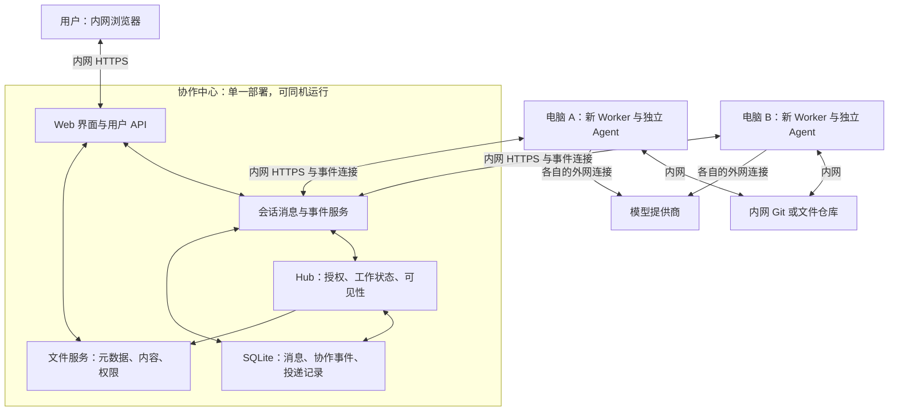

# 局域网多 Agent 协作方案

[项目入口](../../README.zh.md) | [English](./LAN_COLLABORATION.md)

## 一、建设目标与总体选择

新建一套独立的局域网多 Agent 协作系统。用户在内网网页中与多个 Agent 交流、交接任务和交换文件；Agent 分布在不同电脑上，通过局域网连接同一个协作中心；每个 Agent 继续使用自己的 Codex、Claude、Antigravity 或 DeepSeek Harness 运行时，以及各自的外网模型服务。

**推荐采用“专用协作前端 + 内网会话与文件服务 + 现有 Hub 协作内核 + 现有执行桥”的组合架构。** 自研内容集中在适合人和 Agent 一起工作的会话体验、通道接入和可靠调度；成熟的 UI、网络、数据库及文件组件直接复用。Zulip、Mattermost 等作为能力来源和可选接入通道，不把整套聊天产品当作必须接受的架构。

现有飞书大网方案和本机机器人继续独立运行。新系统使用新的部署身份、配置、凭据、端口、数据目录和执行工作区，不读取或迁移原系统的任务、登录和机器人配置。Hermes 不纳入此方案。

“局域网”限定协作链路：用户到会话服务、节点到 Hub、节点间共享文件和代码均走内网。模型访问继续走各 Agent 的外网连接，无需内网模型服务器或离线部署体系。

## 二、用户体验

系统入口是一张协作工作台，而不是让用户理解 Hub、dispatch 和节点地址。

- 左侧是项目与话题列表；每个话题是一段有稳定 ID 的会话，可以改标题而不改变身份。
- 中间是人和 Agent 的消息、引用、进度、结果与文件。用户通过结构化 @ 选择 Agent；同时选多个 Agent 表示明确允许并行回复。
- 右侧显示当前工作负责人、正在执行的工作、下一步、参与 Agent 和交付物；无明确工作分配时，话题可以只是普通讨论。
- 输入框支持普通回复、交给某个 Agent、请某个 Agent 协助，以及带文件的任务。Agent 也可以在同一话题中交接或请另一 Agent 协助。
- Agent 名称和模型是配置，不绑定本机既有机器人名称。一个运行时可以部署多个独立 Agent；每个 Agent 有自己的身份、凭据、工作区和运行限制。
- 用户可以追加约束、暂停后续调度、停止某次运行、查看失败原因和发起新的尝试。已完成工作和原始结果仍可追溯。

共享内容是需求、结论、证据、任务状态和文件；模型私有推理、完整工具轨迹、登录信息和密钥留在执行节点。网页中的“进度”只表达运行状态及经过筛选的活动摘要。

## 三、系统架构

会话服务负责消息、可见的点名通知、引用、附件和事件投递；Hub 负责谁可以做什么、谁拥有工作、哪些信息可读；Worker 负责运行模型、执行工具和管理本机工作区。三者职责保持清晰，但中心首版可以作为一个 Node.js 服务部署，通过同一持久化边界处理协作提交。

中心可以运行在普通电脑、常开服务器或 VM；执行节点按 CLI 的可用环境部署。首版复用项目的 TypeScript/Node.js 与 Windows 进程管理，不为消息服务引入一种强制操作系统。需要跨平台时增加启动/进程适配，不把 Windows 或 Linux 作为产品边界。所有 Worker 主动连接中心，不要求 Worker 开入站端口。

## 四、开源复用与方案取舍

复用分为三层：直接使用独立组件；参考并重构成熟产品的模块设计；通过适配器接入整套平台。优先选择能够明确边界、独立升级和单独测试的能力。AI 辅助迁移、重写和测试可以降低人工成本，但不能替代对原模块权限、事务、顺序和恢复语义的理解。

| 来源 | 取其所长 | 在本方案中的用法 | 不继承的负担 |
| --- | --- | --- | --- |
| 本项目 | 独立模型桥、任务授权、交接与咨询、共享状态 | 作为执行层和协作内核的主体 | 飞书账号、SDK、卡片和 CLI 作为核心依赖 |
| Zulip | channel/topic 组织、引用与搜索、消息事件队列 | 会话组织参考；可选 Zulip 通道；需要成熟聊天时可整体部署 | 可变 topic 名称作为任务主键、围绕服务端原技术栈强行改造所有组件 |
| Mattermost | 独立 Bot、频道与线程、集成边界 | 参考 Bot/用户身份分离；可选现有企业平台接入 | 为任务工作台继承完整办公产品及所有企业功能 |
| Matrix | 不可变事件 ID、同步游标、thread 与显式 mention | 参考统一事件模型和恢复机制；已有 Matrix 可接入 | 首版承担联邦、端到端加密和复杂 homeserver 运维 |
| Web UI 组件体系 | 无障碍控件、布局、表单、菜单、状态展示 | React + 成熟组件库；聊天行、Agent 选择器和任务侧栏按产品需求组合 | 自写整套基础控件或绑定某个聊天产品的页面结构 |
| 实时网络组件 | 浏览器连接、重连、房间和通知 | 可选 Socket.IO；事件持久化和应用确认仍由中心承担 | 把自动重连当成可靠消息队列或执行授权 |
| 文件传输组件 | 分块、断点续传 | 普通文件先用 HTTPS 上传下载；大文件需要时再接 tus 实现 | 首版为了少量文档引入复杂分布式存储 |
| Git 服务 | 代码版本、提交、分支与权限 | 复用已有内网 Git，或部署 Forgejo；无 Web 管理需求时可只用 Git 服务 | 把整个 Agent workspace 当共享目录 |

Zulip 的自托管、消息/事件/文件 API 提供了完整通道能力；Mattermost 支持自托管和 Bot 集成；Matrix 的协议可用来设计事件身份和同步。它们有价值的部分既可以直接接入，也可以作为专用中心的设计参考。[Zulip](https://zulip.com/self-hosting/)、[Mattermost Bot 接口](https://docs.mattermost.com/developers/integrate/reference/bot-accounts)、[Matrix 客户端协议](https://spec.matrix.org/latest/client-server-api/)。

需要直接抽取上游源代码时，按模块保留许可和版权声明，记录来源与修改；使用 API、借鉴交互和直接拷贝实现是三种不同的复用方式。Zulip 使用 Apache-2.0；Mattermost 不同发行与目录有不同条款，不能整库一概当作 MIT。[Zulip 许可](https://github.com/zulip/zulip/blob/main/LICENSE)、[Mattermost 许可](https://github.com/mattermost/mattermost/blob/master/LICENSE.txt)。

组件候选入口：[Fluent UI](https://github.com/microsoft/fluentui)、[Socket.IO](https://github.com/socketio/socket.io)、[tus Node 服务](https://github.com/tus/tus-node-server)、[Forgejo](https://forgejo.org/)。前端库和实时库不承担 Hub 的业务授权；具体组件选择不影响核心协议。

### 为什么首选组合架构

直接部署 Zulip/Mattermost 能最快获得完整聊天，但任务负责人、dispatch、执行租约和文件可见性仍需要我们完成，还要处理聊天平台与 Hub 两套提交的失败窗口。专用协作中心可以直接把可见消息和授权记录在同一提交边界内，对用户提供任务状态而非一般聊天功能。

完全重写聊天基础设施会扩大维护范围；组合架构用现有执行桥与 Hub 避免重写核心，用成熟组件避免重写基础，用专用会话模型解决本项目独有的协作体验。若使用方已有合适的聊天平台，则以该平台作入口，通过同一通道接口接入，无需另换协作内核。

## 五、Hub 和 Worker 的复用设计

### 协作内核

保留 `reply / handoff / ask / return / complete / repair` 语义、显式工作所有权、父 dispatch 因果链、幂等键、参与者和可见性规则。Agent 不能通过自己的文字声明获得权限，Hub 也不调用模型来决定权限。

将任务地址抽象为 `deploymentId + conversationId`，会话拥有不可变 ID；channel、topic 标题和 UI 链接是可变元数据。外部平台接入时，由通道适配层保存外部 ID 与内部会话的映射。新 LAN 部署不迁移原飞书任务数据。

通道中立的消息包含：消息 ID、会话 ID、服务端认证后的发送者、明确的目标 Agent 列表、正文、引用和附件。身份注册采用 `agentId / nodeId / instanceId / capabilities`，外部账号 ID 是可选绑定，不再要求飞书 `openId`。

### 执行桥

继续使用 Codex、Claude、Antigravity、DeepSeek Harness 的参数构造、进程启动、事件解析、停止控制、并发池和权限配置。新增 `LanChannelAdapter`，让它将中心消息与 dispatch 转成统一执行请求，将运行事件和最终结果返回中心。

从当前飞书入口中抽出通用运行流程，形成 `ChannelAdapter → CollaborationAdapter → RunExecutor → AgentAdapter`。飞书 prompt、SDK、卡片、群成员 API 和 lark-cli 保留在原通道侧；LAN Worker 不加载这些功能，也不需要飞书 App Secret。

Agent 使用统一工具入口查询授权上下文、读取文件、发布成果；协作 marker 由 Bridge 消费，转换为正式 action。模型不会持有管理员能力，也不需要直接实现消息协议。

| 现有区域 | 保留内容 | LAN 的改造边界 |
| --- | --- | --- |
| `src/collab/hub.ts` | 状态机、权限、因果与幂等规则 | 抽出通道身份；增加持久化与调度边界 |
| `ledger.ts / context.ts` | 可审计事件、筛选后的共享上下文 | SQLite 事件实现；当前任务投影与按需历史查询 |
| `server.ts / client.ts` | Agent 到 Hub 的认证和请求语义 | LAN API、独立用户入口、claim/heartbeat/ack |
| `bridge-adapter.ts` | action、marker、运行前后的协作流程 | 规范化消息和通道接口 |
| `local-topic-ledger.ts` | 本节点观察记录及局部查询 | 使用新部署与会话 ID 命名空间；不复制私有 session |
| `src/agent/* / RunExecutor` | 模型桥与进程执行 | 新配置、通道中立 prompt、必要身份适配 |
| `artifact-store.ts` | 内容摘要、快照、文件元数据 | 内网文件 provider、鉴权下载与本机 materialization |
| Pilot | 单机 all、中心 hub、执行 worker 的角色和监管 | 新 LAN 配置与数据路径；不执行原 Bot 的切换/恢复脚本 |

## 六、消息和调度机制

“真实点名 + Hub dispatch”的两把钥匙继续保留，但真实点名改为中心持久化的可见结构化消息事件。页面的 @ 控件提交目标 ID，服务端验证用户或 Agent 身份；纯文本 `@名字` 不触发执行。

### 人类发起

1. 中心验证会话权限和被选 Agent 的可用范围。
2. 在同一事务中记录消息、全部目标 dispatch 和待通知事件；只写成功才给发送方确认。
3. 向目标 Worker 和有权查看的网页推送事件。推送只提示有工作，Worker 必须向 Hub 正式领取。
4. Worker 领取后获取当前 objective、约束、相关结论与附件，启动自己的运行时。

### Agent 协作

Agent 输出结果与一个协作 marker；Bridge 在其有效运行身份下提交。Hub 检查当前所有者、父 dispatch、目标和因果深度，随后记录结果、可见点名和新 dispatch。`handoff` 转移负责人，`ask` 保留负责人；咨询完成由 Bridge/Hub 返回给当前负责人，无需模型自行再发一次点名。

### 可靠执行

- 消息与事件在中心持久化，连接恢复从已确认游标继续；outbox 负责通知重试。传输可重复，处理必须幂等。
- `claim` 在存储事务中绑定 Agent、Worker 实例和唯一 attempt；每次运行有租约和心跳，旧 attempt 不能提交新结果或委派。
- 心跳超时首先标记失联/待确认。可能产生外部副作用的执行不因网络中断直接自动重跑；确认旧进程结束或经用户明确恢复后，创建新的 attempt。fencing 约束中心提交，不能撤销旧进程已经执行的外部工具操作。
- “取消”先阻止新委派，再通知 Worker 停止进程树，收到确认后显示已停止；失联时显示等待确认。
- 最终结果、运行终态和可见输出一起提交；客户端重连不重复显示，Worker 重连不重复运行已完成的工作。
- 不承诺任意外部工具副作用的 exactly-once；中心保证唯一有效领取和提交，并对不确定执行显式标记。

首版中心采用单实例 SQLite，把消息、协作事件、dispatch 和 outbox 纳入同一事务边界。数据库与文件内容留在中心本地磁盘；NAS 可以作为备份目标，不把 SQLite 文件置于共享网络盘。规模扩大时保留存储接口，再迁移 PostgreSQL，不提前引入多 Hub。

## 七、上下文、文件与代码

### 上下文

每次执行以当前 dispatch 为主，按会话、参与者和可见性提供需求、约束、确认结论、未完成项和相关 Artifact。长历史通过带游标的查询按需读取，不能直接复用上一 Agent 的私有模型 session。接受的新结论和纠正有来源，旧结论可标记被替代。

任务侧栏是 Hub 状态的投影；消息列表是可见会话记录。没有 Agent 被授权参与的任务，即使知道 ID 也不能查询。

### 文件

用户上传和 Agent 成果统一成为 Artifact：文件 ID、会话/任务归属、创建者、可见性、名称、大小、MIME、SHA-256 和存储定位。Worker 经内网 HTTPS 下载到自己的缓存，校验摘要后使用。

文件发布顺序为：上传临时内容 → 校验并形成不可变内容对象 → 事务提交 Artifact、可见消息和后续 dispatch。事务失败的内容可以清理；未完成上传不能被交接引用。下载端每次验证调用者是否属于允许范围，不能用永久公开链接绕过 targeted 权限。

首版使用中心磁盘内容存储和普通 HTTP 文件接口；大文件再引入断点续传。对象存储作为可替换 provider，不是前置条件。私密结论和附件不能同时发到所有人可见的消息里。

### 代码

代码协作使用内网 Git 的 repository/commit/path 定位。每个 Agent 独立 workspace 或 worktree；交接明确基准提交和分支，平行工作使用不同分支，集成者合并成果。临时文件通过 Artifact 分享，不自动共享登录目录、所有 workspace 或整台机器。

## 八、身份与部署

用户账号负责登录与会话成员权限；Agent 凭据只能操作自己的身份；节点凭据用于节点注册和管理允许启动的实例。用户界面不拿 Hub 管理 token。首版可用中心本地账号、管理员邀请和一次性节点注册凭证，无需外部 OAuth；企业已有身份服务时增加认证适配。

服务之间使用内网 HTTPS，内部 CA 或可信证书由部署提供；防火墙只开放中心入口。Agent 调用模型所需代理只进入对应子进程，内网地址绕过该代理，避免协作请求被送到外部。

新部署有三种形态：

| 形态 | 用途 |
| --- | --- |
| 新电脑 `all` | 中心与新 Agent 同机，保留单机起步体验 |
| 常开节点 `hub` + 多电脑 `worker` | 多节点常态协作，中心稳定运行 |
| 中心带部分 Agent + 额外 Worker | 随节点数量渐进扩展 |

新节点从模板生成独立 manifest，并单独完成 CLI 登录。配置可表达 Agent 名称、运行时、模型、工作区、并发和权限，不假设当前本机机器人名单。卸载新系统只影响其自己的服务、配置和数据。

## 九、交付范围与验收标准

### 首版完整闭环

交付登录、话题会话、结构化 @、多个独立 Agent、普通回复/交接/咨询/返回、任务状态、运行进度/停止、文件分享、内网代码定位以及断线恢复。首个参考组合使用两个新节点上的 Codex 和 Claude；其余已支持桥按相同接口接入。模型和 Agent 名称均可配置。

不将视频会议、审批、日历、在线文档编辑、复杂移动端或公域联邦纳入首版。成熟聊天通道可作为后续入口，与专用前端共用 Hub 和 Worker。

### 实施分解

1. 抽出通道中立协作和执行接口，保留现有飞书入口的行为；建立独立 LAN 配置与部署命名空间。
2. 建立中心事务存储、用户/节点/Agent 身份、稳定会话 ID、消息/dispatch/outbox、claim 和租约。
3. 接入 Worker 领取与恢复流程、结果提交、marker 委派及进程停止；完成两个新节点的文本协作。
4. 建立文件 provider、权限下载和 Git 定位；完成带文件的跨节点交接。
5. 完成工作台、状态投影、日志诊断和安装/备份/恢复包；需要成熟聊天时增加 Zulip/Mattermost 等入口。

每步是独立可验收能力，而不是先做一个不能完成任务的聊天壳。实现时通过共享核心接口和专项测试保持原飞书通道兼容，部署验收只针对新的节点和实例。

### 验收场景

- 人类明确选中两个 Agent，两者各领取一次；未选 Agent 不运行。
- A 完成分析交给 B，B 收到同一会话、有效授权和指定文件；普通回复不擅自改变负责人。
- A 咨询 B，B 返回一次，A 获得恢复工作所需结果，无重复唤醒。
- 非参与者和伪造 Agent 不能读上下文或附件；不同会话隔离；共享范围与聊天展示一致。
- 断网、重启、重复投递和双实例不会产生重复有效提交；执行不确定时不会悄悄重跑有副作用任务。
- 中心或 Worker 重启后，已完成结果、有效负责人和文件仍可恢复；话题改名不产生新任务。
- Worker 继续使用外网模型，所有中心通信、附件和代码交接访问均指向内网服务。
- 新部署能完成启动、停止、备份与恢复；原飞书服务、本机机器人、凭据、配置和运行数据均不受影响。

## 十、最终方案

建设一个可插拔通道的局域网 Agent 协作产品：专用工作台承载人和 Agent 的交流，中心统一持久化会话和授权，现有 Hub 提供协作规则，现有模型桥承担执行。开源聊天产品提供可借鉴、可拆取或可整体接入的能力，成熟组件提供基础设施。部署与既有飞书系统完全独立，模型继续使用外网，后续开发在 `codex/lan-collaboration` 分支推进。
