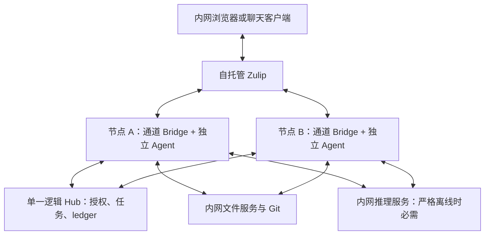

# 纯局域网多 Agent 协作方案（调研提案）

[项目 README](../../README.zh.md) | [English](./LAN_COLLABORATION_PROPOSAL.md)

调研日期：2026-10-06。状态：方案，未实现、未部署、未做第二台物理电脑验收。现有飞书产品目标保持有效；本文提出可选 LAN 通道，需在采纳后另行修改产品约束。

## 建议

优先验证 **自托管 Zulip + 现有 Hub + 通道适配后的 Worker**。先复用聊天、话题、账号、搜索和附件，再逐步增加任务状态界面。不要一开始重写完整飞书，也不要换掉现有确定性 Hub。

如果目标仅是少数人在浏览器中调度 Agent，而不需要通用团队聊天、成熟客户端、搜索和通知，则 **自研轻量任务会话 Web 界面**值得作为另一条路线。它是小型协作产品，不是飞书的全面替代。已有企业 Mattermost 则优先接入现有设施，避免另建聊天平台。以上选择是基于文档和代码的工程判断，尚未经过实际部署比较。

## 1. 仓库进展与对齐

已执行 `git fetch --all --prune`，origin 与 upstream 均成功。原工作区干净；所有原有本地分支与 origin 同名分支 SHA 一致，无需 pull/push。Fetch 成功；研究分支推送时现有 Git 凭据读取失败，因此按用户授权使用桌面 git.txt 的密钥进行本次认证，未写入仓库或输出。分支快照见 [完整引用清单](./BRANCH_SNAPSHOT.txt)。同步指本地跟踪引用与远端一致，不代表把各用途分支合并成同一个版本。

| 工作线 | SHA | 意义和最近进展 |
| --- | --- | --- |
| develop/hub | 6f3ed4d | 当前 Hub 开发基线；9 月 29 日增加长任务进度保活；含本机话题账本、marker 修复、统一 ask 返回唤醒 |
| release/hub | 371bb02 | Hub 部署发布基线；尚未包含上述后续开发提交 |
| develop/worker | d689d73 | Worker 开发线；9 月 22 日 ask 返回唤醒；含独立 Worker 运维文档和委派 CLI 路径 |
| release/worker | 50d8a03 | Worker 发布基线；真实第二台电脑验收仍是发布条件 |
| archive/* | 见清单 | 全部冻结回滚/历史分支；含早期 Hub、重组前版本和独立 Antigravity/DeepSeek 包 |
| upstream/main | 5898681 | 原始桥接项目；独有 23 个提交，包括 Web UI、通道升级、Codex 最终回复等；本 Hub 独有 59 个提交 |
| upstream 功能分支 | 见清单 | register-source、at-bot-config、web-ui、daemon、larkcli、quote-card、channel SDK、Windows stdin 修复；历史参考，不是本产品发布线 |

比较了 develop/hub 与 develop/worker 的内容差异和 patch 等价关系。它们不只是提交 SHA 不同：Worker 的 prompt 暴露 `availableAgents` 和 `collab-delegate.cmd`，Hub 使用群范围 roster 与 Bridge 消费 marker；消息提交授权对多目标 mention 的策略也不同，Worker 还未包含 Hub 最新长任务保活。因此不能为了“最新”盲目合并、强推或推广 release。后续 LAN 实现应先明确共享协议基线，再保留角色部署差异。

本研究从 develop/hub 的最新提交建立独立 `codex/lan-solution-research` worktree；只增加研究文档，不触碰运行目录、登录、Hook、ledger 或 Agent workspace。

## 2. “全局域网”的两种范围

**协作内网化**：聊天、Hub、Worker、文件和代码服务在 LAN 内，模型可经批准调用外部服务。可以保留现有 CLI 能力，但不能称完全离线。

**严格断网运行**：上述服务之外，推理、模型权重、工具、依赖镜像、认证、DNS、证书和安装升级包也必须在内网。现有 Codex、Claude、Antigravity 的登录状态不等于它们支持离线推理。必须逐个确认运行时可否配置内网模型；无法切换的 Agent 不属于严格离线部署。可评估适配本地模型的 Harness/Hermes，但不预先保证当前版本兼容。采用内网推理服务会改变模型能力，需用真实任务评测，不把外部强模型能力视为等价可迁移。

Tailscale（不是 Timescale）只负责远端可达、链路加密和设备准入；应用身份仍由 Hub 的独立 Agent token 约束。LAN 可直接替代其网络功能，无需部署另一个 VPN。Feishu SaaS 仍需外网；移除 Tailscale 不会自动移除飞书依赖。源码依据：[Networking](../NETWORKING.md)、[Design](../DESIGN.md)。

## 3. 开源候选

| 候选 | 已查证的基础 | 适配代价与风险（工程判断） | 结论 |
| --- | --- | --- | --- |
| Zulip | 自托管、channel/topic、消息 REST API、事件队列、上传文件；Apache-2.0 | 最接近话题边界；话题名称可变，必须有稳定映射；Bot 事件及附件权限需实测；服务通常放 Linux/VM/容器 | 新建 LAN 聊天入口首选验证 |
| Mattermost | 官方明确支持隔离网部署；Bot 账号和集成接口 | 用 channel + 根帖 thread 表达任务；版本/版本类型的授权及功能边界需锁定；企业已有部署时成本更低 | 优先复用已有企业设施 |
| Matrix + Element + Synapse | 标准化消息、同步、mention、thread 和媒体 API；Synapse 可自托管 | 联邦、多客户端和 E2EE 增加运维及 Bot 密钥管理；严格 LAN 需关闭不必要外部服务；必须逐组件审视许可 | 已有 Matrix 或确需联邦时选 |
| 自研轻量界面 | 直接围绕本 Hub 的任务投影设计 | 自己承担账号、消息、附件、断线恢复、权限、升级和 UI；不能把 WebSocket 原型当可靠产品 | 需求只限任务协作时可选 |

Zulip 官方说明可防火墙内自托管，并支持 Linux 或 Docker；[自托管说明](https://zulip.com/self-hosting/)、[许可证](https://github.com/zulip/zulip/blob/main/LICENSE)。其 [发送消息](https://zulip.com/api/send-message)、[事件队列注册](https://zulip.com/api/register-queue)、[事件获取](https://zulip.com/api/get-events)、[文件上传](https://zulip.com/api/upload-file) 可作为适配基础；这不构成本项目 Bot-to-Bot 联调已通过的证据。

Mattermost 的 [隔离网部署说明](https://docs.mattermost.com/deployment-guide/deployment-scenarios/air-gapped-deployment) 和 [Bot 账号文档](https://docs.mattermost.com/developers/integrate/reference/bot-accounts) 支持上述候选判断。[许可文件](https://github.com/mattermost/mattermost/blob/master/LICENSE.txt)区分官方编译版本、源码及各目录许可，不能笼统认定所有代码和企业能力均 MIT 免费。

Matrix 的 [客户端协议](https://spec.matrix.org/latest/client-server-api/) 提供 thread、mention、sync、媒体语义；[Synapse 仓库](https://github.com/element-hq/synapse)说明服务与许可证。相比本项目需要的单中心任务会话，它的分布式聊天能力未必带来收益。

不选 AutoGen/A2A 作为聊天替代：它们可启发 Agent 协议，不直接交付人类会话客户端。Rocket.Chat 可列入扩展候选，本轮未取得足够可核验的离线部署资料，不给它确定排名。不开源项目名清单竞赛；能替换具体依赖才计入优先方案。

## 4. 推荐拓扑

聊天服务与 Hub 可同一台常开主机部署；Zulip 可放 Linux VM，现有 Worker 继续 Windows。Hub 可继续主 PC 的 `all`；附加 PC 使用 `worker`，不启动第二个 Hub。LAN DNS + 内部 HTTPS + 防火墙按节点/角色开放，保留每 Agent 凭据。无需 Kubernetes、消息总线、多 Hub 或对象存储作为首版前置条件。

## 5. 哪些协作机制可复用

| 模块 | 复用程度 | 实際工作 |
| --- | --- | --- |
| `src/collab/hub.ts`、`ledger.ts` | 核心逻辑复用 | task 真相、owner、reply/handoff/ask/return/complete/repair、因果链、幂等和可见性保持 |
| `server.ts`、`client.ts` | 大部复用 | 保留凭据到 Agent 身份绑定；LAN HTTPS 可由反向代理终结；用户入口需独立授权，不能把 admin token 给浏览器 |
| `task-id.ts`、`types.ts` | 结构复用，需要协议适配 | `chatId/threadId` 可承载规范化地址，但不能直接使用可变 topic 名；`openId` 是飞书身份耦合点 |
| `bridge-adapter.ts`、`coordinator.ts`、`agent-roster.ts` | 语义复用、通道抽象 | 当前依赖 Feishu 消息类型、ID、mention 与入群语义；需要 provider identity、事件认证、成员范围和投递回执 |
| `context.ts`、`local-topic-ledger.ts` | 大部复用 | 当前 dispatch 优先、每节点只记录观察内容、按会话查询；增加 provider/部署命名空间防地址碰撞，替换飞书查询文案 |
| `artifact-store.ts`、Artifact 类型 | 摘要/元数据复用 | 增加 LAN 可取的 locator 和接收端 materialization；本地绝对路径不能跨节点复用 |
| `src/agent/*`、运行队列和会话隔离 | 条件复用 | CLI 执行能力保留；严格断网时另行验证每种运行时；不共享模型私有 session |
| `src/bot/channel.ts`、卡片/媒体/命令 | 改动集中区 | 直接依赖 `@larksuite/channel`、飞书卡片、引用、reaction、文档评论；不能只换 URL |
| Pilot 与 Hermes Hook | 角色和进程管理复用，启动绑定需适配 | 保留 all/hub/worker、独立环境、可回滚；飞书 CLI shim、文件发送和身份绑定替换；不重装 Hermes |

不要给“代码复用 80%”这类未经统计的百分比。核心协作模型可以复用，通道边界并非已经完全解耦。

特别区分：6f3ed4d 的进度 heartbeat 是运行活动/展示保活，不能据此宣称已有跨节点原子 claim、执行租约心跳、可靠重试队列。后者仍是路线图待实现项。附件 locator 已实现也不等于跨节点文件自动下载已实现。

## 6. 必须解决的协议边界

### 稳定会话身份

统一地址建议为 `deployment + provider + tenant + channel + immutableConversationId`，这是新增方案，不是当前字段。Zulip topic 在发送 API 中以名称表达，编辑 API 支持移动消息/改 topic，不能直接用名称替代飞书 threadId。首个消息注册不可变内部 conversation ID；保存话题别名和消息映射。首版限制自动拆分/合并/跨 channel 移动；遇到此类操作暂停受影响任务并提示，直到定义迁移策略。普通改名保留同一任务。飞书旧地址与 taskId 计算保留兼容，新地址按版本演进，不能重算现有任务 ID。[消息编辑 API](https://zulip.com/api/update-message)。

### 两把钥匙

将“真实飞书 @ + dispatch”推广为“平台可见、目标身份明确的通知事件 + Hub 授权”。Zulip 使用服务端事件中的发送者身份和 mention 信息验证，不能对正文正则找 @ 后直接授权。Agent 输出 marker 后由 Bridge 记录 action 并以当前独立账号发送真实 mention；目标 Bridge 同时核验会话、目标、父 dispatch 和幂等关系。

消息与 Hub 是两个系统，没有天然跨系统事务：提交 dispatch 成功但 mention 失败时，保持未执行状态并报告；补发要使用持久投递记录/可恢复 outbox，防重复通知与重复执行。通知先到则有限等待授权。Bot 重启后续读不能再次执行旧 dispatch。仅在工程实现中建立原子 claim/执行租约后，才可承诺多个实例竞争时单次执行。

采用自研界面也保留两类事实：用户看得见的会话事件，以及 Hub 正式授权。不能用页面里的一句 @ 文本或 SSE 推送代替授权。

### 权限与文件

Hub visibility 只控制其投影，不能撤销聊天平台中已经公开的文字/文件。targeted/handoff 内容不能一边标私有、一边发公共 channel；应使用对应可见范围的通道或 Hub 授权文件端点。worker 先通过任务参与和 visibility 检查，再下载；验证大小、文件名、SHA-256、路径边界。私密附件不能因持有通用 URL 就能下载。

普通文件首版可放中心磁盘并通过受鉴权内网 HTTPS 提供，locator 使用 Artifact ID，下载 API 检查 Agent 和任务可见性。聊天附件只在权限实测通过后当 provider。代码使用内网 Git（可考虑 [Forgejo](https://forgejo.org/)），固定 repository/commit/path；不要默认 GitHub 可达。NAS/SMB 可临时运维辅助，但共享所有 workspace 会破坏隔离，不作为协议来源。

## 7. 轻量自研路线的明确范围

若选自研，只做：登录、任务会话列表、结构化选择 Agent、消息与通知、当前 owner/stage/next step、附件、停止任务、节点状态。原始私有推理和工具轨迹不进入共享页。用户登录/session 与 Agent token 分开；后端作为用户消息入口验证身份和会话权限，浏览器不直接拿 Hub 管理权限。

前端 + 用户入口 API + 事件/附件服务组成消息面，Hub 继续是控制面，Worker 继续是执行面。单实例可从 SQLite 持久消息/outbox 起步（待设计），Worker 出站长轮询或 SSE，恢复游标和心跳；WebSocket 只是一种传输，不解决幂等、授权、恢复和存储。

不做语音会议、日历审批、文档协作、复杂移动客户端及公域联邦。优点是直接展示协作状态、稳定 conversation ID 和统一权限；成本是自己长期维护聊天/文件/账号基础。它适合明确的小型任务工具，不适合承诺“简化版飞书”后不断追加办公功能。

## 8. 后续阶段与验收（均未执行）

1. **选型验证**：一台内网服务器、两台物理 Worker、两个独立 Bot；验证人类双 @、Bot-to-Bot、ask 自动 return、附件互取、topic 改名和事件恢复。先文本后文件；拒绝没有 dispatch 的 Bot mention。若稳定话题映射或 Bot 事件不成立，再转 Mattermost/轻量界面。
2. **通道抽象**：规范化消息、会话地址、身份、真实 mention、发消息/文件、历史取回；Feishu 仍通过同样的接口工作。保持 schema-v1、omitted-role 和原飞书地址兼容。
3. **可靠协作**：原子 claim、执行租约、节点存在状态、恢复游标、outbox、失败补发；运行结束 completed/failed，旧父 dispatch 不产生新委派。
4. **离线交付**：内网模型及工具验收、安装介质、依赖/镜像/权重、内部 CA/DNS、备份恢复。禁止外网出口后完整跑通，记录网络访问；认证刷新、字体/CDN、遥测、更新检查、预览和手机推送都列入检查。常规 APNs/FCM 推送不能视为全内网能力。

必须测试：陌生 Agent 不能读任务；伪造 actor 无效；公共/targeted 文件权限一致；不同 topic 无上下文串读；重复事件不重复运行；worker 重启、Hub 重启、LAN 中断、通知失败、双实例、超长任务、hash 错误及缺失文件能明确恢复或失败。真实第二台 PC 测试与模拟集成测试分别记录。

实施时再估工作量：分别估算通道适配、身份/会话迁移、可靠 dispatch、附件和离线模型。未做 PoC 前不承诺固定日程；完全断网推理可能比聊天替换更影响交付。

## 决策建议

需要成熟团队聊天 → Zulip 优先 PoC；已有企业聊天 → 接入 Mattermost/Matrix；仅要浏览器任务调度 → 轻量界面。三条路线都复用现有 Hub 协作协议与独立 Worker，而不是让聊天平台或另一个 LLM 接管任务真相。

下一次决策只需明确：是否严格断外网、是否需要完整聊天体验、现有内网服务器和模型能力。当前提案同时覆盖两种网络范围，不因这些未确定条件启动实现。

